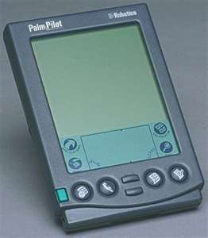

<figure aria-describedby="caption-attachment-1569" class="wp-caption alignleft" id="attachment_1569" style="width: 262px">

<figcaption class="wp-caption-text" id="caption-attachment-1569">The venerable Palm Pilot 5000</figcaption></figure>

I’ve always been an early adopter of technologies. Shortly after I moved to the Bay Area in ’98, I bought the 1st generation Palm Pilot 5000 – absolutely loved it &amp; evangelized the hell out of it (not that many of my Bay Area friends &amp; acquaintances needed persuasion). When I joined Online Anywhere in ’99 followed by the subsequent acquisition into Yahoo! Mobile, I had access to a steady supply of cool new devices ranging from Blackberry to Neopoint (1st smartphone?) to a Timex pager-watch to a Treo 650 to a MacBook (you get the idea).

My constant trysts with cool new technologies temporarily ended in 2007. Not surprisingly, it coincided with my departure from Yahoo and joining Graspr as a co-founder in April ’07. I figured I’d be perpetually connected on my MacBook (either at work or at home) so I ditched the Treo 650, disavowed all manner of smartphones &amp; phones with the tell-tale “email” button. I settled for the super-cool Sony Ericsson W810i and deliberately did not sign up for the data plan. It took me a few months to stop looking for the “email” button but the transition was surprisingly easy. The SE W810i liberated me from my business shackles. I easily settled into using the consumer features of the phone (ahem! the camera) and took loads of pictures &amp; movies of my kids. I also managed to avoid the phone browser barring the occasional “local search” when Goog-411 didn’t like my accent.

When the Jesus-Phone arrived in June, I stayed strong and didn’t succumb to temptation. I vicariously marveled at the i-Phone’s amazing features every time one of my friends brandished it (and a LOT of them did – often). Then in December, my friend Bhaskar’s startup (Qik) launched their mobile live streaming product and, this time, I could hear the “call of the early adopter”. After the Montreal vacation in Dec &amp; the Graspr fundraising activities in Jan, I was ready to order a Qik-ready phone.

I ordered the Nokia N75 and it arrived earlier today. I registered on Qik &amp; streamed my 1st live video – yea! it feels great to be back! The video itself (below) is rather ordinary – you can see the “working cave” in my house, the battle-weary MacBook surrounded by a clutter of post-its &amp; my 2 Yahoo stars. You’ll hear me chuckling in the middle – that’s because I saw the neat chat integration working for the first time. Even though I’ve heard Bhaskar telling me countless stories of how Qik works &amp; I’ve read/seen enough of Scoble’s Qik blogs, I was still blown away when I saw it all working. There was something VERY surreal about broadcasting live – even if the setting was a dimly lit study &amp; the audience was a grand total of ONE – Bhaskar.

The embed code doesn’t seem to work here, so here’s the url to my first Qik video:[ http://qik.com/video/1692  ](http://qik.com/video/1692)

Ramu, Bhaskar, Nick &amp; rest of the Qik team: Fantastic job!! You have won yourself another Qik loyalist.

– Vishy