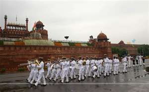

 Missed the Independence Day celebrations at the capital -- by 10 hours

**Aug 15**

The prodigal son returns to India on Independence Day exactly 16 years after he had left for America. Left on a Lufthansa flight and returned on an Air India nonstop flight. We had the closest thing to a red carpet welcome. Our very dear friends had arranged for ‘Man Friday’ (no less) and two vehicles to whisk us away to a comfy guest house in a neato Delhi neighbourhood. It was 10pm by the time we reached, nobody was hungry but we played safe anyway and ordered some takeout. At 3am, the kids woke us up and we realized everyone was hungry and non-sleepy. We finished the food in no time and spent the next 3 hours trying to persuade the kids to go back to sleep. You can guess who won that round. Almost forgot to mention that we were VERY impressed by the service on Air India. Seriously!

**Aug 16**

Went hunting for soymilk in the morning. Thanks to the ubiquity of [Silk](http://www.silksoymilk.com/), the hunt was successful. After breakfast, spoke to the Avtars (dear friends of ours who had moved to Ghaziabad/Indirapuram from SF Bay Area 2 years ago) by phone. Started calling a bunch of friends from [Bokaro ](http://en.wikipedia.org/wiki/Bokaro_Steel_City)days and struck pay dirt. Amitabh came over to the guest house – we had lunch together and had a great time catching up. Later in the afternoon, called another old classmate Rahul who promptly invited us over for dinner. Amrit’s first auto-ride in India – he enjoyed it, The kids became friends with Rahul’s son (and his toys) in no time. Excellent chinese food (“Indian Chinese” variety) and catching up on our last 20 years made for a great evening.

**Aug 17**

**The Jet Airways flight to Bangalore was in the morning. Man Friday was again instrumental in making our airport experience very very smooth. The good vibes must have rubbed off on the [Jet Airways](http://www.jetairways.com/) because they waived the 12 lbs excess baggage fee. The special treatment from Jet personnel didn’t end there. We were the last people that disembarked from the plane in Bangalore and what do I see when I reach the baggage claim? A pleasant and attractive lady from Jet Airways greets me by name and asks me to confirm whether the 6 suitcases and 2 boxes stashed on 3 carts were ours. Cool! Then an entourage of 3 Jet baggage attendants escort us all to the way to our transport. Double cool!**

Flash update: In the midst of our Farewell USA tour (Cedar Falls to be precise), I had accepted an offer to join [Adobe Bangalore](http://www.adobe.com/aboutadobe/careeropp/locations.html). It’s a very exciting role and I’ll elaborate in a separate post – sequel to [Searching for a forcing function](https://www.ulaar.com/2008/06/12/searching-for-a-forcing-function/).

The nice people from Adobe had sent a Toyota Innova (the Indian minivan) with a luggage rack. I needn’t have worried about the luggage not fitting. The drive from the new [Bangalore International Airport](http://www.bengaluruairport.com/portal/page/portal/BIAL_PageGroup/BIAL_HOME) to the Adobe guest house on Bannerghatta Road took one hour. Our driver pointed out all the neighbourhoods along the way – our education and settling down in Bangalore had begun.

P.S. Has anyone noticed that I’m gradually switching from American to British spelling (colour instead of color)? Strange thing is that this happened subconsciously.

