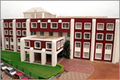

<figure aria-describedby="caption-attachment-1487" class="wp-caption alignleft" id="attachment_1487" style="width: 170px">

<figcaption class="wp-caption-text" id="caption-attachment-1487">NPS Koramangala - Pic courtesy npsinr.com</figcaption></figure>

It was Bangalore Day #5 and our first Friday. I had taken the day off for the express purpose of visiting the top school on our short list – [National Public School](http://www.npsinr.com/). In a separate post (Masti ki paathshala), I will discuss our criteria in choosing the right school for our kids and how National Public School (“NPS” for short) captured our imagination. NPS Indiranagar (the first campus) was founded in 1982 by Dr. K. P. Gopalkrishna, and who still serves as the Chairman of the (now) four campuses. NPS Koramangala (started in 2003) and NPS HSR Layout (started in 2007) were our target locations since we were converging on Koramangala as our future neighbourhood.

Since the school year had already started 2+ months ago, a colleague advised me that our best bet was to ‘seek an audience’ with Dr. Gopalkrishna and impress upon him why NPS was our top choice. So off we headed to NPS Koramangala. We got there pretty early but were greeted by a queue of eager parents ahead of us. “Early parent catches the proverbial school seat”, I muttered to myself. I joined the queue while P kept the kids busy in the waiting area. I stated my desire to meet Chairman G and pat came the reply – “the Chairman is traveling”. Attempts to gather an eta proved futile. Dejected, I rounded up the family and we started trooping out.

As we reached the gate, a spanking green [Skoda Laura](http://www.skoda-auto.co.in/LauraExteriors.html) passed us. Like any self-respecting nosy Indian would do, I peered inside the tinted windows. I glimpsed a suited gentleman in the back seat. My Sherlock Holmes instincts on overdrive, I asked the guard if it was Chairman G in the Skoda. He answered in the affirmative. We hurried back inside the school and I got back in line. When I announced that I wanted to meet the ‘recently returned from his travels’ Chairman, the lady (now smiling) asked me how I knew. Purely rhetorical question of course. Now that the cat was out of the bag, she asked me to write down my ‘particulars’ (Indian term for name &amp; purpose). After an additional thirty minutes, we got the audience.

We had no real expectations from this meeting. False! The eternally unrealistic optimist (read “me”) expected the closing lines to sound something like this *“Mr. and Mrs. Kuruganti, I am so impressed with your background, credentials and excellent moral standing. Even though the school year started two months ago and our classrooms are full, I’m willing to make an exception for your boys – in whose eyes I can already see their future academic brilliance.”*

Ok. So the interview didn’t quite end that way but you knew that, right? We had a really interesting (and at times argumentative) discussion. I’ll save the specifics for a latter addendum. This post has gestated a full 50 days – if I postpone any longer, it won’t see the light of day.

Dec 21 2008 Update: Found this comprehensive and excellent post on Bangalore schools by blogger [Chitra Iyer](http://chitra-aiyer.com/) (this is her new blog site):

http://r2blore.blogspot.com/2007/02/list-of-good-schools-in-bangalore.html

Feb 21 2009 Update: In late January, out of the blue we got a call from NPS Koramangala that our 3 year old had been accepted into the Montessori program. Apparently the Montessori 2-year program runs parallel to the kindergarden program. We had applied to the kindergarden program yet they considered our son for the Montessori. After thinking about the admission decision for a few days (virtually unheard of based on the reaction of the admission officials), we accepted. We had to pay the entire school year’s tuition *6 months* before the school year even began – nice! Then again, this appears to be the standard operating procedure in all Bangalore (perhaps all Indian?) schools.

Apr 18 2009 Update: Shortly after S wrote the admission test for NPS Koramangala (1st Grade), we made a few trips to both the NPS branches – Koramangala and HSR Layout. Turns out my mind had played a trick and I owe someone an apology. When I wrote this post in mid-Oct 2008 and compared the NPS Koramangala receptionist to folks working in a government office, it was really the NPS HSR Layout receptionist I was thinking about. The receptionist lady at Koramangala, with whom I had several recent cordial conversations recently is a fine and decent woman and I’m sorry I mistakenly maligned her (via this blog post) from Oct ’08 to Apr ’09. I’ve edited the relevant section and moved it below..

*——–start retracted portion*

**If you haven’t been to an Indian government office in quest of \[insert\_your\_favorite\_service\_here\], some background is in order. The person ‘behind the desk’ holds a position of great power. And clearly they never heard of* *with great power comes great responsibility**. Entire tomes can be written about the government peon, the clerk, the hospital compounder (Indian title for a medical assistant) but… suffice it to say that a common operating theme is to infuriate the ‘service requester’. This is not to say that they are all cut from the same cloth. No sir! Their style can range from the* *bored* *and the* *lazy ignorer**to the* *doing\_you\_a\_big\_favour* *to the* *cant\_you\_tell\_I\_am\_really\_important**.**

*NPS* *Koramangala* *HSR Layout is no government office but the lady at the reception desk was an interesting blend of the aforementioned profiles**. When it came to my turn, her expression bore a mixture of boredom and mild annoyance.*

*—- end retracted portion*

