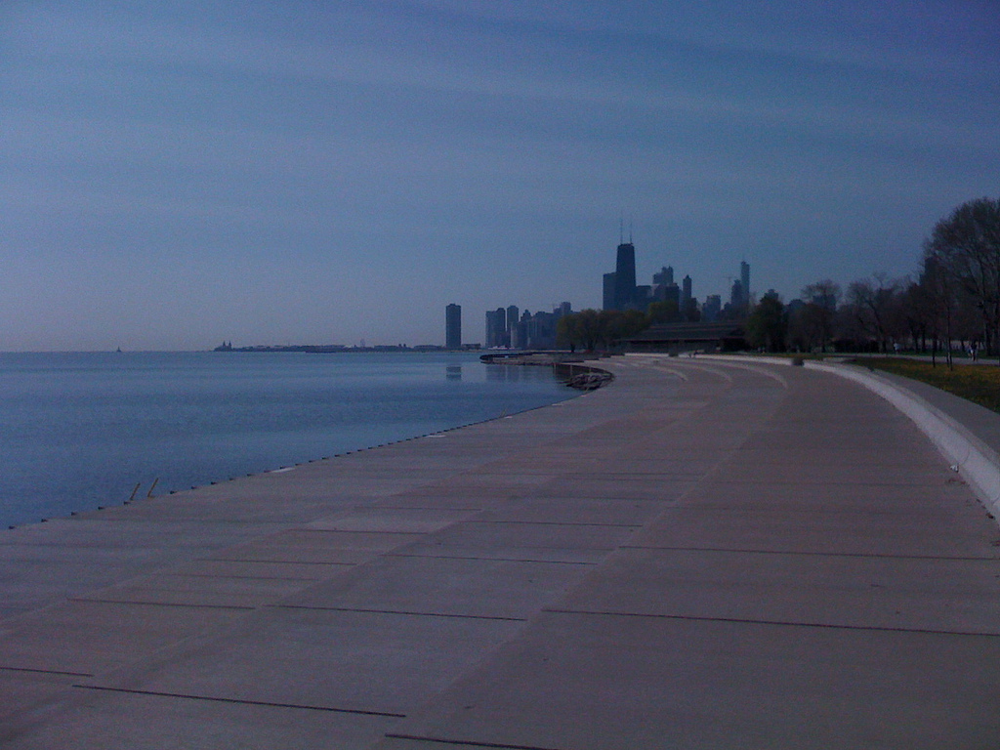

Chicago's Lake Shore Drive (between Diversey and Fullerton)

I originally wanted to start a post called “Ten little things I miss about America” and then realized it should more on the lines of ‘memories that I treasure’ (true true!) rather than a life that I miss and crave (at least not yet!). Sixteen years of American life were spent in 3 cities (Houston, Chicago and San Francisco Bay Area) so this is going to become a three-part series. I’m going to allow my stream of consciousness to flow with little filtering (P often wonders whether I have ‘any’ filters) – the only exclusions would be grand tourist sights like Grand Canyon, Yellowstone National Park, Golden Gate Bridge, etc. So here I go in no particular order…

- Running along Lake Shore Drive between Diversey and Navy Pier often times at 10pm and not being the only soul on that stretch
- Dining in umpteen multi-ethnic restaurants in Lake View/Lincoln Park neighborhoods
- Riding the different L trains between Lake View, Downtown, Belmont, Park Ridge, and Evanston
- Driving north on Lake Shore Drive and continuing on Sheridan Avenue through Evanston, Wilmette, Highland Park all the way to the Wisconsin border
- Walking on Michigan Avenue (aka “The Magnificent Mile”) during festive Christmas time and in sub-zero bone-chilling wind chill conditions (ducking in and out of stores)
- Summers in Grant Park (Taste of Chicago, concerts, jazz festival, oh.. so many events)
- Listening to Fareed Haque mesmerize the audience at The Green Mill with a custom-built guitar-sitar
- Experiencing the young trumpet genius Nicholas Payton at The Jazz Showcase
- Watching Jethro Tull at Tinley Park following a loud warmup session from Emerson, Lake &amp; Palmer
- (Dating days with P) Watching R. Carlos Nakai perform the native American flute at the Field Museum of Natural History
- Zipping around Greater Chicago on my rocket (ahem, 1985 Suzuki GS-700ES) – thanks for protecting me, oh guardian angel
- (Dating days with P) Out of the world performance by Nusrat Fateh Ali Khan – the pride of Pakistan
- (Dating days with P) First Dave Brubeck concert at the Orchestra Hall
- Riding my Suzuki from Chicago to Omaha with a gas tank cap held tight with tape. This is a blog post all by itself (maybe someday after I retire)
- Returning to Chicago and getting caught in a thunderstorm. Riding an hour in soaking rain before stopping at a motel close to Des Moines, Iowa
- Bungie jumping in Wisconsin along with Ganesh – childhood buddy who intersects three of my place circles (Bokaro Steel City, BIT Ranchi, and Chicago)
- (Dating days with P) After training for a Chicago-area Half Marathon for 3 months, woke up late on race day and missed the start (by one hour). Oh well! apparently the auspicious time hadn’t arrived for me to run marathons
- My first Starbucks coffee – in an obscure Dominicks location – next to the Park Ridge offices of SEI Information Technology
- Meeting P for the first time in a Chicago art gallery. What on earth was I doing in an art gallery?? As the wise old men say *“it was meant to be”*
- Watching Big Daddy Kinsey, Junior Wells, and a host of blues luminaries in Blues Etc and Blues Chicago (didn’t mind the smoke-filled ambience those days)
- Playing disc golf during lunch time with a group of like-minded fanatics at an ‘object’ course in Park Ridge
- My first winter morning in Chicago. Icicles formed on my wet hair as I vigorously scraped the ice off my 1984 Volkswagon Jetta
- Watching Jean Luc Ponty perform at Navy Pier
- (Dating days with P) Watching Ian Anderson perform, as a guest artist, at the National Flute Convention in downtown Chicago (Grant Park? I think). He had the cheek to poke fun at the flautists’ “puckered lips”
- A glorious year at Old Town School of Folk Music (on Armitage Ave). They made me feel special even though I had little talent for playing the silver flute. Thank you Judith Johnson Brown.
- Watching Ulele at their CD release party on Morse Ave (North Shore) with [Michael and Marilyn](http://mlswebworks.com/) and two of their friends (Deidre and Ms. X).
- My first veggie Thanksgiving at Anthony Clarke’s Arlington Heights apartment. Anthony &amp; wife were fellow bikers (from Maryland) who took my apartment sub-lease (while I moved to my Lake View apartment).
