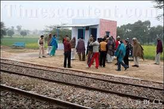

<figure aria-describedby="caption-attachment-1499" class="wp-caption alignleft" id="attachment_1499" style="width: 275px">

<figcaption class="wp-caption-text" id="caption-attachment-1499">Tajnagar Railway Station (Pic: courtesy whataworldagain.wordpress.com)</figcaption></figure>

*I have watched a city of a million dreams held hostage by 20 or so men who have purged from their souls every trace of humanity – let’s not confer on them the dignity of a religion – and I have felt the blood drain out of me.*

*I have felt a sense of paralysis and rage. My family and I are safe at home, none of my friends were in the hotels or at the other attack sites; but I am numb, not with fear or personal loss, but something far deeper: a sense of overpowering bleakness.*

Thus writes Sambit Bal (Editor of Cricinfo) in his post (unrelated to cricket) – [An overpowering bleakness](http://content-ind.cricinfo.com/magazine/content/current/story/379988.html). He has captured the essence of what I too have been feeling for the past 36 hours. Like Sambit, I’ve had a job to do through out the day – which I did, but in a highly unproductive and distracted way. In between scanning the Twitterverse, Rediff, CNN and NDTV, and lunch conversations with colleagues, my heart and mind was flitting between Nariman House, Taj, Oberoi, CST Railway Station, and zooming out to morbid visions of [The Clash of Civilizations](http://en.wikipedia.org/wiki/Clash_of_Civilizations).

I started writing this post Thursday night partly to stop incessantly reading Twitter/Web coverage of the Mumbai terrorist attacks but mainly to channel my rage, outrage and deep sadness. After 12 hours of following news coverage, I realized that I had stopped referring to Bombay as ‘Bombay’ and started calling it ‘Mumbai’. How is this relevant to what is going on in Mumbai currently? I could not answer this yesterday so I stopped rambling. Today I *may* have an answer. I had long resisted the switch to ‘Mumbai’, ‘Chennai’ (old name Madras), and ‘Kolkata’ (old name Calcutta) as my personal protest to the wave of regionalism sweeping Indian states. I am part of the unique story of India – we can’t even agree on what to call a city! According to [Google Trends](http://google.com/trends?q=mumbai%2C+bombay), most of India (and the world) has already switched to Mumbai – as far back as 2004. Yesterday marked my personal pledge to Mumbai – not “the city formerly known as Bombay”. This might seem trite or banal to some of you but indulge with me the symbolism for a bit. If this kind of terrorist event does not galvanize the nation’s psyche into united action, nothing else will.

Coming now to the title of the post – *nahin chalta hai* (Hindi phrase translates to “it is NOT ok” or “we won’t stand for it”). Essays can be written about the various nuances of the Indian chalta hai attitude but here’s the crash course version. When the city’s roads are a maze of potholes and the motorists put up with it without taking the municipality to task, that is *chalta hai* in action. When a traffic cop demands a bribe from a motorist and he just pays up because that is how the Indian system works, that is *chalta hai*. When a city like Mumbai which has had a record 14 terror attacks in the past 15 years and, following the customary mourning, outrage and media attention that follows the aftermath of each attack abates and the incredibly resilient Mumbaikars ‘move on’ and not demand more from the government, that is also sadly *chalta* *hai.*

Well, dear friends, Mumbaikars &amp; fellow Indians! it’s time for us to declare to ourselves (and the government) that *yeh* *Nahin Chalta Hai*. Let this be the last major terror incident on Indian soil. Let us admire the resilient Mumbai spirit but please let us NOT forget the carnage, outrage, pain and humiliation. [Jagadish Santhanam](http://tinyurl.com/6f9cyg) has this exhortation to Mumbaikars:

*Mumbai, please stop getting on with life. Cry! Become angry! Riot! Do something to let those in power know that they can’t go off to sleep and let another terrorist attack happen, knowing well that the Mumbaikar’s resilience and spirit will ensure that they don’t get blamed in the end.*

I agree with everything Jagadish has to say except the rioting bit. I was talking to my childhood friend and classmate from Bokaro (who has been living in Mumbai for the past 10+ years) last evening and was encouraged by his words. His words were: “this time it’s different. there’s a lot more anger among Mumbaikars about the brazenness of the attacks.” He expects a citizen backlash (more like “citizen action”) that will hold the state and central government accountable.

You may or may not agree that the current Mumbai terror attacks are India’s 9/11 but it’s hard to refute Vir Sanghvi (Hindustan Times) in [The Longest Day](http://tr.im/1ls1):

*..India is now part of the global terrorist battleground. If the international jihadi network decides to treat us on par with Israel, England, America and other countries that are seen as enemies of its twisted version of Islam, then the Bombay attacks may only be a beginning. Worse may follow.*

*No more anger. No more promises. It’s time to act..*

WHAT CAN WE DO?

There are all manners of experts and citizens opining on this subject. My 2 cents on the subject are:

1. India needs a national plan to combat terrorism. Should be a cabinet-level position. Even if we had a competent home minister (and god knows how useless the current one is), an anti-terrorism (or overall intelligence czar) is urgently needed.
2. Secure the borders please! This includes naval &amp; land borders with all neighboring countries (since none of them are India well-wishers).
3. Start a national *Nahin Chalta Hai* campaign. We have been a nation of ‘chalta hai’. I say Enough is Enough, damn it! Let’s get the Bollywood stars to produce an entire series on how “we the people” will not tolerate this nonsense anymore. We need a collective change in attitude. Thanks to my friend [Shanthala](http://twitter.com/shanthala) for alerting me to a Hollywood-stars-produced video inspiring young Americans to vote in the presidential election (youtube video embed at the end of the post).
4. As [Prem Panicker](http://twitter.com/Prempanicker) rightly commented on Twitter, let us drop this national obsession (by our Prime Ministers) to win a Nobel Peace Prize. It is more important for India to take its national security seriously than for it improve diplomatic relations with Pakistan.
5. I also agree with the prevailing sentiment on the Twitterverse that it’s not just the government that needs to do the work. My friend [Mekin](http://twitter.com/m_mekin) tweets that *we citizens CAN do, is not let anybody forget this. Life is not the same again &amp; we need to tell each other.* *Moving on … basically makes these events fade away and the precautions &amp; paranoia that we need to have evaporates.*

There’s a lot to be learned from the experiences of other countries that have borne the brunt of terror attacks (namely US, UK, Israel). The world wants India to be safe and successful so let us be receptive to any help extended to us in this regard.

And a final request, could we please have the Prime Minister or Sonia Gandhi or Vilasrao Deskmukh (heck, all three of them) make a slightly more impassioned speech to give some semblance of confidence to the Indian citizens? Show some spirit, spunk and fire in your belly, people! I have a zillion reasons to detest the current American lameduck President George W Bush but… when he gave the speech in the aftermath of 9/11, most Americans felt united and emboldened (even if you discount his Texan-style “we’ll smoke them out” comments).

An example of a celebrity produced (in this case Hollywood stars) video inspiring young Americans to vote in the recently concluded USA presidential election.

<iframe allowfullscreen="true" class="youtube-player" height="394" src="https://www.youtube.com/embed/0vtHwWReGU0?version=3&rel=1&fs=1&autohide=2&showsearch=0&showinfo=1&iv_load_policy=1&wmode=transparent" style="border:0;" type="text/html" width="700"></iframe>