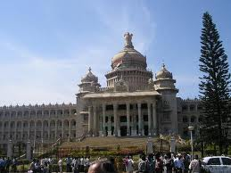

<figure aria-describedby="caption-attachment-1491" class="wp-caption alignleft" id="attachment_1491" style="width: 259px">

<figcaption class="wp-caption-text" id="caption-attachment-1491">Vidhana Soudha (Pic: courtesy tripadvisor.com.sg)</figcaption></figure>

I had planned to write this post sometime back – a retrospective kinda post providing a snapshot of the family’s settling down process – my job, kids schools, car, meeting friends, setting up the house, etc. On November 25, we completed 100 days in Bangalore but the next day [all hell broke loose in Mumbai](http://www.rediff.com/news/mumterror08.html). Over the next 10 days, I read countless news articles, opinions, blog posts and spent an inordinate time on [Twitter (#mumbai)](http://search.twitter.com/search?q=%23mumbai) hungrily and anxiously consuming every scrap of real-time news (&amp; noise). Below is a sampling of some of the articles that made an impression on me:

- [Will the messiah of the hour please stand up?](http://www.rediff.com/news/2008/dec/01mumterror-will-the-messiah-of-the-hour-please-stand-up.htm)
- [Strategic motivations for the Mumbai Attack](http://www.stratfor.com/weekly/20081201_strategic_motivations_mumbai_attack)
- [Pakistan will have to pay a heavy price](http://www.rediff.com/news/2008/dec/02mumterror-pakistan-will-have-to-pay-a-heavy-price.htm)
- [Wednesdays will be our day of national shame](http://www.rediff.com/news/2008/dec/03mumterror-wednesdays-will-be-days-of-national-shame.htm)
- I know its difficult to change our media – but here is an effort &amp; I am with it: <http://smallchange.in/>
- <http://www.yehhumnaheen.org/> Apparently 62 mil Pakistanis have signed this. Did the namesake song come first or the petition? Sign of hope?
- [It’s easy to point fingers on others but takes courage to accept our mistakes..](http://mekin.livejournal.com/65520.html)
- MJ Akbar’s blog – [The 26th of November](http://www.mjakbar.org/mjblog.htm)
- [Prem Panicker’s Twitter feed](http://twitter.com/prempanicker)
- [Muslim’s peace rally against 26/11 attacks](http://news.webindia123.com/news/articles/India/20081207/1123033.html)
- [Mumbai attacks politicize long-isolated elite](http://www.nytimes.com/2008/12/07/world/asia/07india.html?_r=1&partner=permalink&exprod=permalink)
  - Title of this article should have read “long-aloof”, not “long-isolated”
- [To South Mumbai](http://www.indianexpress.com/news/to-south-mumbai/394275/)

Within the first 24 hours, I even wrote the post [Nahin Chalta Hai](http://ulaar.wordpress.com/2008/11/27/nahin-chalta-hai/) with my reactions and 2 cents on the changes India needs to undertake. After a week I realized that it’s impossible for me (in my capacity of a part-time blogger) to remotely do justice to the aftermath of the Mumbai attacks. So I decided to return to the blog’s original theme — which is to provide a flavor of an Indian family’s return to accustomed earth after spending 40% of our lives in America.

100 days completed in Bangalore — so what’s the mood at in the Kuruganti household? Pretty good, it turns out. Here’s a glimpse at the different facets of our settling down which encourage us that we may be on the right track…

**Home for ‘Hum do Hamare Do’**: (Note to non-Indian readers, *Hum do Hamare Do* is an old 1970’s era family slogan that advocated an ideal family with 2 kids). After two weeks of frenetic apartment hunting in high-rise communities, we nearly came back to square one. We always knew our kids were a living testament to mankind’s close genetic proximity to *Macaca fascicularis* but seeing them scale balconies (granted they were just ‘attempts’) scared the bejeebies out of us. In the eleventh hour, we found a first floor apartment in Raheja Residency (note: Indian first floor = American second floor) that met all our needs. Great floor plan, redesigned and open kitchen, great landlords, and great Koramangala 3rd Block neighbourhood. Bangalore residents will know that Raheja is a venerable 10+ year old apartment community (turns out one of our close friends who lives in Fremont, California lived in this community on an expat assignment for a year in ’97). We moved into the apartment on Sep 6 and thanks to P’s herculean efforts, the house’s livability was exponentially with each passing day. By mid-October, all the heavy furniture and related accouterments had been purchased and ‘interior decorated’ – we were ready to receive guests.

**Cars, Driving &amp; Traffic**: In the first 4 weeks, we made our way around through a mixture of auto-rickshaws and taxis. The hunt for the family car was pretty easy. Our criteria were simple – avoid SUVs, minivans, and imported cars and a car just big enough to seat a family of 4 with a driver and squeeze in two adults (for my parents’ visits). Converging to the [Maruti Suzuki SX4](http://www.marutisx4.com/) was a simple matter after that. In parallel, I started the search for a reliable driver. Since we were [not looking for a Man Friday,](http://ulaar.wordpress.com/2008/06/29/service-with-a-smile/) we found and hired Sunil pretty quickly. Timing was perfect since he started the day after we got our SX4. Someday I’ll write a post on Sunil but here is the short version on why I hired him: recommended by another driver, 3 years of driving experience, he ‘looked’ honest and hardworking, he’s only 22 years but his body language seemed to confirm the years of working experience he claimed. Two months after we hired him, Sunil has proved himself to be all that we hoped and some more – always prompt, reliable and has a ton of pride too (he doesn’t take largesse easily) – which is a rare trait for service professionals in India). Sure he’s not perfect – every once in a while he thinks he’s in a Formula 1 race (isn’t he a 22-year old after all?) but after we remind him firmly, he returns to his reliable moorings.

Yes – Bangalore traffic really sucks and we are so glad we have Sunil to mitigate that pain. Since I had every intention to drive, I swallowed my pride and enrolled in Santro Driving School. My first 5 driving lessons confirmed that it was a judicious decision indeed. I drove on American roads for 16 years but the last time I had driven on Indian roads (for a few months) was in [sleepy Ukkunagaram](http://en.wikipedia.org/wiki/Ukkunagaram) (a suburb of Vizag) back in 1986. I also got myself a learner’s license and my Indian driving expertise is growing by leaps &amp; bounds. In the first few weeks after I got my learner’s license, I would drive to work (with Sunil riding pillion). Gradually I started driving the family on Sundays (Sunil’s off day) and weekday evenings. According to P, I don’t honk enough – she’s right! there’s no such thing as honking too much on Indian roads. The primary reason to honk is to inform the car/motorcycle/pedestrian/dog *“hello – I’m headed your way so watch out and adjust your trajectory”*.

**Kids, Schools &amp; Diwali**: The 5.5 year old and 2.9 year old are going to [Greenwood High School](http://www.bangaloreschools.net/2007/11/01/greenwood-high-whitefield-sarjapur-road-bangalore/) and Little Feat Montessori respectively. Both our kids were accustomed to full-day of school so the 1/2 day schedule seemed inadequate. After a month of research, P found the perfect foil to their morning school routine – [Vivaa International](http://www.vivaainternational.com/). Touted to be the first Bangalore Montessori with a full-time daycare and started by two business women mothers (one of whom cut her Montessori teeth in America), the school (two storeys in a 3-storey house) with an outdoor play structure, inside wooden floors and overall clean interior inspired confidence. This is also the first time the two brothers are in the same school so they are having a blast. Two other Vivaa kids (twin boys incidentally) also live in the same Raheja block so S &amp;A spend several playground hours with their friends at home too. We bought 2 matching blue BSA bicycles so cycling has been the #1 desirable activity. A’s bike turned out to be big for his current height so he’s happily sitting behind S’s bike (on the ‘carrier’) and enjoying the ride. S is definitely ready for the training wheels to come off. S also had a very fun-filled Sports day at the main campus of Greenwood High. His team won the 30-meter relay race (for which he got a gold medal) as well as the overall team prize. Not sure if S or his dad is more tickled by this.

**Bangalore Book Festival**: I’ve always loved book festivals and book sales so when I learned about the famous Bangalore Book Festival, we had to go — it was a small detail that the venue (Palace Grounds) was an hour away and we had 2 little ones to manage in a sea of humanity. The night before, I read this [rather colorful review](http://www.toothsoup.com/blottingpaper/?p=165) by a Bangalore-based poet/blogger. In the end, we lucked out because Soumya (my University of Houston classmate) was visiting and he decided to come along too – the “3 adults, 2 kids” odds helped our case. Mostly behaved myself at the book festival – picked up an RK Narayan, Tharoor’s Midnight to Millenium, David Frawley’s book Ayurveda and a few PG Wodehouse paperbacks. I have to confess the tally would have been higher had the 2.9 year old decided to keep a tighter control on his bladder (carrying a toddler &amp; running across 10 aisles and returning cost me 30 minutes easy but hey – no hard feelings, A!).

**Jethro Tull at the Palace Grounds**: Thanks to my dear biwi, I was alerted about Tull’s Dec 2 concert in Bangalore at the Palace Grounds. I couldn’t believe it! If I needed a musical ‘welcome home’, this was it. I’ve been to 4 prior Tull concerts (three in Chicago, Illinois and one in San Jose, California) and I don’t miss an opportunity when Tull comes a touring. My dear biwi (bless her heart again!) was going to hold the home fort on Dec 2 (a weekday evening) while I indulged myself. Found several colleagues who were Tull enthusiasts so eventually we had a gang of five. A dear friend from SF Bay Area had to cancel his business trip due to illness so spot#5 got filled in the eleventh hour by another dear friend (from my Xaviers Bokaro days). Considering that this concert took place 5 days after the Mumbai attacks, we headed to the concert with some mixed feelings but ended up having a rollicking time. Ian Anderson was at his entertaining best. It was not a classic Tull concert – Part 1 was Anoushka Shankar and her troupe, Part 2 was classic Tull, and Part 3 was a fusion with Tull and Anoushka. The encore closer was a very unique and incredible live variation of Locomotive Breath with sitar and bansoori blending in exquisitely. I managed to record a few Qik videos – will post soon.

Judging by the length of the post so far, realized that this is a two-part series so will end the post for now. Continued in [100 Days in Bangalore (Part 2)](http://ulaar.wordpress.com/2008/12/30/100-days-in-bangalore-part-2/).