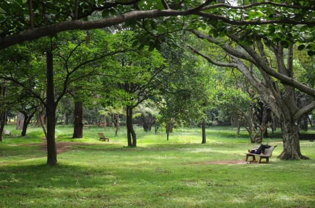

<figure aria-describedby="caption-attachment-1824" class="wp-caption alignleft" id="attachment_1824" style="width: 300px">

<figcaption class="wp-caption-text" id="caption-attachment-1824">Cubbon Park, Bangalore (circa 2009) – Pic courtesy thehindu.com</figcaption></figure>

(Someday this post shall be completed. Until then, here’s a relevant comment thread between me and a New Jersey Indian American woman contemplating the move.)

Other posts related to the “Where in India” decision:

- [Where in India are we moving to?](http://www.ulaar.com/2008/05/30/where-in-india-are-we-moving-to/)
- [The Bombay Seduction](http://www.ulaar.com/2008/06/12/the-bombay-seduction/)
- [Gurgaon Growling](http://www.ulaar.com/2009/06/18/gurgaon-growling/)
- [100 days in Bangalore (Part 1)](http://www.ulaar.com/2008/12/14/100-days-in-bangalore-part1/)

*—-*

*Hi Vishy,  
Great and interesting blog!! I am a 26 yr old married woman staying in NJ from last 2 years. My hubby works with an investment bank. We two are also seriously thinking of moving back to India and we definitely belong to “should-we” group..:)I read all your posts, sequentially, right from the first one and really felt surprised how simila we ppl think in terms of living in US and when talked about going back to India. We also are in the process of deciding upon the city to which we want to move. And we hav also selected Delhi/NCR, Bangalore, Mumbai as our options. Both of us belong to UP.  
I have seen New York city and absolutely love its diverse and cosmopolitan crowd, the freedom in the air. And thats why I am more inclined to settle in Mumbai. When I was reading your post “The Bombay Seduction”, I felt its something special about Mumbai city that everybody who goes there falls in love with that..:)but later in your post found out that you are settled in Bangalore. Would you please tell me why you and Poonam made this decision? I understand its all the individual’s choice and the preferences but in the end of the post you showed your intent of living in Mumbai. Actually I am collecting all possible informations from my friends and different sources which can help us in making a right decision about the city, job etc while moving back to India. Your valuable experience might help us.  
Once again would like to say I really liked your blog. You have put your thoughts and experiences in a very interesting manner. Would love to hear from you,  
With Best Wishes,  
PS*

——

—–

*Hi PS,  
So glad you are finding the blog interesting &amp; useful. There are 3 posts that I never completed:  
Gurgaon Growling  
Bangalore Calling  
Why we chose Bangalore*

*I have a fond hope that during the Christmas holidays I’ll complete them (your comment is inspiration enough). Meanwhile here’s the short version of our decision:  
1\. Since we have 2 young kids, having sufficient “playing spaces” was a top criterion. This translated to “gated apartment communities” which were present in greater profusion (&amp; affordability) in Bangalore than Mumbai.  
2\. Had we been contemplating this move 10 (or even 6) yrs ago – an era sans kids, Bombay might have trumped Bangalore.  
3\. New York is to Mumbai as Silcon Valley is to Bangalore. During our years in US, both Poonam &amp; I longed to live in New York for a few years. The window of opportunity (we felt) was again in the pre-kids era so it passed.  
4\. I’m not saying a family with kids cannot live in Mumbai – it’s just that for a family with kids returning from US, Bangalore is a softer landing than Mumbai. In your case (assuming you don’t have kids yet), Mumbai sounds like a great fit, especially if you consider the fact that your hubby is an investment banker (for financial folks, Mumbai trumps Bangalore big time).  
5\. Finally, after spending 10 excellent yrs in Silicon Valley, the fact that Bangalore ethos was the closest to it clinched it for us. Will elaborate on this in the ‘Bangalore Calling’ post *

*Wish you the best in your moving plans. Hey – maybe you should start your blog? And keep the questions/comments coming..*

*Vishy*

—–

*Hi Vishy,*

*Thanks for your reply!! Many of the NRI people whom I have interacted with have chosen Bangalore to settle down while moving back to India. I wish to know the positive aspects about B’lore city- is it  
1\. plenty of job options  
2\. similar-to-US lifestyle  
3\. Pleasant Weather*

*However, I have heard from my age-group people that Bangalore has extremely high cost of living(high rents and real estate prices). And the road traffic is sickening and horrible over there.*

*If possible, pls share your views and experience (till date) about Bangalore and Mumbai city. I will be looking for a job in an IT co., so would like to explore whether Mumbai would have enough IT job opportunities. Also as you have moved very recently there, is the IT job market bad in India too? Is hiring taking place?*

*Looking forward to your next posts..:)  
Happy Christmas and a great new year 2009!!  
PS*

——

*PS,  
Yes to all three – plenty (read PLENTY) of job options – especially for techies, closest to SF Bay Area (&amp; by corollary US) and best weather among all the leading metros. One cannot over-emphasize that aspect. There’s a reason Californians are happier than East-coasters (ok – I only have anecdotes as proof). I believe every Indian metro has one redeeming quality – in the case of Bangalore, #1 is the weather. For a techie, there’s also a strong #2 – abundance of job choices.*

*Yes – traffic sucks big time. Then again, with the exception of Delhi/NCR, other metros are no great shakes either. Mumbai traffic is quite lousy, Hyderabad’s traffic might get better faster than Bangalore’s.*

*Regarding IT jobs in Mumbai – sure there are a fair number of them but it doesn’t come close to Bangalore. If you are looking for a career in technology product development, Bangalore is a clear #1 (followed by Hyderabad, Chennai, and Gurgaon/Delhi – order depends on who you’d ask). If it’s IT in finance, Mumbai would be a really good bet.*

*The IT job market in India is not yet bad. However the operative word may be ‘yet’. Technology product &amp; service companies are still hiring in 2009 but everyone’s really cautious. In this global meltdown state, it’s hard not to get affected.*

*Vishy*

—–

