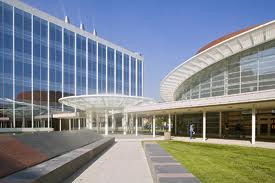

University of Houston – Science &amp; Engineering Building

This is Part 2 of a 3-part series on my life in America spanning Houston, Chicago and SF Bay Area. Part 1 was [Memories of an American Life (4 years in Chicago)](https://www.ulaar.com/2008/11/11/memories-of-an-american-life-4-years-in-chicago/). I reached Houston, Texas on August 16, 1992. When I arrived, I had just one friend (Namita Raghavan - classmate from BIT Ranchi). When I left for Chicago 2 years later, I had made several dozen good friends, and plenty of good memories. Below are some fond recollections:

- Seeing Namita’s friendly face at the airport.
- My first experience of American freeways in Soumya’s tiny 1992 Dodge Colt with cars whizzing by on both sides.
- Eating my first Pizza Hut pizza at Namita’s Cambridge Oaks apartment the evening I arrived.
- Experiencing campus life at University of Houston during the first semester.
- Starting my book collection via Houston Public Library’s annual book sale at the Astrodome. In Shiv’s words that day, I bought books *like people buy potatoes*.
- Teaching Fortran Programming to a class of 45+ sophomores. Enuf said – I survived!
- Interviewing at Compaq for an internship and learning that they had so many employee groups moving offices, they needed to build a system to optimize it.
- Getting a summer internship at Grumman Technical Services and a brief exposure to a quaint 4GL called Peregrine Systems.
- Buying my first car – a maroon 1984 manual transmission Volkswagen Jetta.
- Tequila shots with Naveen, Shiv, Asmi, and a Mexican couple (pursuing Ph.D in Economics). Btw, no self-respecting Mexican does ‘shots’ – they drink their Tequila straight up.
- Singlehandedly demolishing a large Pizza Hut pizza in under 30 minutes. My witness and co-glutton was my dear friend Naveen who, as I was his witness, also demolished a large pizza.
- 36-hour Greyhound trip from Houston to Charlottesville, Virginia. Developed a fresh appreciation for vegetarian choices available in large cities (read “Houston”).
- Exciting day at Astroworld – my first trip to a Six Flags theme park.
- Continuing Soumya’s fine tradition of driving the 41 mile 610 Interstate loop in the wee hours of the morning as a ‘reward’ for completing assignments.
- Driving Soumya’s Dodge Colt on 610E in the left lane and discovering that the brakes had stopped working. Thanks to my non-panicky copilot (was it Gorty?), managed to execute a sequence of nervy lane changes which eventually brought us safely to the shoulder.
- Renting a Toyota Camry and driving nearly continuously (for 36 hours) to Minneapolis. My cousin Swarna (who was doing her MBA at Baylor University, Waco) was the fearless copilot. Getting my first ever speeding ticket at Huntsville (just 60 miles north of Houston) was the rite of passage. And to think that if Soumya hadn’t loaned me a fuzz-buster, I might have been clocked at 100mph!
- Road trip to Tampa, Florida over a Labor Day Weekend with Soumya. Rental car: Pontiac Grand Prix with a moon-roof and fancy steering controls. We perfected the art of “zero stop” driving.
- Awesome trip to the Big Bend National Park with Soumya &amp; Naveen. We fell asleep in the car in front of the Visitor Center and woke up to see the majestic mountains up close. We dined in Alice’s Restaurant (a vegetarian restaurant to boot) in Terlingua – aka “Ghost Town”.
