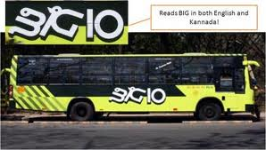

<figure aria-describedby="caption-attachment-1613" class="wp-caption alignleft" id="attachment_1613" style="width: 298px">

<figcaption class="wp-caption-text" id="caption-attachment-1613">Pic: courtesy sumanbhat.wordpress.com</figcaption></figure>

I first met [Sanjay Anandaram ](http://www.jumpstartup.net/ourpeople.html)(serial entrepreneur turned venture capitalist) during the [Dec 2008 Jethro Tull concert](http://ulaar.wordpress.com/2008/12/28/jethro-tull-at-palace-grounds-bangalore/). We connected on the intellectual level and had some interesting conversations as we drove in Tridib’s car to Palace Grounds. Sanjay lives in Raheja and, while we haven’t met again in person, occasionally sends useful social &amp; civic related emails. A few days ago, he sent this message about [ABIDe](http://www.abidebengaluru.in/) (Agenda for Bengaluru Infrastructure &amp; Development) exhorting Bengaluru residents to start using the newly commissioned and expanded Volvo public bus service using a corridor approach. Read on.

*—- begin email —-*

*Dear Friends,*

*As you are aware, ABIDe (Agenda for Bengaluru Infrastructure &amp; Development) Task Force, with the Chief Minister as Chairman, Mr. Ananth Kumar (MP-Bangalore South) as Vice Chairman and Mr. Rajeev Chandrashekar (MP – Rajya Sabha) as Convener, has been constituted to revive and rebuild Bengaluru through a combination of Comprehensive planning, improved municipal services and new investments into infrastructure. ABIDe also owns the task of providing a blue-print for sustainable and orderly development of Bangalore under Bengaluru Vision 2020.*

I and Ashwin Mahesh (IIM-B), are entrusted with the task of suggesting solutions to the Traffic and Transport issues of Bangalore – A tough job indeed :). Please visit <http://abidebengaluru.in/report/show/7> to read and give suggestions on our recommendations.

The Transportation team at ABIDe has identified public transport as the most important tool in reducing traffic congestion and chaos on Bangalore roads. Given that metro rail network is still some years away, Bus based public transport system is being promoted with a corridor approach.

To promote public transport and make travel hassle free, 10 major arterial roads (Big-10) have been identified as high density traffic corridors which will be made junction/signal free with dedicated point-to-point Bus Services, both A/C and non-A/C buses, named as Big-10 service.

Priority Bus Lanes, Bus Bays, Paved Footpaths, Safe Pedestrian Crossings, Cycle Lanes (proposed) will also be introduced on these Big-10 routes. We have 3, 6, 12, 18 and 24 month deadlines to accomplish all these Road Infrastructure Improvement objectives on all Big-10 Corridors. Please visit ABIDe website for corridor and other details. – <http://www.abidebengaluru.in>

However, deployment of Big-10 and Hop-on Hop-Off (HoHo) Bus Services has already begun.

Out of 10 Corridors Big-10 Bus Service is already in operation on Hosur Road (Vellara Jn – Electronic City) and HAL Airport Road (Trinity Jn – Whitefield-Hope Farm jn). This is proving to be extremely popular. Next week Bannerghatta Road Big-10 Service will start. In next 2 months all 10 Corridors will have Big-10 Bus Service with a frequency of 5-10 minutes, both A/C and Non-A/C Service.

This service CONVENIENTLY connects with Central Business District (CBD) HoHo Service (Kendra Sarige) at Vellara Jn on Hosur Rd and Trinity Jn on HAL Airport rd respectively. This makes it extremely convenient for anyone living and commuting on these routes to use this Big-10 Service in conjunction with CBD HoHo service to reach any point in the city including all shopping malls and offices, without the need to take their private vehicles to work or shop.

I have myself used these services and they are extremely convenient and efficient.

Please encourage all your friends and colleagues to use these BUS services. Traffic congestion will reduce only if we stop/reduce taking our cars to work and shop.  
No amount of cribbing or road widening is going to help if we keep adding private cars to our roads. Now we have the comfortable and convenient public transport in close proximity to our homes and work places, lets use it and help our city and the environment.

*PS: Please send this e-mail to your friends and colleagues with suitable modifications as you deem fit. We need to popularize public transport through media, blogs, personal contacts and word of mouth, to save Bangalore from traffic chaos.*

*—— end email —–*