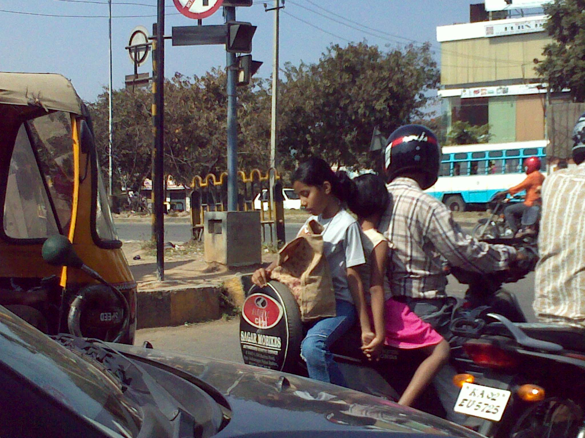
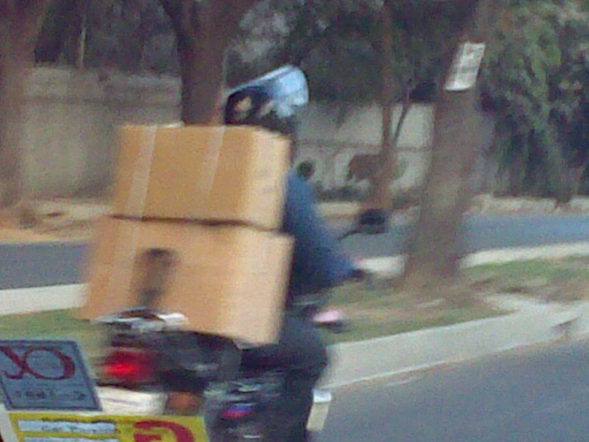
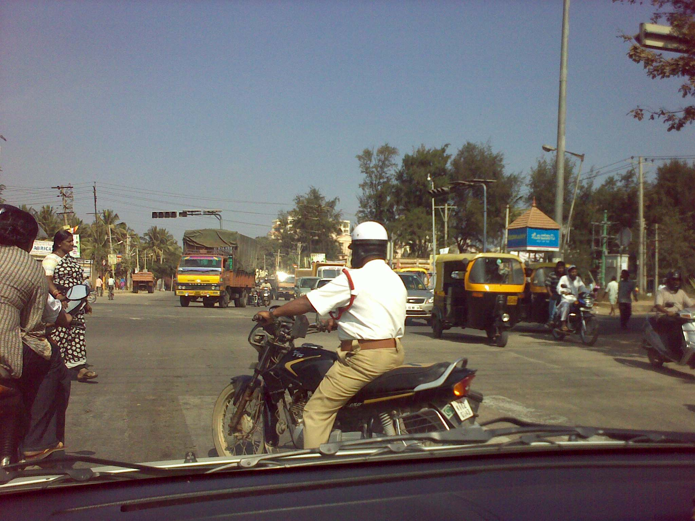
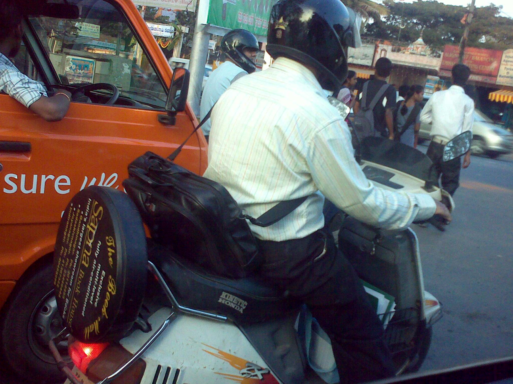
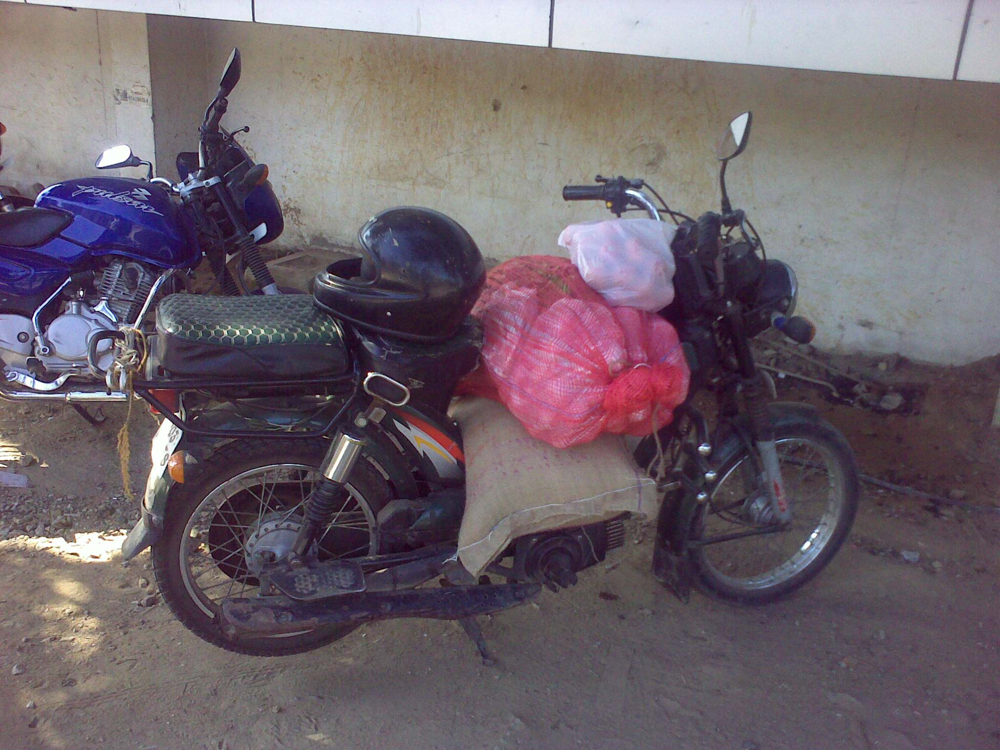
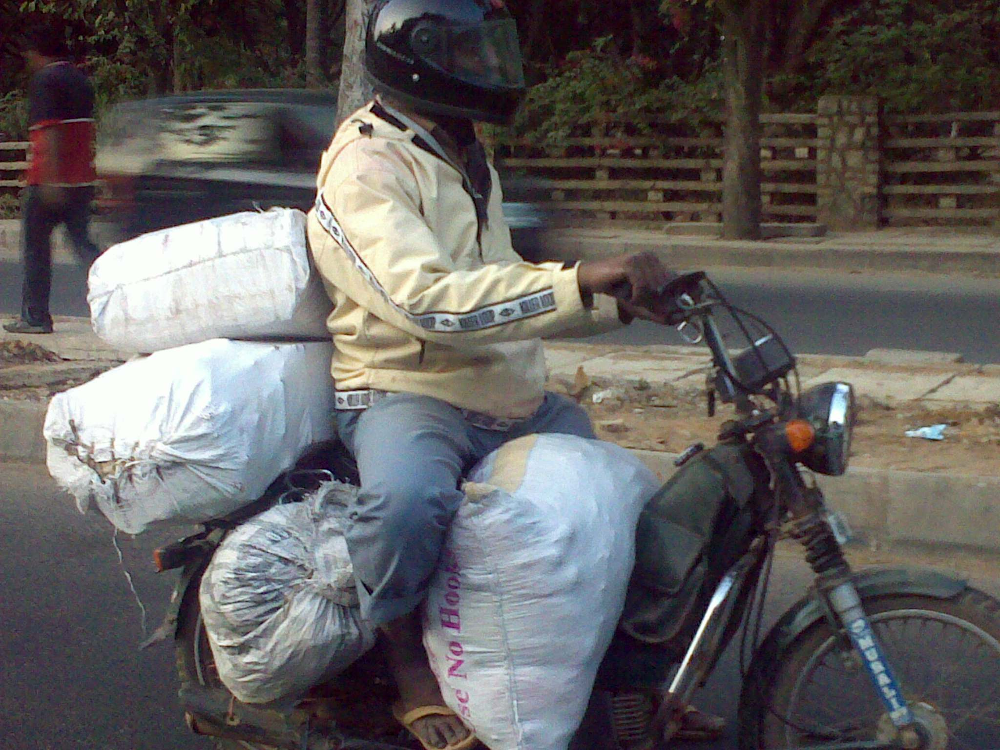
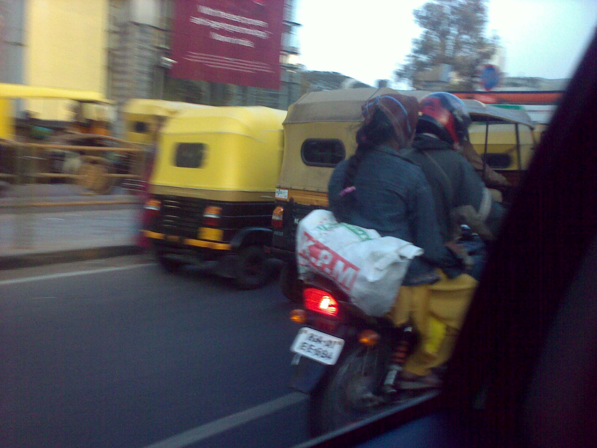
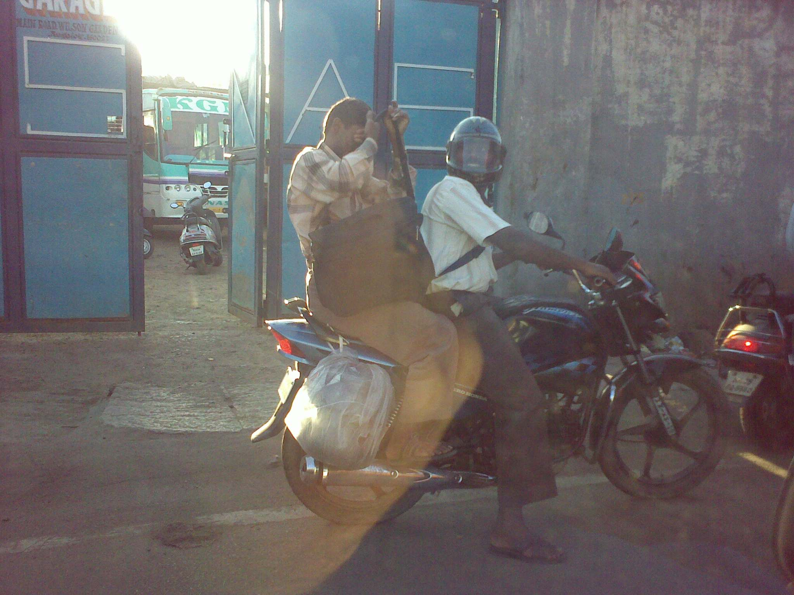
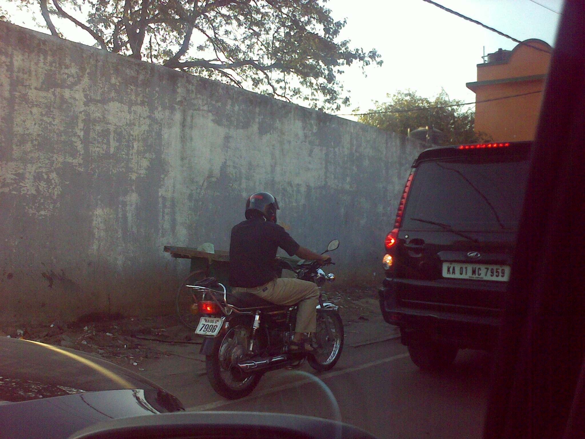

Sure, the number of automobiles on Indian roads has dramatically increased in the last 20 years but it still pales in comparison to the urban steeds that zip past lumbering 4-wheelers, zig &amp; zag through gnarling traffic, and frustrate pedestrians when they get on the pavements in a bid to weave traffic jams. I’m referring of course to the timeless 2-wheelers of India – ranging from the venerable Bajaj scooters (a vanishing breed) to the automatic transmission scooters (Honda Activa &amp; its kin) to the Royal Enfield Bullet (India’s Harley Davidson) to the ever evolving crop of 100cc/125cc/150cc motorcycles from Hero Honda, Yamaha, Suzuki &amp; the indigenous Bajaj to the scooty (TVS-50 et al).

Between the LML Vespa scooter I used to ride in Jamshedpur (1992-94) and the Suzuki GS-700ES I used to ride during my Chicago years (1995-1998), I have fond memories of the ‘wind in my hair’ whether I used a Studds or a Shoei helmet. It may thus surprise the reader to discover that the rest of this blog (the photographs I’ve collated in the past 3 months) have nothing to do with ‘riding into the sunset’ motorcycle rider. Rather, it is about the diverse type (&amp; number) of passengers and cargo that are laden behind the 2-wheeler’s driver. The concept of a ‘pillion’ itself is redefined in India – you can have a mom &amp; two kids sitting in the traditional pillion seat or you can have 2-3 kids sitting on top of the motorcycle’s tank or you can have a 4-10 year old kid standing on the front footboard of a scooter. In my first month in Bangalore, I even saw a scooter-driving mom with an infant in a Baby Bjorn equivalent sling – I was too shocked to whip out my trusty camera in time. With all these examples, shouldn’t we call the urban Indian steeds as MPV (Multi Purpose Vehicle)?

I present to you a few urban steeds in the din and roar of the Indian roads living up to their multi-purpose image.

