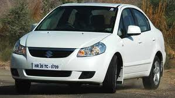

Pic: courtesy bsmotoring.com

(Part 1 of a two part series)

We bought a new Maruti Suzuki SX4 in early Sep 2008. Since I was not in a terrible hurry to drive in Bangalore traffic, we had to get a driver. The initial plan was to hire a temporary driver from one of the agencies (they’d be pricey but allegedly more reliable) – the rationale being that it would take longer to find a reliable driver. The plan fizzled out quickly since all the leads I got were either defunct listings on [Asklaila](http://asklaila.com) or had gone out of business. I would find out much later (in March 2009) about EziDrive but that’s another story. We started getting driver leads from various quarters. The first lead was quite promising – a 22-year old chap (Sunil Kumar) referred by a *driver-in-Adarsh-Vihar who sorta-knew-Sunil’s-brother-in-law*. We’ll return to the italicized phrase in Part 2 of this story.

So what was promising about Sunil Kumar? For starters he spoke Hindi (very well). He also understood English. He knew the streets of Bangalore very very well (unlike many of the clueless taxi and auto drivers whom we encountered in the initial weeks). He lived in Balajinagar – pretty close to Koramangala. He *looked* honest and reliable. He had been driving for 3 years. We asked him for his references and he responded that *his previous employer had moved to Hyderabad and he had misplaced his mobile number*. We hired on a 2-week probation period with the intention of making him permanent (if he made the ‘cut’) while still keeping the search on for other drivers. As the two weeks drew to an end, we had lined up only one other candidate driver – recommended by a very good friend’s long-standing highly-reliable driver. Unfortunately that lad couldn’t speak Hindi to save his life. Needless to say, that conversation didn’t proceed much further. We also interviewed another driver who spoke passable Hindi but lived very far away so we ruled him out as well. Meanwhile, Sunil’s probation period had gone rather well. He impressed us with his safe driving skills, especially commendable because of his young age. He arrived promptly at 8am every day and his conduct throughout the initial weeks gave us no reason to doubt his attitude or character. This, combined with the fact that we had no credible alternative to compare with, was moving us inexorably towards making him permanent. The ‘deal terms’ discussion, with representation from his brother-in-law, converged quickly enough. 6-day work week, 10-hour working days, off on Sunday and a monthly salary of Rs. 6500. Coincidentally my starting salary at Tata Steel 18 years ago was Rs. 6600 – a princely amount for fresh engineering graduates. Inflation thy name!

Sunil is a short thin man of dark complexion with alert eyes. He looks older than his 22-years, not surprising considering he started working when he was 14 or 15. He lives with his parents, two sisters, a brother-in-law and a niece in a pucca house in Balajinagar. His father is a drunkard and a wastrel. His mother works in a semiconductor company as a janitor. One of his sisters also works and his brother-in-law is a driver who owns his own taxi. The commute from his home to ours is a 45 minutes walk. And walk he did every day, since his bicycle was stolen earlier by miscreants.

To be continued…
