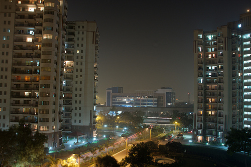

<figure aria-describedby="caption-attachment-1826" class="wp-caption alignleft" id="attachment_1826" style="width: 300px">

<figcaption class="wp-caption-text" id="caption-attachment-1826">Gurgaon at night (Pic: courtesy flickriver.com)</figcaption></figure>

*I wrote this post in my head in June 2008 shortly after my 2-week reconnoisance trip to India before the big move. Thanks to the growing list of candidate topics and my ever shrinking leisure time, it didn’t see the light of day. During my flight back from my business trip to Bay Area in June 2009 (exactly a year later), I finally managed to finish the post. It took a further 3 weeks to make it from “paper notes” to WordPress 🙂 Now just pretend that you are reading this in Jun 2008.*

[Marc Canter](http://marc.blogs.it/) (of [Broadband Mechanics/People Aggregator](http://www.broadbandmechanics.com/) &amp; [MacroMind](http://en.wikipedia.org/wiki/MacroMind) fame) had come to Yahoo in mid-2006 to give a tech talk. With a downtown skyscape as his first slide, he quizzed the audience about the city’s identity. Nobody could guess it and he announced that it was Gurgaon – India’s fastest growing city. Why was Canter telling us this? Because the software for PeopleAggregator (the thrust of his talk) was being written in Gurgaon. The transformation of Gurgaon, Haryana from a sleepy village on the outskirts of Delhi to a technology and industrial hub (worthy of Thomas Friedman’s [World is Flat](http://www.thomaslfriedman.com/bookshelf/the-world-is-flat)) was complete.

Of course, Delhi NCR is more than just Gurgaon (it encompasses Noida, Ghaziabad and Faridabad as well) but I happened to spend most of the 3 days in Gurgaon. I had flown in to Delhi to interview with a Gurgaon-based technology firm (there are so many, bet you can’t guess which one). Interview done, my friend Pranshu (colleague from Yahoo days) picked me up and we headed to dinner. Along the way, I called my classmate &amp; friend from Xaviers Bokaro days (Ritu) who absolutely and warmly insisted (in a way that only treasured old classmates can) that I stay at her flat in Gurgaon. We had last met in 1987 but thanks to the last two years of reconnecting via our school’s Yahoo Group, we just picked up where we left off. Ritu was still the same bubbly girl with the infectious laughter. It was a great weekend spending quality time with her husband and two kids and a thoroughly enjoyable Sunday afternoon party with the rest of our Xaviers Bokaro classmates (Geeti, Vikram &amp; Amitabh).

By now you are probably wondering about the title of this post – growling huh? I’ve seen a lot of cities (both in India &amp; America) but they were all ‘already built’ cities. Gurgaon was the first city I glimpsed in the throes (albeit ‘late stage’) of being built. A few months ago (in a video conference interview with yet another Gurgaon-based company), I asked the interviewer what he liked most about living in Gurgaon. His reply “After living in Bangalore for 8 years, Gurgaon weather absolutely sucks – especially in summer. However, we all know that India is growing at a frenetic pace. Living in Gurgaon gives me a bird’s eye view of India’s growth — skyscraper by skyscraper, road by road, month by month, also as the Delhi metro extended deep into Gurgaon.” As Pranshu drove me through Gurgaon late afternoon (after a memorable day of “Offroading in Behrampur”) in his open Jeep, I saw scores of skyscrapers in various stages of completion and I couldn’t help thinking of it as “Gurgaon Growling” at the sky above. I also wondered what it would be like to see a time lapse photography seequence of Gurgaon from high-up in the air. \[[Google Maps](http://maps.google.com) – are you listening?\]

If you thought I had an exciting weekend in Gurgaon, you haven’t heard the half of it. My friend Pranshu is fond of motorcyles, open jeeps and adventures involving both. He used to own a 600cc motorbike and a Jeep Wrangler during his Silicon Valley days and his move to Delhi (Vasant Vihar) hasn’t cramped his style one bit. He bought himself a bright red Jeep, did a whole bunch of customizations and teamed up with a group of fellow crazy offroading enthusiasts. Pranshu’s gang would spend the better part of every Saturday in a hamlet called Behrampur (on the outskirts of Gurgaon) and attack various hilly slopes and muddy swamps. I don’t need a second invitation for any adventurous gigs so I accompanied Pranshu on Saturday armed with my trusty Canon Powershot TX1. I was blown away by the day’s proceedings – rumbling and groaning of powerful 4×4 Jeeps, splashing through muddy hollows (much to the angst of a few slumbering buffaloes), towing jeeps up steep slopes. After the day’s fierce festivities drew to a close, it was a real bonus to see dozens of beautiful peacocks strutting &amp; squawking in the wild. They say ‘a picture is worth a thousand words’ so enough said – here’s the link to selected videos from that adventure (thanks again Pranshu!):

[Offroading in Behrampur/Gurgaon](http://ulaar.wordpress.com/2009/09/21/offroading-in-behrampur-gurgaon-selected-shorts/)