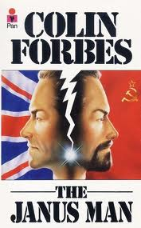

 Pic: courtesy goodreads.com

This is a sequel to [The Proud Man](https://www.ulaar.com/2009/04/17/the-proud-man/) and is based on a series of events that occurred in March 2009.

*Act 1, Scene 1: Raheja apartment living room (Time: 2:00pm)*

“Madam! Aap garage mein jaldi aayiye. Aapke gaadi ko kuch ho raha hai.” (Translation for non-Hindi readers: please come to the garage quickly. Something’s happening to your car). This was an anonymous tipster call which came through the intercom one afternoon in early March. Not wanting to take any chances, P went to the lobby and had one of the security guards accompany her to the garage. As she neared our parking spot, her worst fears seemed to come true – the car was gone! A minute later (lo and behold!) she sights Sunil backing our car from one end of the garage (several car lengths away from our parking spot). At the same time, Sunil’s friend (a fellow Raheja driver) rides Sunil’s new Bajaj motorcyle and parks it behind the SX4. Cursing the anonymous tipster, P tapped on the driver’s window to enquire why he moved the car. The shocked look on Sunil’s face would later become the proverbial Exhibit A. He recovered his composure quickly enough to mumble that there wasn’t sufficient room to maneuver his motorcycle and hence he had to move the car. “Odd,” thought P but the explanation satisfied her and she went back upstairs mentally cursing the tipster again for wasting her time.

*Act 1, Scene 2: Raheja apartment living room (Time: 2:15pm)*

Phone rings again – same anonymous caller. He asks in a smug tone “Madam! aapne dekha?” “Kya dekha” replied an irate P. The disappointed tipster begins his story “Sunil aapke gaadi se petrol chori kara raha tha. Woh to shuru se chori kar raha tha.” P went into fact checking mode and grilled the tipster (what was Sunil doing with the stolen petrol and why was he spilling the beans?) Apparently, in the initial days and months of pilfering, Sunil would sell the petrol to other Raheja drivers. Ever since Sunil got his new motorcycle, he simply took to topping that gas tank at convenient intervals. The tipster was so confident , he urged P to examine Sunil’s motorcycle’s gas tank (predicting that it would be full to the brim). As to the tipster’s motives, he simply could not bear to see us being cheated month after month.

*Act 1, Scene 3: Block X lobby*

There are eight blocks in Raheja Residency – the anonymous call had come from block X. Just for precaution, I’ve decided to keep the identity of Block X a secret. Determined toe get to the bottom of the evolving events, P proceeded to block X. Even though Sunil was implicated thus, such was the trust level he had established with us that P still considered him “innocent until proven guilty”. She asked Sunil to accompany her to block X without stating the reason. The call was traced to the block X manager’s office (which is on the garage level). The block X manager deliberately took P aside and repeated what the tipster had already told her – that Sunil was stealing petrol from our car. The manager had allowed the tipster to use his office phone because: a) tipster was one of the drivers in block X, and b) he knew the story to be true and wanted the car owners (us) to be made aware of the happenings. So why did the manager have no reason to doubt the tipster? For the simple reason that petrol pilfering is not uncommon at all in Raheja. (The next day when I went to meet the block X manager to obtain more facts, I learned how rampant the pilfering racket was at Raheja and even other apartment communities in Bangalore but I digress…) P walked back to the apartment – troubled and contemplative. She didn’t share anything with Sunil but he clearly knew that something was amiss.

*Act 1, Scene 4: crowded stretch of Koramangala 80-feet road (Time: 3:30pm)*

On the way to the Oasis mall, P tells Sunil to pull over on the side of the street. With the engine switched off and both outside the car, she confronted Sunil with the accusations. Sunil had the same guilty look but he kept repeating that he was innocent and uttered the rhetorical “how could he commit this ghastly deed when we’d been so nice to him?” He made the seemingly absurd statement that he doesn’t even know how to steal petrol from any car (especially the SX4). The other damning thing was that he never offered any character witness to corroborate his innocence. You’d think one among the group of drivers (perhaps his good friend Manju – who was parking his motorcycle) he hobnobbed with would be propped forward to defend him. I guess not if the entire lot was rotten – if the tipster was right, the other drivers were buying stolen petrol from him. P told Sunil that she wasn’t sure whether he was guilty or innocent. If he was guilty, we would find out in due course. If he was innocent, she told him to watch his back since someone was out to get him fired. Later in the evening, Sunil mentioned to P that he had talked to the other drivers and the consensus was that the pall of suspicion would be upon him whether or not he was guilty.

*Act 1, Scene 5: “Smoking gun” found inside our apartment (Time: 9pm)*

After P briefed me on the day’s events and we played &amp; replayed all the events, it occurred to us that we were monumentally stupid in at least 2 areas:

- In the 6 months since we bought our car, we never calculated how much mileage each tank of petrol was giving us. Sure we had a lot of things on our minds in the initial months of adjusting to Bangalore life… (that was our lame excuse)
- During the day, as Sunil waited in the garage for the next driving assignment (picking up the kids, shopping trip, etc.), we let him keep the keys. On most days, this meant that he was undisturbed in the garage for 2-3 hours at a stretch (with the car keys). We learned later that this was simply not a standard practice and was rife with risks.

Anyway, I was VERY organized about my petrol receipts. I kept every single one of them in a safe place, so I pulled them all out for the last 3 months and observed that we were filling up 40 liters of petrol every week (give or take a day). Assuming 9 km per liter for the SX4 (low-end for city driving), this suggested that we were traveling 360 km per week! Gosh! Were we suckers or what? This was *way* higher than our driving patterns in the past 3 months. Just in the event that our recollection of the past 3 months was sketchy, we focused our attention on the last 6 days of driving (i.e. from the last refueling). The precise driven mileage came to 130km which meant that the fuel guage should display a reading greater than 1/2 tank. Alas! the gauge displayed close to empty.

*Act 2, Scene 1: Confrontation (take #2)*

Next morning after Sunil dropped me at the office, without giving him any prior notice, I told him I needed to speak to him. I sat him down at a Coffee Day table and launched into “People versus Sunil”. He predictably professed his innocence. I had him do the math on how much distance he was driving us every day over the 6-day period and he arrived at the figure of 140 (close to my calculation of 130). I then walked him over to the car dashboard and showed him the near empty fuel gauge. I also told him about the last 3 months of petrol bills with weekly refueling of 40 liters, yet driving 130-160km. Sensing the trap closing around him, Sunil comes up with two lines of defence.

Defence #1: Apparently he had ‘heard’ that petrol was being stolen in the garage. He related that petrol from one of the driver’s scooter had been stolen once so it was ‘possible’ that someone was stealing from the SX4. I asked him who it could be since he was the only one with the keys. He insisted that it wasn’t him and also repeated the earlier ridiculous defence that he didn’t know how to remove petrol from cars. This doubly stank because the two times we had to get the car serviced (at the dealer), he keenly drew our attention to the fuel gauge and advised us to refuel the car following the servicing because the service technicians would otherwise steal the petrol. Nice!

Defence #2 (a conspiracy theory with communal overtones): Apparently there are rival factions of Kannada and Tamilian drivers in Rahejs (with the latter being the majority group for our block). The building manager (a Tamilian) was allegedly “in” on a conspiracy to oust Sunil so that one of his henchmen (a fellow Tamilian of course) could be hired in his place. He promised to provide more evidence in due course.

The rest of the days’s interactions with Sunil were conducted in a stony silence and a stiff upper lip.

*Act 2, Scene 2: The resignation &amp; Mafia connection (Time: 7:30pm)*

I get a call from Sunil and he informs me that due to the pall of suspicion on him and the intrigue between the Tamilian &amp; Kannada drivers and the alleged conspiracy to oust him, he feared for his personal safety &amp; the safety of his new Bajaj motorcycle. He would thus stop coming to work from the next day. He also gave me the names of three Tamilian drivers (who were currently looking for a driver job). His smoking gun was that our block manager would come forward and recommend one of these 3 drivers. I didn’t bother telling him that even if the conspiracy theory were true, it still wouldn’t vindicate him. Weeks after Sunil’s voluntary resignation, the building manager never recommended a single driver to us – so much for that conspiracy theory. The additional irony was that during the 2 days when P was talking to various folks in the block, the block manager gave the benefit of the doubt to Sunil and just warned us to be more careful. Here’s the last thing that Sunil said that evening “*Aap mujhe dikhaiye kisne aapko mere bare mein phone kiya, mein use dekh loonga*” (Translation: You show me who the tipster is and I’ll take care of him. The tell-tale “*use dekh loonga*” – doesn’t get more mafiosi).

Title of post was inspired by a Colin Forbes novel by the same name.

