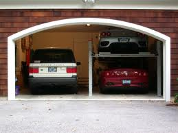

 You can be sure that our garage would never look like this. Pic: courtesy bitsandpieces1.blogspot.com

(First guest post from my wife. It’s actually an email she wrote on the Raheja Residency “residents only” forum but I found it so funny that I had to post it here. Maybe she’ll follow-up with a few more posts that she’s actually on the hook for — refer to [A Year in Bangalore – The Unwritten Posts](https://www.ulaar.com/2009/09/06/a-year-in-bangalore-the-unwritten-blog-posts/)). *Garage Gang* refers to a good majority of the drivers employed by Raheja Residency residents and, who, spend most of their dead time in (you guessed it) the Raheja garage.

—-Begin email—– 

*There are folks who say don’t sweat the small stuff…well good for them. The rest of us need to vent i.e. give public utterance to our shared grievances. This post is devoted to those who deal with the garage gang on a daily basis. Before we go further,* ***please understand we expect absolutely no action by the management to resolve this ongoing problem***. 
*So feel free to share with your fellow sufferers how the garage gang added to your day today? Analyze reasons behind such behaviors and offer simple solutions which will never be implemented. Lament the fact that an educated working class community is held ransom by the uneducated working class people. Hopefully in this process you will find some empathy and humor which will ease the pain of dealing with the garage gang. After a few days, you can go about your daily life knowing someone cares about your concerns (at least one of them) without any disappointment that the problem persists – the power of no expectations! For those who have no complaints about the garage gang – and hence no clue what this post is all about – here are some examples of the garage gang-induced maladies…*

1. *Encroachment – parking their employers vehicles and their own 2-wheelers in another residents empty-even-for- 30-minutes car park*
2. *Insolence – continue to shamelessly occupy the wrong car park, with not a hint of apology tendered to the rightfully offended resident, who owns or pays rent for the car park*
3. *Creepy looks – some women are uncomfortable with the looks received when they go to the dimly lit garage*
4. *Arrogance – the attitude of we-know-the- security- guard-doesn’t-care-manager- is-incompetent-president- is-scared- of-us and if-you-personally- take-us-on- we-will-at-a-minimum- damage-your- property*
5. *Theft – vehicle parts and petrol*
6. *Blocking – refusing to move aside and making it as difficult as possible for the other (usually owner) car drivers to drive past them*
7. *Property damage – punctured tyres, scratches, damaged windows*
8. *Unregulated freedom – free to go anywhere in the complex without notification, unlike maids who usually enter through the main doors of a building and are potentially questioned by the security guard regarding their visits*

*Individuals may share their stories and other stresses induced by the garage gang.*  
*We have personally suffered from 1, 2, 4, 5, 6, 7, and 8 (I do feel bad about leaving 3 out in the cold but while friends have complained about the creepy looks, I personally have not noticed them).*

—-End email—–
On a related note, [The Janus Man](https://www.ulaar.com/2009/07/17/the-janus-man/) post describes our first serious encounter with members of the Garage Gang.
