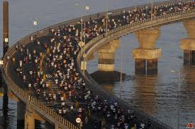
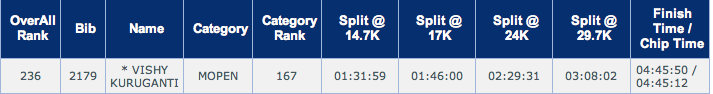
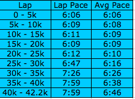

Half-marathoners covering the Worli sealink (Pic: courtesy sulekha.com)

If you’ve not read Part 1 of this 2-part series ([My Road to Mumbai Marathon 2010](https://www.ulaar.com/2010/01/28/my-road-to-mumbai-marathon-2010/)), the short version is this – “a case study in how to train well for a marathon for 4-5 months and then nearly blow it all in the final week before race day”. Anyways, this is part 2 – how I fared on race day, what kind of tricks I played on my body, how my body got its revenge back, and the banter I carried on with a fellow Bangalore runner for more than half the distance.

An hour prior to all my long training runs, a Clif Bar ([Crunchy Peanut flavor](http://www.amazon.com/Nutrition-Crunchy-Peanut-Butter-package/dp/B0000CEO7J)) was my energy bar of choice. Since I started my morning a good 2 hours prior to start time, I consumed an extra bar.

*Race start to 6k*

Experts recommend the race day strategy as follows – run the first 21k at your target pace and the second 21k *by feel*. Sounds simple, right? *By feel* is meant to capture the sum total of vagaries of race day that make it different from all your long training runs. A change in city, weather, start time, what you ate during the last 24 hours, how well you have tapered, are all factors that determine the outcome of the second 21k because the body starts giving you feedback – i.e. whether race day conditions are favorable (or not). My original target pace was 6:02 min/km which translates to a finish time of 4 hours 15 min. I felt this target pace was justified by the fact that I did a 32k and a 34k distances at 5:56 pace in my final training month. With my body not in the best possible shape, obviously I needed to reduce my pace — the tricky part was by how much. So my modified strategy was to start with a 6:15 pace for the initial 5k, see how the body felt and alter pace accordingly.

It was a foggy morning on Marine Drive, I felt surprisingly good in the first 2k, took that to be a good sign and gradually increased my pace. It’s so easy to get carried away during the initial 5-10k and it takes incredible discipline to ‘rein yourself in’. By the time I reached the 5k mark, I realized that I was doing a 6:06 pace – faster than I planned. Started slowing down and at the 6k mark I was in for a pleasant surprise – ran into fellow Bangalore [RFL](http://runnersforlife.com) runner Jothi Padmanabhan.

*6k to 28k*

It wasn’t clear at first who was happier to see the other. We had both participated at the Kaveri Trail Marathon (Sep ’09) – I finished that race (in 5 hrs 15 min) whereas Jothi had bailed out at the half-way mark. Hence, by recent form, I was the ‘better’ runner. Jothi said something on the lines of “Man! if we run together for most of the distance, I think I’ll have a good finish time”. I gave him my sob-story-in-a-nutshell (how I had trained really well with a target pace of 6:02 but with an infection, cold, cough, jetlag, etc. wasn’t feeling particularly strong) and said it was 5k-at-a-time and thank-god-I-have-you-for-company. With the right amount of banter, we plodded on, periodically glancing at our respective Garmin watches as we managed to keep a consistent average pace (6:08 at the 10k mark to 6:10 at the 25k mark). The crowd of runners just ahead of us were very raucous initially — especially in the stretch where the half-marathon runners were running in the opposite direction — they’d recognize many of their buddies and excitedly shout words of encouragement. We wondered how long their enthusiasm would last. Jothi pointed out a hoarding for the L&amp;T South City (yeah Bangalore real-estate). At some point between the 15-20k stretch, a few packs of elite runners overtook us (at a gracefully fast clip). We were surprised to see a lone white man in the midst of the first pack of Kenyan &amp; Ethiopian runners (our reaction was circa “White men can’t jump”). Much later, we saw the white man &amp; a few other Kenyan runners resting — apparently they were pacers for the elite runners! Did I mention Jothi &amp; I running together was really working well? I held his water bottle while he chowed down on some biscuits. He held my bottle while I refilled my bottle with electral and helped myself to [Gu Energy Gels](http://www.amazon.com/GU-Energy-Gel-Pack-Banana-Strawberry/dp/B000PGJ3G6). Talking of Gu energy gels, the other tweak in my strategy was in the frequency and number of gels I consumed. My training call was to consume one every 8k which works out to 4-5 gels. Since I didn’t carbo-load heavily in the preceding 48 hours, I figured I needed to compensate so I took my first gel at 5k and reduced the distance frequency to 7k which made it a total of 6 gels. In the final analysis, this was a good adjustment I had made.

We crossed the half-way mark where we experienced a mild case of pandemonium – an overlap zone where large numbers of 1/2 M and Full M runners were all jockeying for position. Since many runners were walking, this turned out to be an interesting obstacle course section – fortunately no mishap occurred. Much earlier, on Marine Road, we caught several glimpses of the Worli-Bandra Sealink – we were impressed and were looking forward to crossing it on the way back. At the 23k mark, as the Sealink came closer, Jothi commented – *“this is where the men will separate from the boys”*. As if on cue, the 9am Mumbai sun began smiling on all the runners. I’m sure all the Bangalore runners (spoilt by pleasant year-round weather) would agree with me that the sun was *smirking* instead of smiling. The 5.6km stretch of the Sealink started approximately at the 24k mark. Any gradients on a marathon course are to be respected (especially if you haven’t incorporated hill training into your regimen). Many runners were walking on the incline (this is the stretch where I first saw Sunil Chainani of the [Bangalore Hash Harriers](http://greaterbangalorehash.com/home.html) – he was just ahead of us and we overtook each other several times for the next few km). We continued running but reduced our pace because, as Jothi wryly reminded us *“only 18k more to go”*.

Somewhere in the middle section of the bridge, it started feeling like an anti-climax. Sure – we were running on top of one of India’s engineering marvels and the views of the vast open sea and the Mumbai landscape were enjoyable for a few minutes but there was this little matter of running 42km. Was it unreasonable to expect some semblance of a breeze? I distinctly remember reading (in my school geography books) about sea breeze during the daytime and land breeze during the nighttime (or was it the other way around?) The bridge was the most desolate section on the entire course – understandable (because it’s normally off-limits for pedestrians) but it still hurt. (Sigh) If only one of the 3 rock bands we saw in the first 5k had setup their stage on the bridge… Of course, most shocking was the absence of water stations on the entire Sealink stretch of 5.6km and even the 3km following it. Much has been written about this glaring omission \[[TOI story](http://timesofindia.indiatimes.com/sports/more-sports/athletics/Lack-of-drinking-water-on-Sea-Link-comes-in-for-criticism/articleshow/5456229.cms) and [Tanvir Kazmi’s blog](http://runinfinity.com/2010/01/my-mumbai-marathon-2010-race-report.html)\].

I personally did not suffer due to this omission and there’s a good reason for it. First a quick primer on two hydration strategies used by marathoners. For one type of runner, hydrating every 3-5k (sometimes even 10k) seems to be sufficient. For the second type of runner, continuous hydration is preferred. Years ago, while training for my 1st marathon, I learned that my body’s delicate chemical balance demanded a continuous hydration strategy. Anything less would result in a severe bout of headache. For all my training long runs, I would carry my trusty bottle (with a sipper) filled with 50% gatorade 50% water. Depending on the distance, route &amp; group vs. solo type of run, the refilling tactic would vary. In solo training runs in US, refilling was a simple matter of locating the right gas-station close to the half-way mark. In Bangalore, refilling tactics ran the gamut – official water-stops during RFL-organized long runs, Gatorade/water reserves in one of our group’s cars – Pankaj’s Red Dragon, Strang/Rakhi’s Gora-Gadi or Shantanu/Ankita’s Suzuki Swift. Special thanks to Ankita who manned the “water car” on numerous ‘Dandi runs’ even when she wasn’t running herself. When I ran my first marathon, I ditched my bottle on race day since there were water stops every mile (which I believe is a standard for most, if not all, International marathons). [Kaveri Trail Marathon](http://kaveritrailmarathon.com) (aka “KTM”) was a different matter altogether. Water stops were few and far in between and, Electral-spiked water was more infrequent. Since I knew about the water stops before the race, I carried my Gatorade+water bottle which served me well for the 1st half of the race. There were 2 major blunders I committed at KTM. Blunder #1: I ditched my bottle at the half-way mark thinking I would manage fine with the water stops. Blunder #2: I first started walking at the 24k mark (my mind was weaker than my body at that point). Having learned my lesson from my KTM blunders, I carried my bottle all the way till the end (refilling it diligently with water or Electral at every water stop). Thus, while the vast majority of runners were mouthing curses at the SCMM organizers on the Sealink, I was relatively in a more benevolent mood. The sun wasn’t making it easy but compared to the 35-42k stretch, this would appear like a piece of cake.

As we started going downhill (final 1k of the Sealink), Jothi said he’d slow down a bit so I pulled away ever so slightly. I would next see him at the 40k mark.

*28k to 33k*

I descended the bridge, made a left and started looking anxiously for the water stop (I had downed my bottle in anticipation). It took 1-2k more of plodding before I hit upon the water stop. At the 30k turnaround (where I think we crossed a timing mat), I caught sight of Meher and Nari (both fellow Bangalore runners) approximately a minute ahead. Meher (who regularly wins podium spots in Bangalore running events in the Open Women’s category) is an excellent runner. We’ve run many training runs together. During most of 2009, she was significantly faster runner than me. In my final month of training, I ran faster than her in a few tempo runs and one 30k+ runs. While we were both gunning for a 4 hrs 15 min finish time, her target was backed by many months of consistency and, more importantly, a better training plan, not to mention the experience of running Mumbai the previous year. So when I saw Meher, my *irrationally optimistic* brain’s reaction was *“Not bad! all things considered I’m doing pretty well if I’m merely a minute behind Meher”*. As I introspected on this weeks after the race, I realized that this was a sign I was already going too fast — I should have reduced my pace still more to account for Mumbai weather and my non-peak condition. But… let’s say I *had* run at a slower pace for the first 30k, there was still no guarantee that I’d have fared better in the final 12k.

My pace predictably reduced with each passing kilometer. In the 30-35k stretch, I averaged 7:26. As my Bangalore pal Rohit correctly notes in his [Mumbai Marathon race day report](http://rohbust.blogspot.com/2010/01/mumbai-marathon-2010-race-report.html), the crowd support during this stretch was particularly amazing. After drinking a mish-mash of Gatorade, water, Electral, and Gu energy gels for 3+ hours, you start to crave for something else. I’ve never been more excited to see peeled oranges – I feverishly reached out for them from the outstretched hands of 2 Mumbaikar Samaritans. I am not exaggerating when I say that *those oranges were the most delicious things I ever consumed*. God bless those Mumbaikars!

The sun wasn’t bothering me in an overt way even though it was clearly getting warmer and warmer. The operative word being *overt*. With the lessons from KTM still fresh, I had trained my mind that I would *not think* about the sun. I also told myself that running 34k in Vijayawada (with the last 45 min in the sun) counts as preparation — even though it was the winter sun (yes – Vijayawada does have some cooling in Dec-Jan). The temptation to walk was getting stronger and stronger but I resisted. But what does *resist* mean? It merely means that I slowed down my running but *did not walk*. It does not mean that I was running faster than [Chand Ram](http://en.wikipedia.org/wiki/Chand_Ram) or any of future legions of fast walkers. I remembered my friend Strangway’s words after KTM *it doesn’t matter whether you run or walk until you start walking*. But why was it so important that I not walk? or at least delay walking as much as possible? Because once you start walking, your mind concedes a BIG point to the body. What was previously a muffled and barely audible voice from the body making appeals such as *“Err.. could we stop here for a minute?”* to *“Hmm… are we there yet?”* to *“This is really getting monotonous, I say”,* the body’s inner voice gets a major fillip. The tone changes to *“Aw come on! You’ve run a good kilometer since the last walking break. I NEED another break”*. This is the slippery slope story that I personally experienced at KTM between the 24k mark and finish line.

*Virtues of carrying your own bottle*  
I’ve already talked about the primary value of carrying your own bottle – especially for runners requiring continuous hydration. The lesson from my 2nd blunder at KTM 2009 was that the bottle serves yet another important role in the mind-games between the body and the mind. During the end-game miles of a marathon, the mind and body constantly joust for control of the runner – so every little thing can make a difference. The virtue of carrying your bottle till the end (and keep it refilled of course) is that it completely eliminates *at least one less excuse*. The body’s voice cannot sigh like this *“If only you had taken one more swig of Electral at the last water stop, I could have…”* or *“I think I’m dehydrated so let me walk until the next water stop”*. Don’t know about other runners but this certainly worked for me. Eventually I got sick of the warm water/Electral mix but there was always the option for *one more sip*.

*33k to Finish Line*

Somewhere at the start of the race, we saw three yellow jerseyed guys sporting “100 marathons club”. Somewhere close to the 33k mark, one of these guys (a man probably in his 50’s) overtook me. He then turned around and gave me an encouraging smile. I smiled back. Several minutes later, he overtook me again – he flashed me the same encouraging smile (presumably he had stopped for a break and restarted). When this happened a third time, I couldn’t help wondering whether I was having my very own [Groundhog Day](http://en.wikipedia.org/wiki/Groundhog_Day_(film)) moment.

The dreaded Pedder Road hill incline was now upon me. Since I had done no hills training during the past year, there was a healthy amount of apprehension and respect for hills. I managed to run the Sealink incline without walking but the kilometer stretch of Pedder Road was a different matter. The good folks at [Active Network](http://active.com) advise you (in this article [How to tackle Hill Training](http://www.active.com/running/Articles/How-to-Tackle-Hill-Training.htm?act=AFC-SocialMedia&Property=Active&Sport=Running&PageType=Content_Articles&Emp=SA&PostType=Micro_blogging&Site=ActiveTwitter&Dy=02_05_10&Note=How-to-Tackle-Hill-Training)) to *make friends with the hill*. I did indeed make friends with the hill. I’ve said enough about “running slowly but don’t walk”. Desperate times call for desperate/conservative methods. I walked the entire stretch with no shame whatsoever. The walk energized me and I felt a second wind coming. Sadly the second wind was to last a mere 2 km (until the 37k mark) after which I hit the famous marathoners’ wall.

During the last 5+ km, everything seemed to be happening in slow motion. The triumph of mind over body (which was my story for the last 24 hours and the first 37km) seemed to have turned on its head. I was reminded of a squash player’s quote: *“Mind says move, body says #$#$ off!”* I was still running… Sorry, did I say *runn*ing? I meant plodding along at a snail’s pace. I kept trying to step on the proverbial gas pedal but nothing was happening. I was running on EMPTY. No more glycogen stores! No Gu energy gels or oranges or Electral or chilled water was going to turn things around. I just had to keep going. The good news in all this? Well, at least I was not cramping — as that would taken out whatever little joy I was still experiencing so close to the finish line.

The 40k marker came up and I heard a familiar voice behind me cheerfully yelling “Final stretch Vishy, three Queens Park rounds!” It was my race buddy Jothi who had apparently found his second (or third) wind. He overtook me at a gentle clip but his cheerful words egged me on. My legs still wouldn’t respond – they stuck to their robotic pace — the pace which they had decided was suitable for survival. Jothi’s Queens Park reference was to the 700+ meter dirt track in our home ground (Cubbon Park). When I finally did cross the finish line, my Garmin watch informed me that I had run 42.55k (a good 0.35k above the regulation distance). I had finished, I had survived and I was NOT a mess. I went looking for my buddies.

There is always the possibility that I didn’t run or complete the marathon and the above writeup was simply a figment of my imagination. To dispel that possibility, here’s a screen-grab of the official result (well, technically even this could be faked in Photoshop I suppose – so you’ll have to take my word for it):

For my readers who skipped my highly verbose description above in the hope of seeing something pithy at the end, the table below conveys my race day story albeit in crisp clinical terms (I had set my Garmin for 5k auto-laps):

