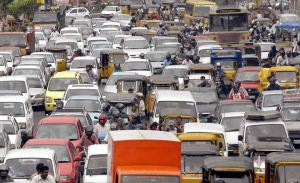

 Pic: courtesy helloji.wordpress.com

This is your first month back in India after half a lifetime in America or Europe or… you are an expat who’s landed in India on a 2-year assignment. You have done the wise thing by hiring a driver but you still have to watch the movements of the heterogeneous traffic – with morbid fascination! Don’t be alarmed…

If you see a motorcyclist riding the wrong way on a one-way road,

He knows that the odds of him getting caught by a cop are very slim.

\*\*\*\*

If you approach an intersection without a traffic light,

India has crowd-sourced the traffic light and the results are stunning.

\*\*\*\*

If you see a motorcyclist standing on the stirrups,

He probably has an hour-long commute and his orthopaedician has advised him to rest his back.

\*\*\*\*

If you see helmets slung on motorcyclists’ forearm instead of their heads,

The helmet law is really about preventing fines, not saving heads.

\*\*\*\*

If you see a slow-moving moped piled high with bales of vegetables and no driver,

Look again – he’s draped on top of the bales miraculously still clutching the handlebars.

\*\*\*\*

If you see three women holding hands and crossing an uncrossable stretch of road,

Haven’t you heard that millions of Indians can separate traffic? Just like Moses could separate the waters.

\*\*\*\*

If you see a motorcyclist riding with his head at a 45 degrees angle,

No – he doesn’t have spondylosis. He has tucked his cell-phone between his helmet &amp; ear and is on a conference call.

\*\*\*\*

If you see a woman walking in the middle of the road and she’s NOT crossing the road,

She’s a great poker player and has calculated that it’s safer to walk in the middle of the road than on the side.

\*\*\*\*

If you see an auto-driver using his turn-signal indicator,

His electrical system is shot – otherwise why would a self-respecting auto-driver use turn signals?

\*\*\*\*

If you see hand signals from the back seat of an auto rickshaw.

No – the passenger is not related to the auto driver. He’s less religious than the auto driver.

\*\*\*\*

If the stray dog sleeping in your car’s shade doesn’t budge even after your driver starts the car,

The dog knows precisely when the gear shift happens and will only move then.

