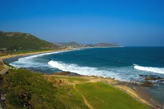
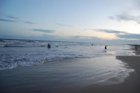
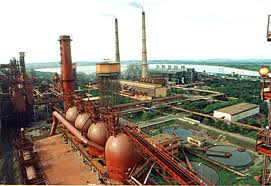

<figure aria-describedby="caption-attachment-1596" class="wp-caption alignleft" id="attachment_1596" style="width: 275px">

<figcaption class="wp-caption-text" id="caption-attachment-1596">One of Vizag's many beaches (Pic: courtesy indiashots.com)</figcaption></figure>

If you haven’t inferred from my surname yet, my lineage is from the state of Andhra Pradesh. My great grandfather was a Sanskrit scholar and taught Sanskrit in Visakhapatnam (aka “Vizag”). He lived in Vizag his entire life. Mobility score: \[1 state, 1 city\].

My grandfather was schooled in [Machilipatnam](http://en.wikipedia.org/wiki/Machilipatnam) (a port town which dates back to at least 3rd century BC) and attended college in Calcutta. Attending an out-of-state college was a big deal in the early 1900’s. If you consider the fact that he was being raised by his mother (a widow at that time), a progressive and remarkable lady, it’s even more impressive. My grandfather completed his B.Comm degree and joined Andhra Bank and worked there until retirement. He proved his mettle as a branch manager and, as a consequence, was frequently transferred to new towns to open and stabilize branches. Partial list of towns he lived/worked in include Vijayawada, Guntur, and Kakinada. Mobility score: \[2 states, 5 towns\].

<figure aria-describedby="caption-attachment-1597" class="wp-caption alignright" id="attachment_1597" style="width: 275px">

<figcaption class="wp-caption-text" id="caption-attachment-1597">Machilipatnam beach at dawn (Pic: courtesy Wikipedia)</figcaption></figure>

My father attended school in Vijayawada and engineering college in Kakinada. He worked for two Public Sector Undertakings (PSUs) – SAIL (Steel Authority of India Limited) and RIN (Rashtriya Ispat Nigam). He started his career in Bhilai (Madhya Pradesh-&gt;Chhattisgarh), then moved to Rourkela (Orissa), a long stint at Bokaro Steel City (then in Bihar, now in Jharkhand) and finally retired in Vizag (Andhra Pradesh). Mobility score: \[4 states, 7 towns\].

<figure aria-describedby="caption-attachment-1598" class="wp-caption alignleft" id="attachment_1598" style="width: 271px">

<figcaption class="wp-caption-text" id="caption-attachment-1598">Bokaro Steel Plant (India's 4th integrated steel plant, built with Soviet help)</figcaption></figure>

I grew up in Bokaro Steel City, completed my high school from Vizag, attended college at Ranchi (Bihar-&gt;Jharkhand), worked for a few years in Jamshedpur (Bihar -&gt;Jharkhand), 16 years in America (Houston-&gt;Chicago-&gt;San Francisco Bay Area), and presently in Bangalore (Karnataka). Mobility score: \[2 countries, 3 states, 5 Indian towns, 3 American cities\].

The fourth generation (our 2 boys) haven’t quite hit their 7th birthdays yet but their mobility score already reads: \[2 countries, 2 cities\]. I wonder what their score will be by the time they hit their 40’s. Me wonders if new mobility dimensions like planets and space stations need to be added by then…