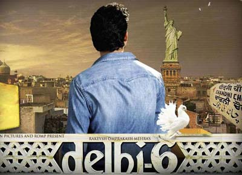

Movies were never a dominant part of my entertainment. It’s not that I dislike them – it’s just that there always seem to be more interesting things to do. It’s thus a tad bit ironic that I found inspiration to explain our migration in two Bollywood movies and one Hollywood movie.

 Pic: courtesy 1morefilmblog.com

[Close Encounters of the Third Kind](http://en.wikipedia.org/wiki/Close_Encounters_of_the_Third_Kind): *Rob Neary (played by Richard Dreyfus) becomes increasingly obsessive about a mountain-like structure after a UFO encounter. He eventually learns that the mountain structure that’s haunting him is nothing but Devil’s Tower in Wyoming. He heads towards the site along with others with similar experiences. The US army apprehends most of the civilians headed to the UFO site but Rob (and a handful of others) make it to the mountain. After a mothership UFO appears and ‘returns’ the people abducted over the years, the US Army determines that these are apparently ‘peaceful’ aliens. As the aliens emerge from the mothership, Roy is invited to join them in their travels.*

I’m not saying that I was seeing visions of Bangalore during my years in America but there was just that subtle subliminal *pull* that just refused to go away.

 Pic: courtesy glamsham.com

[Lakshya](http://en.wikipedia.org/wiki/Lakshya_(film)): *The movie centers around Karan Shergil (played by Hrithik Roshan) – a young man with no actual goal in mind or plans for his future. His inability to take anything seriously causes a strain in his relationships with his father (a successful businessman) and his girlfriend, Romi (played by Preity Zinta), a student activist and motivated reporter. He eventually joins the Indian Military Academy (IMA) mostly on an impulse. When he drops out of IMA, it’s the last straw for his girlfriend who dumps out. His parents aren’t too happy either. Stung by the dumping followed by a period of introspection, Karan rejoins IMA with a newfound dose of commitment. When the Kargil war breaks out, Karan’s unit is deployed close to enemy lines and faces heavy losses. After Karan’s unit is assigned the task of taking back a strategic high-altitude outpost (from the Pakistanis), he declares his lakshya (i.e. goal) is to succeed in his mission — at any cost.*

So what’s my *lakshya* in life? Simple question but no simple answer. According to Buddha, *“Your work is to discover your world and then with all your heart give yourself to it.”* Problem for 99% of folks (yes – I’m in that big bucket) is that it might take an entire life to ‘discover’ their world. As I wrote earlier on this topic (see [Why are we moving back to India now](https://www.ulaar.com/2008/06/02/why-are-we-moving-back-to-india/)), it’s not that we were miserable in America, it’s just that I felt there was a higher probability of finding my *lakshya* in India than in America.

<figure aria-describedby="caption-attachment-1744" class="wp-caption alignleft" id="attachment_1744" style="width: 300px">

<figcaption class="wp-caption-text" id="caption-attachment-1744">Pic: courtesy searchandhra.com</figcaption></figure>

[Delhi-6](http://en.wikipedia.org/wiki/Delhi-6): *Roshan (played by Abhishek Bachchan) accompanies his dying grandmother Annapurna (played by Waheeda Rahman) to their ancestral property in a crowded neighborhood of Chandni Chowk, Delhi. Roshan is initially stunned by the mad rush of neighbors and the commotion that’s Old Delhi. However, Roshan eventually warms to the place, wholeheartedly embraces the sense of community, and gradually becomes steeped in the culture of the place. He also starts falling in love with local lass Bittu (played by Sonam Kapoor). The pivotal point in the movie is when Roshan decides to stay back in Delhi and his professed reason (to his parents in New York) is “It just WORKS in India!” He goes on to describe how, in spite of the chaos he has experienced in the recent past, there’s something inherently ‘right’ about it.*

I personally think the screenplay writer took the politically correct approach by saying “It just WORKS in India!”. What he really meant for Roshan to say was *“It just DOESN’T WORK in India and I want to understand why it doesn’t work and be a part of a change for the better in India.”* Ok – so that was rather wordy and we know why the dialogue writers picked the verbiage which they did.

Apr 15 Update: Today I stumbled upon this Gaurav Bhatnagar’s slightly dated but very relevant post [Why return to India](http://www.newdelhitimes.org/archives/2004/10/why_return_to_i.html).

My favorite extracts from his post:

Mahatma Gandhi’s quote: *“I cling to India like a child to its mother’s breast, because I feel she gives me the spiritual noursihment I need. She has the environment that responds to my highest aspiration. When that faith is gone I shall feel like an orphan withut hope of ever finding a guardian.”*

*This lack of a definite answer was a bit unnerving. I suddenly felt that perhaps my decision to go back was not well thought out. Perhaps I had made a choice based on emotions. And yet strangely I was feeling a quite confidence in my decision. Even though I could not justify it, I knew it was time to go back. I couldn’t see myself anywhere else but in India. Funnily, it seemed obvious to me that I needed to be India even though I couldn’t think of many rational reasons for that. There was almost an urge to go back, an invisible force pulling me back. So I think my decision to go back is based on faith. A faith that I can fulfil my ambitions and aspirations in India. A faith that a brighter future awaits me there. Clearly this is blind faith because I don’t have any solid reaasoning to back it. But I am not scared, not even apprehensive. I have never felt so confident of my choice.*

