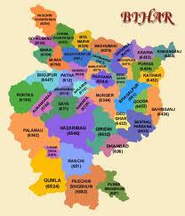

<figure aria-describedby="caption-attachment-1601" class="wp-caption alignleft" id="attachment_1601" style="width: 208px">

<figcaption class="wp-caption-text" id="caption-attachment-1601">Bihar District Map (courtesy topnews.in)</figcaption></figure>

Back in Nov 2009, we had a big reunion of St. Xaviers Bokaro alumni and their families. If you haven’t bumped into anyone from Bokaro (formally known as “Bokaro Steel City”) yet, you need to know that the mere mention of Bokaro is enough to send them into raptures and wax eloquent about this utopian steel township in a part of Bihar that’s now Jharkhand. For all the Bokaro alumni, it was a thoroughly enjoyable evening and I daresay the non-Bokaro spouses had a decent time too. A few mini-reunions later, I heard about Bihar Foundation from one of my classmate’s husband. Ajit Chouhan’s blog post [Bihar Foundation – Connecting Biharis Worldwide](http://coolbihari.blogspot.com/2010/01/bihar-foundation.html) does a good job outlining the foundation’s charter and ambitions.

For a variety of reasons, Bihar doesn’t rank high on India’s list of states (on many indicators – be it socio-economic, literacy, or governance). When I found this ode (authored by Mayank Krishna), it felt like a gust of fresh air. I present to you – I am Bihar (a proud and optimistic ode on Bihar)!

(Reproduced with permission from the author [Mayank Krishna](http://www.mayankkrishna.blogspot.com/))

**I AM BIHAR**

I am the history of India,  
I gave the world its first Republic,  
I nourished Buddha to enlightenment,  
I gave world its best ancient university,  
My son Chanakya was the father of Economics,  
Mahavir came out of my womb to found Jainism,  
My son Valmiki wrote Ramayan, the greatest Epic  
Rishi Shushrut, the father of surgery, lived on my soil  
My son Vatsayana wrote Kamasutra, the treatise of love ,  
My son Ashoka – The Great was the greatest ruler of India ,  
I gave birth to Aryabhatt, the great ancient mathematician ,  
I gave Ashoka Chakra that adorns India’s national flag ,  
My son Dinkar is the national poet of India ,  
I gave the world its first Yoga University ,  
I gave India its first president ,  
I am the land of festivals ,  
I am brotherhood ,  
I am humility ,  
I am the past ,  
I am the future ,  
I am opportunity ,  
I am revolution ,  
I am culture ,  
I am heritage ,  
I am intellect ,  
I am farmer ,  
I am power ,  
I am literature ,  
I am poetry ,  
I am love ,  
I am heart ,  
I am soul ,  
I am yoga ,  
I am global ,  
I am inspiration ,  
I am freedom ,  
I am force ,  
I am destiny ,  
I am Bihar ,  
…Come with your dream  
I will make it a reality