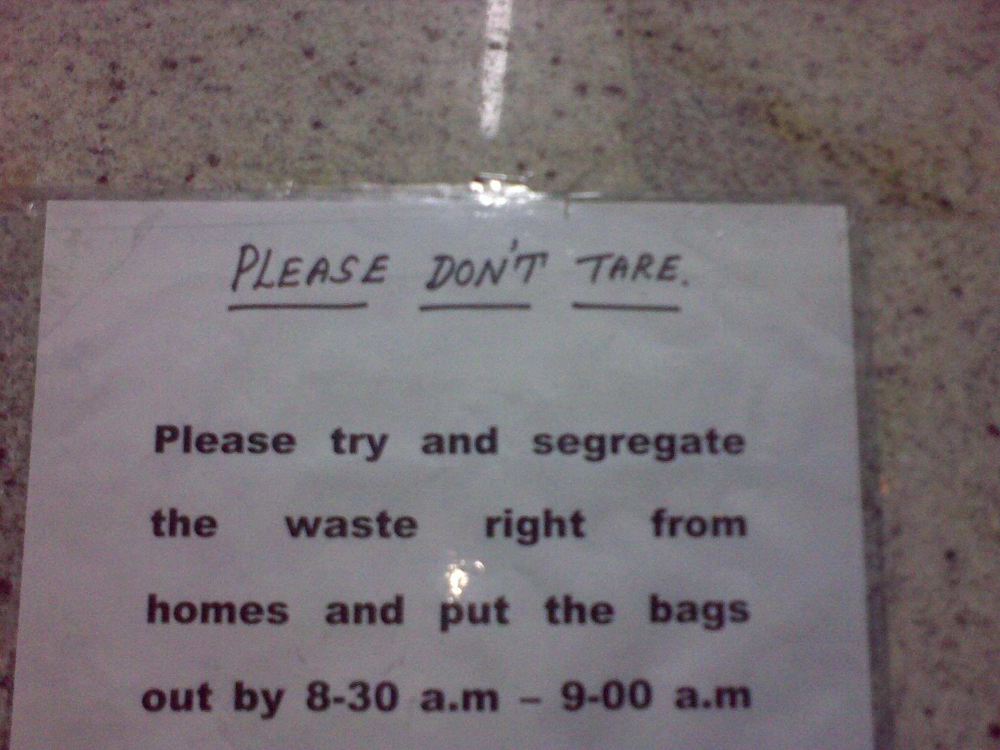

1 year 10 months and 3 non-SLR camera phones later, below is a partial collection of India-defining frames I’ve found interesting.

 
 Yes – there ARE parking signs in Bangalore. Just try finding them. 

 
 TVS Moped with less than regulation (i.e. 20%) load 

 
 This is a glass-half-full kinda kid – “look at all the traffic we are AHEAD of!” 

 
 Where else in the world do we have Midnight Marathons? Venue: Whitefield Road 

 
 This may seem like graffiti but it’s NOT – I insist that this plot is NOT FOR SALE! 

 
 One sign, two messages! For some strange reason, reminded of that famous pre-Independence sign “Dogs and Indians not allowed!” 

 
 Sign inside Bethany High School boys 

 
 If at first you don’t spell it right, you must try and TRY again! 

 
 In case you haven’t noticed, India’s spelling bee champs have all moved to USA. 

 
 How many spelling mistakes can you spot? 

 
 Indians love to pun.. really! 

 
 A yr after being commissioned into service, this stainless steel vessel one day just gave up! 7 vertical cracks appeared simultaneously after a rasam production! 

 
 Wish we had this sign in OUR apartment complex..Then we could fret about dog owners ignoring it. 

 
 It’s not just the BMW and Mercedes you’ll see on Bangalore roads. Toyota MR2 for the discerning. 

 
 Time to visit the optometrist? Don’t bother. Any of these store signs can be used for vision check. 

The next post in this 4-part series – [The darndest things you see in India (Part 2)](https://www.ulaar.com/2010/07/22/the-darndest-things-you-see-in-india-part-2/).
