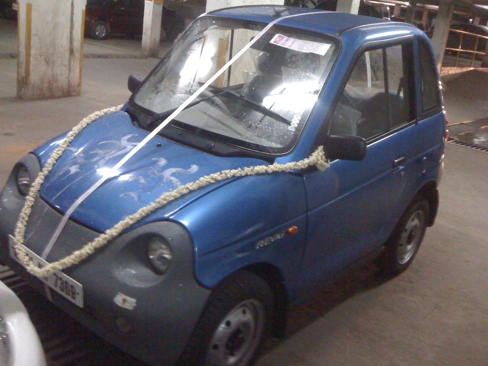

<figure aria-describedby="caption-attachment-655" class="wp-caption alignleft" id="attachment_655" style="width: 300px">

<figcaption class="wp-caption-text" id="caption-attachment-655">2-day old Blue Reva fresh after car-puja – in kissing distance of older sibling (SX4)</figcaption></figure>

Title translation (for non-Hindi readers): *Hum do humare do* is an old 1970’s era government initiated family planning slogan to promote family of four (*hum do* = we two, *humare do* = our two). *Bina exhaust ke* = without exhaust.

So… two months shy of our 2nd year anniversary of returning to India, we purchased our 2nd car – a blue REVAi. If you’ve not been tracking electric car trends, RECC (REVA Electric Car Company) has been selling REVAi electrics in India since 2001 and in UK since 2003. For possibly a few more years, RECC remains the only company in India selling electric cars. The [wikipedia entry for RECC](http://en.wikipedia.org/wiki/REVA_Electric_Car_Company) accurately describes REVAi as an urban electric *micro-car* seating two adults and two *kids*. Did I say accurate? I meant ‘nearly accurate’ because it should read two adults and two kids (*under the age of 10*).

Now that we’ve established how small the REVAi is, let’s move to other specs. For this, I shall borrow liberally from this 2006 [review of the REVAi](http://www.hindu.com/mp/2006/10/11/stories/2006101100380400.htm) in The Hindu…

> *The first thing that hits you when you look at the car is its size which makes you think of yourself as Gulliver, the giant when you sit inside. The steering is a wee bit too close to your chest and the A pillars close in on you.*

Ok – so I wasn’t done talking about the REVA’s size. If you don’t step in gingerly to the driver’s seat, you could easily brush the lever to make it high beam. If you turn your head around suddenly (to see what your 4-year old’s doing in the back seat), the rear-view mirror would need readjusting.

> *The Reva’s a full metre shorter than the Maruti Suzuki Wagon R but around 100kg heavier than Maruti Suzuki 800. The body is built of hard ABS (acrylonitrile-butadiene-styrene) plastic and a tubular space frame holds everything together. Eight deep discharge batteries sourced from leading American golf cart battery maker, Trojan, sits in the middle of the chassis, with the controller and energy management system parked under the rear section of the car. The motor itself, a Bulgarian 13KW DC unit from Kostov, sits beneath the chassis and powers the rear wheels. The job of the energy controller is to make sure current is drawn equally from the batteries, especially during high load requirements and there are no surges and spikes.*

The golf cart lineage certainly shows with the quiet humming of the motor. Our li’l one’s take on that humming sound – “it feels like we are in an airplane on the runway”. By the way, the rest of the comments in The Hindu review are slightly dated since the new batteries are supposed to extend the driving distance to the 70-90k range depending on your use of air-conditioning).

The REVA buying decision was somewhat analogous to our returning to India decision. There are a lot of reasons why one would NOT want to buy this car and only a few reasons why one should. Turned out those few reasons were crucial.

Reason #1: (Zero emissions) This is a dead-obvious reason but needed to be stated. Until public transportation becomes a viable option in Bangalore (will it ever?), we needed a 2nd car and it just couldn’t be a traditional petrol/diesel one.

Reason #2: (Automatic transmission car) Ever since our adventures with [The Janus Man](http://ulaar.wordpress.com/2009/07/17/the-janus-man/) came to an end, we haven’t employed a full-time driver. I’ve become scarily comfortable driving the SX4 in various types of Bangalore traffic conditions but the kids’ dropoffs and pickups from school, ferrying them to after-school activities has required a combination of part-time drivers from [EZiDrive](http://ezidrive.in/) and auto-rickshaw rides. P has been on the threshold of *to-hell-with-these-drivers-but-I-cant-drive-a-stick-shift-car*. Getting the REVA is expected to be a watershed moment for her. First the learner’s license, then driving in Sunday traffic, then driving in Saturday traffic, then driving solo on weekends, and…voila! one day she goes solo on weekdays as well. We are not sure if she or the kids are more excited with this prospect.

Reason#3: (Minimalism) What’s the smallest car that can get us around and keep the kids protected from the air pollution? Turns out the only answer in 2010 is REVAi. Small is indeed beautiful.