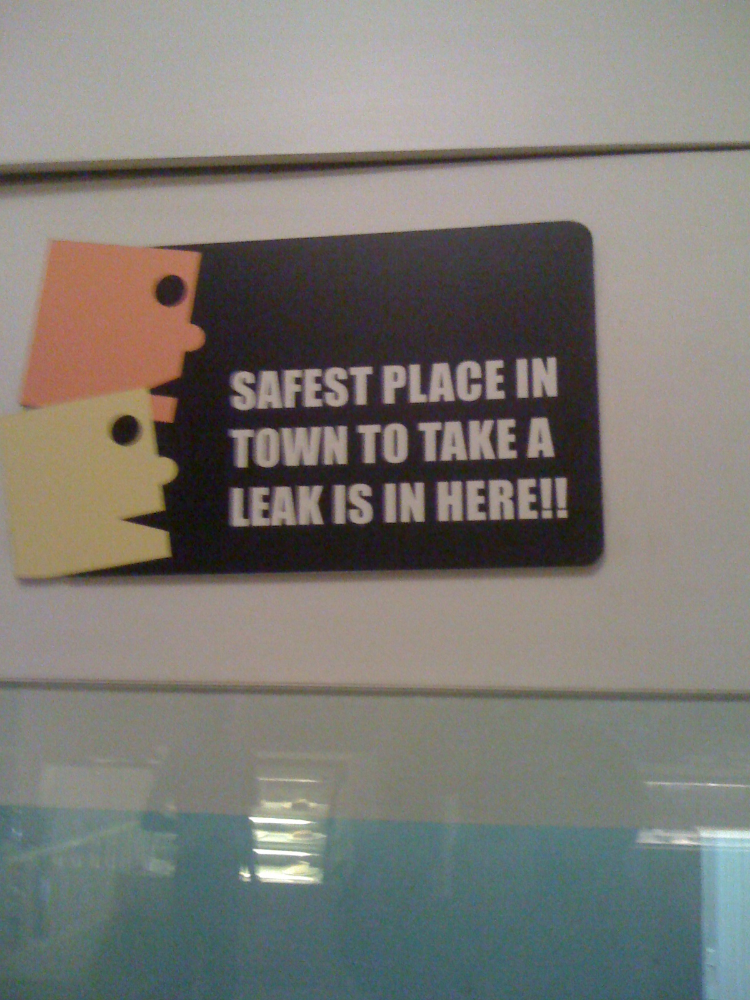

The previous post of this series is [The darndest things you see in India](https://www.ulaar.com/2010/06/11/the-darndest-things-you-see-in-india/) and the next is [The darndest things you see in India – Part 3](https://www.ulaar.com/2010/08/05/the-darndest-things-you-see-in-india-part-3/).

 
 Lessons in user interface design! 

 
 Gotta admit Boca Grande has one of the cleanest loos in town! 

 
 Is the Avon brand marketing manager a genius? 

 
 If not for sale, why list name? Bcos owner wants to be notified if someone begins building something... 

