Today is the 11th anniversary of the day India won the Kargil war against Pakistan. One of my fauji friends (and classmate from Xaviers Bokaro) forwarded an email with pictures of the brave officers who won this war for India, albeit with a lot of casualties. His email started with the statement – ***the least we can do is remember***. Next related project: find the names of all the soldiers (not just the officers) who died in the Kargil war.

—————————————————————————————-

WE RECAPTURED OUR LAST HILL FROM PAKISTAN  
BUT WE LOST OUR MOST VALUABLE, GREAT WARRIORS, BRAVE BROTHERS .TODAY IT’S TIME TO REMEMBER THEM!

<table><tbody><tr><td><figure aria-describedby="caption-attachment-735" class="wp-caption aligncenter" id="attachment_735" style="width: 465px">

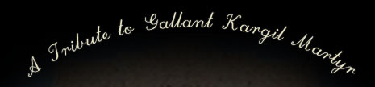<figcaption class="wp-caption-text" id="caption-attachment-735">The least we can do is remember</figcaption></figure>

</td></tr></tbody></table>

<table><tbody><tr><td><figure aria-describedby="caption-attachment-736" class="wp-caption alignleft" id="attachment_736" style="width: 136px">

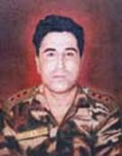<figcaption class="wp-caption-text" id="caption-attachment-736">Capt.Vikram Batra – Param Vir Chakra(Posthumous)</figcaption></figure>

</td><td><figure aria-describedby="caption-attachment-737" class="wp-caption alignright" id="attachment_737" style="width: 137px">

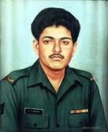<figcaption class="wp-caption-text" id="caption-attachment-737">Grenedier. Yogendra Singh (Param Vir Chakra)</figcaption></figure>

</td></tr><tr><td><figure aria-describedby="caption-attachment-738" class="wp-caption alignleft" id="attachment_738" style="width: 142px">

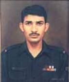<figcaption class="wp-caption-text" id="caption-attachment-738">RFN. Sanjay Kumar (Param Vir Chakra)</figcaption></figure>

</td><td><figure aria-describedby="caption-attachment-739" class="wp-caption alignright" id="attachment_739" style="width: 133px">

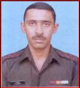<figcaption class="wp-caption-text" id="caption-attachment-739">Major Padmapani Acharya of the 2nd Battalion, The RAJPUTANA RIFLES (Maha Vir Chakra (Posthumous)</figcaption></figure>

</td></tr><tr><td><figure aria-describedby="caption-attachment-740" class="wp-caption alignleft" id="attachment_740" style="width: 131px">

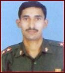<figcaption class="wp-caption-text" id="caption-attachment-740">Lieutenant Balwan Singh, Maha Vir Chakra Of the 18th Battalion of GRENADIERS Regiment</figcaption></figure>

</td><td><figure aria-describedby="caption-attachment-741" class="wp-caption alignright" id="attachment_741" style="width: 118px">

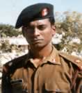<figcaption class="wp-caption-text" id="caption-attachment-741">Major M Saravanan, VirChakra, 1 Bihar</figcaption></figure>

</td></tr><tr><td><figure aria-describedby="caption-attachment-742" class="wp-caption alignleft" id="attachment_742" style="width: 144px">

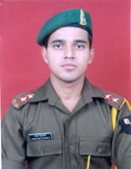<figcaption class="wp-caption-text" id="caption-attachment-742">Lieutenant Kanad Bhattacharya, Sena Medal (Posthumous)(22 YEARS)</figcaption></figure>

</td><td><figure aria-describedby="caption-attachment-743" class="wp-caption alignright" id="attachment_743" style="width: 140px">

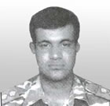<figcaption class="wp-caption-text" id="caption-attachment-743">Captain Saju Cherian, Sena Medal 307 Medium Regiment</figcaption></figure>

</td></tr><tr><td><figure aria-describedby="caption-attachment-743" class="wp-caption alignleft" id="attachment_743" style="width: 140px">

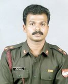<figcaption class="wp-caption-text" id="caption-attachment-743">Captain R Jerry Prem Raj, Vir Chakra (Posthumous), 158 Medium Regiment</figcaption></figure>

</td><td><figure aria-describedby="caption-attachment-743" class="wp-caption alignright" id="attachment_743" style="width: 140px">

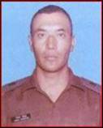<figcaption class="wp-caption-text" id="caption-attachment-743">Major Sonam Wangchuk, Maha Vir Chakra Of the LADAKH Scouts</figcaption></figure>

</td></tr><tr><td><figure aria-describedby="caption-attachment-743" class="wp-caption alignleft" id="attachment_743" style="width: 140px">

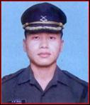<figcaption class="wp-caption-text" id="caption-attachment-743">Lieutenant Keishing Clifford Nangrum, Maha Vir Chakra (Posthumous) Of the 12th Battalion of JAMMU AND KASHMIR</figcaption></figure>

</td></tr></tbody></table>

