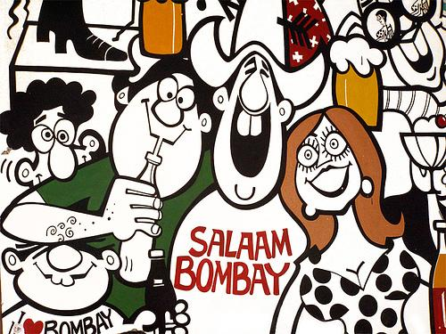

<figure aria-describedby="caption-attachment-1760" class="wp-caption alignleft" id="attachment_1760" style="width: 300px">

<figcaption class="wp-caption-text" id="caption-attachment-1760">Pic: courtesy ekmarathimanoos.blogspot.com</figcaption></figure>

Soumya Banerjee (my friend from University of Houston days) returned from Boston to India 10 years ago – a period which we can term the “first wave” of reverse brain drain. Very few of my Indian-American friends returned that early so he stands out. It’s thus fitting that he’s the first profile being published in the [new R2IProfile category](http://ulaar.wordpress.com/2010/07/12/r2i-profiles-launching-a-new-category/). Here we go with the email interview…

**Q: How long &amp; where did you live in US? When did you return to India?**  
A: 10 years. Lived in Houston (Grad school + 1.5 years) and Boston

**Q: Why did you return?**  
A: The company I worked with (Sapient) was setting up an office in India. Had a casual conversation and took a flight over. Wife (Priti Dhall) stayed back in the US for a year and then she also moved. Meeting in London stops being romantic after a few months.

So clinically speaking it was the job. Also important is the fact that we always thought we would move back some day. (America was never our country)

**Q: Which Indian city did you move to and why?**  
A: Delhi, since 3 of the 4 guys setting up the office were from Delhi 🙂 Moved to Mumbai after 7 years in Delhi.

**Q: Apartment, villa or independent home? How did you arrive at this decision? Did you move all/part of your household belongings?**  
A: Apartment (one floor of a 3 floor house). Only two of us, did not need a HOUSE. Also at that time Gurgaon was not developed and did not have that many apartments. We moved with six suitcases of stuff. Rest we left behind.

**Q: How do you rate your return to India on a scale of 1-10?** \[10=love the place/should have moved earlier, 1=hate it here / plotting my return back to USA)  
A: 10

**Q: What are the 3 things you absolutely love about India since you returned?**  
A: In no particular order…

- Career growth
- Ability to travel and see the country
- Family being close by

**Q: What are the 3 things you absolutely detest about being in India?**  
A: In no particular order…

- Roads in cities
- Chalta hai attitude
- Encounters with corruption

**Q: What are the 3 things you miss most about America?**  
A: See below:

- Food 🙂
- Silence
- Not being involved in every family decision/trip

Editor’s Note: Soumya is currently working on an online education startup ([Attano](http://www.attanolearn.com/)) targeting Indian students. If you meet Soumya in person, you’ll find that, far from the brevity of his email responses, he’s a voluble and engaging communicator with an insatiable wanderlust. For evidence of his wanderlust, I present you Exhibit A – [Genesis](http://www.soumya.org/) (photo blog of his travels in India). Soumya’s dear wife (Priti) meanwhile is accruing karma points for several generations of Banerjees and Dhalls through her dedicated work on [CanKids India](http://cankidsindia.org/) (a support group for children with cancer and their families).