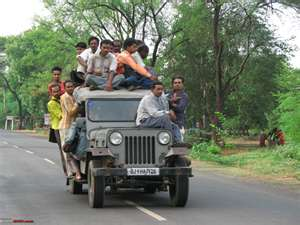

Pic: courtesy team-bhp.com

During our initial months in Bangalore, as we ploughed through the dense urban traffic (being driven around by auto drivers and cab drivers), the biwi and I speculated that automatic transmission cars would be a hit in India. It had to be a case of *when*, rather than *if*. I mean, why would anyone reject the convenience that automatic transmission cars offer?

The Indian automobile trends in 2008 hardly supported our bold prediction. The only mass-market automobile models with automatic transmission were the Hyundai i10 and the Maruti Suzuki Astar. The trend improved slightly in 2009 when at least two more car models came with automatic transmission option – Hyundai Verna and Honda City. According to this [Carazoo article](http://www.carazoo.com/article/1310200901/Top-10-Indian-Cars-with-Automatic-Transmission) published in 2009, luxury cars like Mercedes and BMW and semi-luxury cares like Honda Accord and Skoda seem to be reporting better statistics around automatic transmission adoption.

Every driver I encountered and every colleague I accosted, on the topic of automatics, would reply “premium in car price along with drop in petrol mileage by 2-3km (*minimum*) for every liter is simply not worth it”. Lesson #101 on the cost conscious Indian customer – cost trumps convenience any day.

As a non-driver in Indian driving conditions, the preceding narrative should be sufficient to establish why Indian car buyers weren’t voting heavily for automatic transmission cars. It’s only after I set my inner-driver loose on the Bangalore roads last year (following [The Janus Man](https://www.ulaar.com/2009/07/17/the-janus-man/) saga) that I was to learn another reason — a *metaphysical* one — why the automatic transmission might never be a hit on Indian roads.

I was driving to work one morning and had just gotten onto Bannerghatta Road. The 30 second stretch under the Dairy Circle underpass (at 8:10am I should add) is the only time I’m able to shift to the 5th gear and enjoy that easy coasting feeling before it’s time to take the left to my office building. It suddenly struck me why the manual transmission had become such an integral part of my driving experience in India. The steering wheel, brakes, horn, and the manual stick shifter are the only *four* things under my control when I get behind the wheel of my car \[thanks to my friend Prateep for reminding me of the invaluable horn\]. Practically nothing else is within my control — the quality of road can deteriorate swiftly after a torrential downpour, the pedestrian can decide to cross the road forcing me to downshift or brake suddenly, the auto driver can cut in front of me if I paused to scratch my cheek. So of the three things within my control as a driver on Indian roads, you want me to give up *one* of them? No – never!

….

….

Did I say *never*? Oops! We recently added an automatic transmission car into our stable — say hello to [Hum do humare do – bina exhaust ke](https://www.ulaar.com/2010/06/27/hum-do-humare-do-bina-exhaust-ke/).
