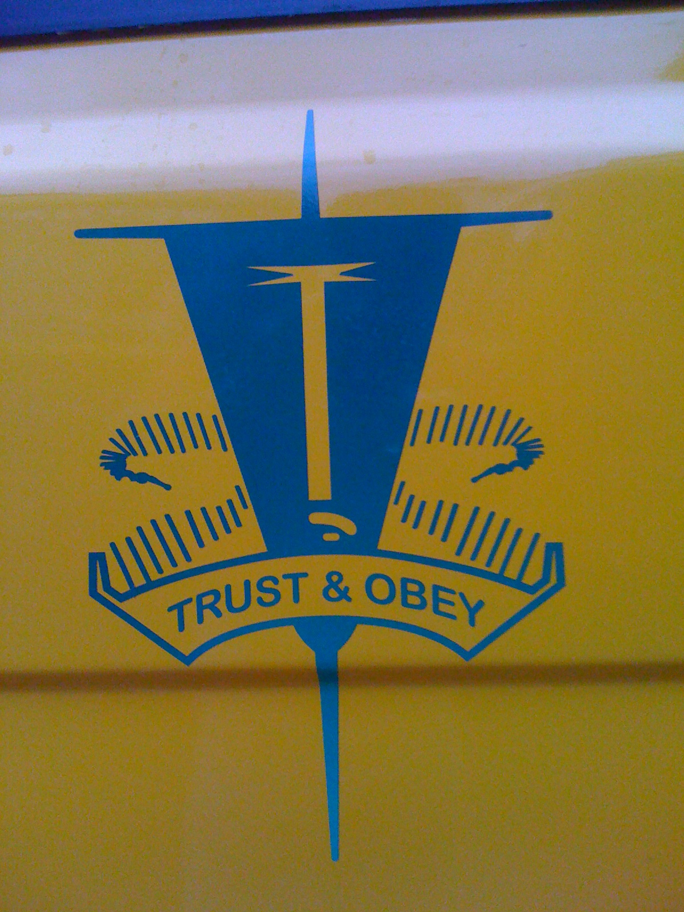
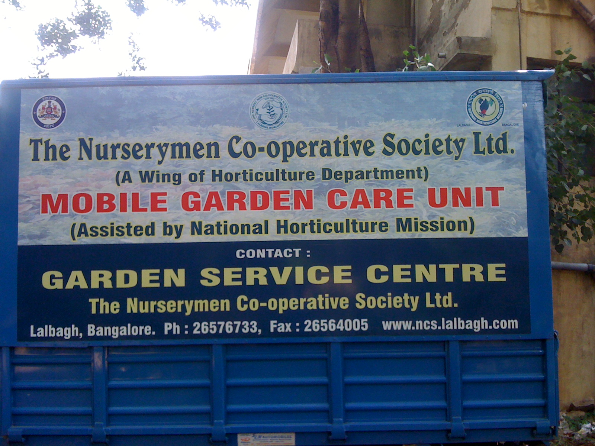
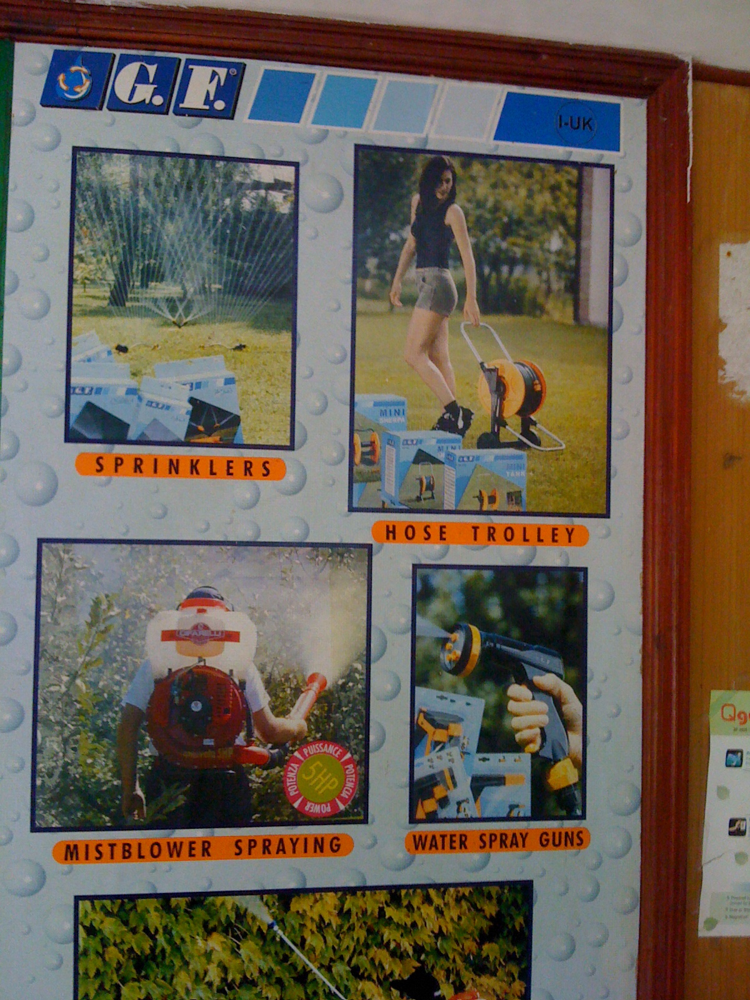
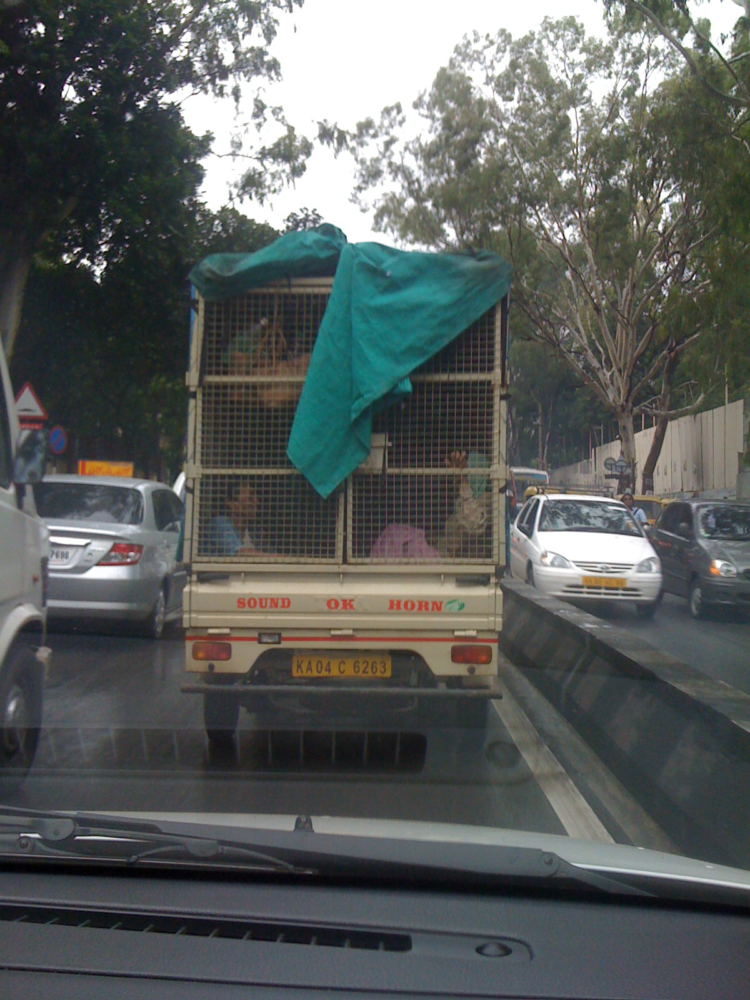
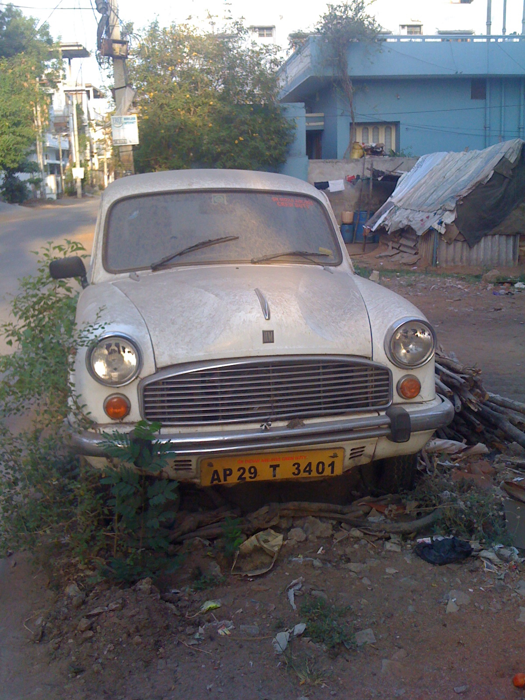

 
 Bhurka (abaya) beyond your imagination! 'nuf said. 

 
 Emblem of a Tier 1 Bangalore school. 

 
 Lalbagh nursery has a mobile garden unit... 

 
 Marketing collateral inside Lalbagh nurserymen's office. Am still on the lookout for that woman... 

 
 Jail-birds? Think again.. group of day labourers headed to work. 

 Abandoned Ambassador headed to a 'slow boat burial' 

Next post in this 4-part series is [The darndest things you see in India – Part 4 (park signs)](https://www.ulaar.com/2010/08/25/the-darndest-things-you-see-in-india-part-4-park-signs/).
