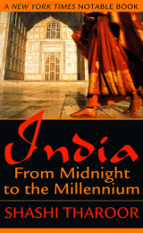

<figure aria-describedby="caption-attachment-1604" class="wp-caption alignleft" id="attachment_1604" style="width: 160px">

<figcaption class="wp-caption-text" id="caption-attachment-1604">Pic: courtesy tharoor.in</figcaption></figure>

Someday (way in the future) I wanted to write this post. The thoughts were clear in the head but there were several more interesting posts queued ahead in my WordPress Drafts folder. During my last business trip, I finally started reading Shashi Tharoor’s [India – From Midnight to the Millennium and Beyond](http://tharoor.in/books/india-from-midnight-to-the-millenium/). When I read Chapter 3 (specifically pages 56-57), I realized that Tharoor has articulated the gist of my thoughts on the subject. While the nuanced version of this blog post can wait, here’s the relevant extract from Tharoor’s book:

> *I am a believer, despite a brief period of schoolboy atheism (of the kind that comes with the discovery of rationality and goes with an acknowledgement of its limitations — and with the realization that the world offers too many wondrous mysteries for which science has no answers). And I’m happy to describe myself as a believing Hindu, not just because it is the faith into which I was born, but for a string of other reasons, though faith requires no reason. One is cultural: as a Hindu I belong to a faith that expresses the ancient genius of my own people. Another is, for lack of a better word, its intellectual “fit”: I’m more comfortable with the belief structures of Hinduism than I would be with those of the other faiths of which I know. As a Hindu, I claim adherence to a religion without an established church or priestly papacy, a religion whose rituals and customs I am free to reject, a religion that does not oblige me to demonstrate my faith in any visible sign, by subsuming my identity in any collectivity, not even by a specific day or time or frequency of worship. As a Hindu, I subscribe to a creed that is free of the restrictive dogmas of holy writ, that refuses to be shackled to the limitations of a single holy book.*
> 
> *Above all, as a Hindu I belong to the only major religion in the world that does not claim to be the only true religion. I find it immensely congenial to be able to face my fellow human beings of other faiths without being burdened by the conviction that I am embarked upon a “true path” that they have missed. This dogma lies at the core of Christianity, Islam, and Judaism — “I am the Way, the Truth and the Life; no man cometh unto the Father \[God\], but by me” (John 14:6), says the Bible; “There is no God but Allah, and Mohammed is his Prophet,” declares the Koran — denying unbelievers all possibility of redemption, let alone of salvation or paradise. Hinduism, however, asserts that all ways of belief are equally valid, and Hindus readily venerate the saints, and the sacred objects, of other faiths.*

He then goes on to lament the emergence of religious chauvinism and fundamentalism in twentieth-century India but that’s a whole different story. As I re-read the excerpt, I observed that while Tharoor lists Judaism in the three major religions that espouse the “only true path”, he doesn’t include the relevant quote. I’m hoping that one of my Jewish friends on Facebook will chance upon this post and set the record straight.