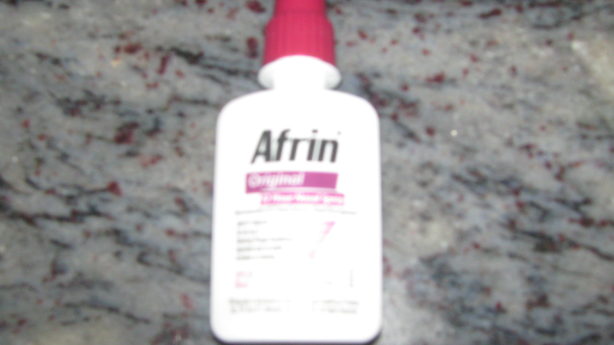

My inseparable flying companion for the past 12 years!

*\[Jan 7, 2015 update: seven years after I wrote this post, a helpful commenter informs us that the technique described below is called the Valsalva Maneuver. Bwana impressed!\]*

*Disclaimer: Even though I no longer live in the litigious jurisdiction of America, I feel it necessary to mention that I have nothing against Afrin (the nasal drops product) and nothing against Schering-Plough (the company that manufacturers it).*

During a recent business trip, I ran into my cousin’s husband (Ravindra) at the Bangalore airport. I was meeting him after a year so we had a merry time catching up during the 90 minute flight to Hyderabad. You gotta love these chance meetings! I was fiddling around with the Afrin bottle wondering when I should take the customary dual snort. After the 10th time I opened and closed the cap, Ravindra asked me whether I had a cold. I replied in the negative and gave him a lengthy explanation — how I had my first painful flying experience 12-odd years ago and my doctor diagnosing it as nasal congestion aggravated by a [deviated septum](http://www.cedars-sinai.edu/Patients/Programs-and-Services/Sinus-Center/Conditions/Deviated-Septum.aspx). The final recommendation from the doctors was “Rain or shine! Whether you have a cold or not, always use a nasal spray a few hours before the plane starts the descent!”

I’ve been following this advice religiously ever since because the prospect of a ruptured ear drum or excruciating ear pain wasn’t particularly appealing. Has Afrin worked for me all the time? Not a perfect hit rate but pretty close. Trans-atlantic and trans-pacific flights can sometimes get tricky because it’s recommended to have a gap of 12 hours between successive doses. There have been several alarming close-calls when I forgot to pack it or the spray ran out. Thankfully airport pharmacies stock this critical (for me) product and many international airlines also supply sachet-sized nasal drops. I’m so paranoid about sleeping through the crucial last 2 hours of international flights that I’ve requested wake-up calls from stewardesses.

Ravindra listened to me patiently and said he could teach me a simple technique to make Afrin completely redundant. Here’s the two step technique he taught me. As the aircraft starts descending, after you start feeling pain or your ears get blocked (whichever occurs first):

1. Keeping your mouth closed, pinch shut both your nostrils.
2. Slowly try to exhale from your nostrils (keeping the nostrils closed – this is the important bit). This has the effect of pushing the air inside – thus balancing the air pressure inside and outside your ears.

Repeat steps 1 and 2 until you start feeling your ears pop. If you were feeling ear pain, it should also ebb at the same time. For the two flight descents I put this technique to test, it worked like a charm. I needed to repeat the above steps only a few times. I was so excited with this working that I just kept on repeating it — almost until the aircraft touched down. Thanks a TON, Ravindra! This is the beautiful thing about serendipity. This technique was passed down to Ravindra on one of his business trips in 2001 by a kindly Chicago-bound American as he (Ravindra) was reaching for his own Afrin nasal spray. 🙂

In summary, don’t let your friends fly with Afrin — they don’t need it anymore.
