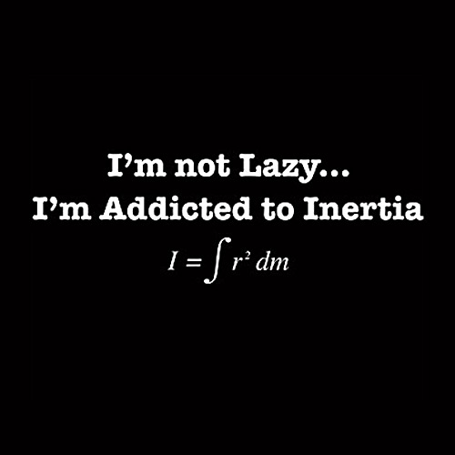

<figure aria-describedby="caption-attachment-1757" class="wp-caption alignleft" id="attachment_1757" style="width: 300px">

<figcaption class="wp-caption-text" id="caption-attachment-1757">Pic: courtesy shirtoid.com</figcaption></figure>

As a sovereign republic, India turned 63 today. Today also marks our second anniversary in India – after 16 years in America. To mark this occasion, I tweeted the following:

> ### *2 years in India. The second year whizzed by even faster than the first. Me thinks we’ll stop counting now.*

My biwi, who’s not active on Twitter, had the following Facebook status update:

> ### *2nd R2I Anniversary…content? yes; complaints? several; regrets? a few; no. of good days 2X no. of bad days; thought of R2A? twice; ready to R2A? nope. Best part of the experience, to R2I or not to R2I is no longer the question:)*

Is it a coincidence that I left India on India’s Independence Day in 1992? And a double-coincidence that we returned on Independence Day 2008? Probably. But sometimes I feel like “manufacturing” theories… 🙂

In the past two days, I’ve been hearing local radio disc jockeys asking their listeners “On India’s Independence Day, what would you like freedom from?” I wondered what my answer was 2 years ago. It was definitely not “freedom from America”. As I wrote in an earlier post, we were leading a pretty decent life in the SF Bay Area but for an angst — which would surface every now and then. Inertia, as the wise have noted, is a powerful thing. We celebrate today “breaking the shackles of the status quo!”