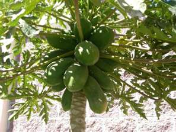

For the last 3-4 months, I’ve been reading about the many cases of dengue-related deaths in Bangalore. A colleague’s (S) daughter was also diagnosed with dengue – fortunately it turned out not to be critical and she survived. S was lamenting that dengue is a much more serious disease than Swine flu yet it receives much less media coverage. Of course the lack of hysteria might be a good thing. Another factoid that S shared is that most of the dengue fatalities (at least in Bangalore) were females under the age of 16. Yesterday we heard the tragic news that a kid from nearby Bethany High School succumbed to the disease.

This [Where in the world is Dengue](http://blog.google.org/2010/08/where-in-world-is-dengue.html) post from Google.org tells us that Bangalore (&amp; India) are not the only affected places. Brazil and Central America seem to have the highest number of reported cases, followed by India, and Africa. Dengue thrives in both cities and rural areas of the tropics and subtropics and is caused by a virus that is transmitted by mosquitoes. The symptoms are similar to a severe flu, and can be quite painful. There is *no cure* and *no vaccine*.

Which brings us to the reason why I’m writing this post… I received one of *those* emails today on the Raheja resident community mailing list – PASS THIS INFORMATION TO AS MANY AS YOU CAN, IT MAY SAVE LIVES.

Email reproduced in its entirety below (two recovery cases cited):

> *The originator of this mail is renowned medical professional Dr. (Mrs) Sriyani Basnayake, therefore we can trust the contents.* \[Read author’s note at the bottom of this post.\]
> 
> *I would like to share this interesting discovery from a classmate’s son who has just recovered from dengue fever. Apparently, his son was in the critical stage at the ICU when his blood platelet count drops to 15 after 15 liters of blood transfusion. His father was so worried that he seeks another friend’s recommendation and his son was saved. He confessed to me that he gave his son raw juice of the papaya leaves. From a platelet count of 45 after 20 liters of blood transfusion, and after drinking the raw papaya leaf juice, his platelet count jumps instantly to 135. Even the doctors and nurses were surprised. After the second day he was discharged. So he asked me to pass this good news around.*
> 
> *Accordingly it is raw papaya leaves, 2pcs just cleaned and pound and squeeze with filter cloth. You will only get one tablespoon per leaf. So two tablespoon per serving once a day. Do not boil or cook or rinse with hot water, it will loose its strength. Only the leafy part and no stem or sap. It is very bitter and you have to swallow it like “Won Low Kat”. But it works.*
> 
> *Papaya Juice – Cure for Dengue  
> You may have heard this elsewhere but if not, I am glad to inform you that papaya juice is a natural cure for dengue fever. As dengue fever is rampant now, I think it’s good to share this with all. A friend of mine had dengue last year. It was a very serious situation her as her platelet count had dropped to 28,000 after 3 days in hospital and water has started to fill up her lung. She had difficulty in breathing. She was only 32-years old. Doctor says there’s no cure for dengue. We just have to wait for her body immune system to build up resistance against dengue and fight its own battle. She already had 2 blood transfusions and all of us were praying very hard as her platelet count continued to drop since the first day she was admitted. Fortunately her mother-in-law heard that papaya juice would help to reduce the fever and got some papaya leaves, pounded them and squeezed the juice out for it. The next day, her platelet count started to increase, her fever subsided. We continued to feed her papaya juice and she recovered after 3 days!!! Amazing but it’s true. It’s believed one’s body would be overheated when one is down with dengue and that also caused the patient to have fever. Papaya juice has cooling effect. Thus, it helps to reduce the level of heat in one’s body, thus the fever will go away. I found that it’s also good when one is having sore throat or suffering from heat. Please spread the news about this as lately there are many dengue cases. It’s great if such natural cure could help to ease the sufferings of dengue patients. Furthermore it’s so easily available. Blend them, squeeze the juice, and drink immediately! It’s simple and miraculously effective!!*

I did a few web searches on Dr. Sriyani Basnayake — turns out she’s a Sri Lanka-based family planning advisor. I suppose she could still be described as a renowned medical professional though I wouldn’t jump to the conclusion “therefore we can trust the contents.” Having said that, if I heard about any of my near and dear afflicted with dengue, I’d definitely urge them to try the papaya juice remedy. Wouldn’t you?
