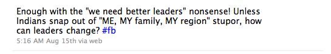

I posted the tweet (see below) after reading the 100th Independence Day tweet (from celebrity, non-celebrity and sundry) bemoaning the state of the nation and placing the blame squarely on the corrupt political leaders. Since some of my tweets are selectively published to Facebook, an interesting discussion started which I’m reproducing with the commenter’s permission. My friend VS’s theory is particularly thought-provoking.

> *HB: Totally agreed !! And to be honest I have no hopes the this can happen, not matter how much advance we become in terms of technology and things like that, no matter where we leave or get educated from. Seems these are so much intertwined in our genes; hope evolution helps. 🙂*

> *‎VS: @Vishy, I have a different perspective here … at a fundamental level, every eco-system follows the principles of demand & supply; whether it be service levels supplied by a business organization or a political entity/leader. At any givenpoint in time, ‘service providers’ supply what the volume sweet spot of their ‘customer base’ demands. In that context, I believe the aggregate demand in our environment today is for what we, the minority, perceive to be corrupt and sub-average leadership, but which is acceptable for constituents who form the volume sweet spot. In my experience, this is true for service levels delivered by business organizations (ala HSBC 😉 and political leaders (ala Lalu & Maya!). Remember, in a competitive market or democratic government, its not about the individual’s sense of right or wrong; instead its about what the market or electorate will bear :). As a demand shift transpires; either at the slow but steady pace set by evolution, or the rapid but potentially unstable velocity of a revolution; ‘competitors’ seize the opportunity to deliver differentiated service levels, attuned to new demand curve; and this reaction in turn unravels a race for ‘market share’; resulting in a net shift of service supply levels in the ‘market place’.  
> Therefore, as I see it, the solution lies in raising the level of demands placed on ‘service providers’, by their volume sweet spot customers; i.e. shifting the volume sweet spot up the ‘demand curve’. This is where the notion of creating ‘jaagruti’ or awareness comes in; a process which is easier said than accomplished, but which is the only sustainable path to growth at a least common denominator level.*

> *@VS Interesting perspective. I initially thought your analysis was only valid in the service provider /service consumer context – on this front am in agreement. On the broader level (govt <-> citizen front), don’t see competitive forces come to bear on the politician front – the competition will be between one goon-business nexus vs. another. The Tharoors are very few and far in between. Yes – jaagruti at the individual level is needed (what J Krishnamurthy talks about) but how does it happen with enough people?*

> *‎VS: @Vishy: I guess the difference in our perspectives is based on what we believe to be the cause, versus its effect.  
> IMHO, the reason we have one Tharoor (who too was disappointing, at a personal conduct level, but that’s a different post 😉 among many goons is because the demand for a service provider like him is low … the day there’s a critical mass of enlightened/aware citizens within a constituency, demanding higher levels of leadership services (and who communicate their intent cohesively, in no uncertain terms), we will see competitors; i.e. similar minded leaders, who will stand up to lead them. BTW, while the contest may be between goons, politics sees some of the fiercest competition there is out there … in fact the business world often borrows from the play books of political battles! If consumers want a service, they need to demonstrate their demand and propensity to pay for the same. Likewise, if constituents want a certain quality of leadership, they need to create a politically tenable critical mass of support, for the right kind of leaders to seize the situation and stand up. Leaders are not born as often as they emerge: based on the circumstances and people that surround them 🙂*

> *SS: Maybe it’s also a loss of hope or accumulation of disgust after seeing ‘leader’ after ‘leader’ making promises and breaking them with astonishing consistency.  
> Anyway, enough talk. Vishy, get started. Ashwin is already accomplishing a lot in Bangalore. Maybe you and others can join him. Or chart your own course. Either way, the community wins.*
> 
> *NS: guys laissez faire governance,if it can even be called that is here to stay.. We can propound our theories to kingdom come but it isnt gonna rapidly change nothing..*
