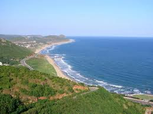

*For Part 3 in this series, I bring to you an interview with Srinivas Savaram. Srinivas is my friend from Rejuvenate India Movement volunteering days (circa 1999) – I later learned that he was my senior in Timpany School, Vizag too. He returned to India in 2004.*

**Q: How long &amp; where did you live in US? When did you return to India?**  
 A: Lived in the US for just over 15 years mostly in Northern Virginia (DC metro area). Returned to India in early 2004.

**Q: Why did you return?**  
A: As with most Indians, the yearning to return ‘home’ was always there. For a while it morphed into a modified version of X+1 syndrome since I stayed in school for much longer than most others. However, the desire to return became stronger since in the late ’90s. Around this time, my involvement with many voluntary organizations started in earnest, a majority being India related. This increased my awareness of the needs in India and so the desire to return to India became even stronger. By this time, my brother and sister had also moved to the US. This prompted my parents to finally visit the US for the first time. They waited until both of them retired. Realizing the difficulties that retired persons face in India, the desire to return reached a fever pitch. So, one fine day, I decided that the time had come. Since I was still single, the decision was probably easier than for many others. At the time of returning, my reasons for the decision were:

1. Do some hands on volunteer work to help the underprivileged, specifically related to literacy and education,
2. To be with my parents so that they did not feel lonely and I did not feel guilty that I was enjoying a life of luxury that would not be possible without them while they are left to fend for themselves at a time when their energy levels may be taking a downturn. There was also a realization, based on my experience interacting with retired friends and colleagues in the US, that in India retired people assume that their life is over and now they have nothing much to look forward to versus their counterparts in the US who look forward to a new life of freedom, exploration and relaxation.
3. To start a business of my own and provide much needed employment to the growing number of youth in India as well as to create a long lasting reputed organization.
4. To start an educational institution which will set the mind free and create the much needed leaders of tomorrow.

<figure aria-describedby="caption-attachment-1754" class="wp-caption alignleft" id="attachment_1754" style="width: 259px">

<figcaption class="wp-caption-text" id="caption-attachment-1754">Rishikonda (one of Vizag’s famous beaches)</figcaption></figure>

**Q: Which Indian city did you move to and why?**  
A: Since my parents are in Visakhapatnam (aka “Vizag”) and it is a city that always tugs at my heart, this was the only option open. I did not want to move to a larger city where my career prospects might be better because it would mean uprooting my parents and their comfort. Vizag also offered an opportunity create a strong new sector (IT or otherwise) from scratch that other cities did not offer.

**Q: Which company did you move to? How did it work out? Where do you work now?**  
A: I moved without a job on hand wanting to go with the opportunities that presented themselves. I initially joined a local software company but very quickly moved out to take up a franchise of a HR company along with a business partner. The franchise experience taught some very valuable lessons, the biggest one being that working with Indian franchisers is laden with a lot of risks. We are now an independent company offering consulting services – we added management and IT consulting to our portfolio in addition to HR consulting.

**Q: Dwellings – apartment, villa or independent home? How did you arrive at this decision? Did you move all/part of your household belongings?**  
A: Since my return I have been living in my parents home along with them. Maybe I am old fashioned but for me a nuclear family is not appealing. I was able to give away almost all my furniture and other belongings, so I brought back only a part of what I had in the US. In hindsight I probably would have left back even more.

**Q: How do you rate your return to India on a scale of 1-10 (10=love the place, why didn’t we move earlier, 1=hate\_the\_place; currently planning my return back to USA)**  
A: 7 or 7.5.

**Q: What are the 3 things you absolutely love about India since you returned?**  
A: Here’s my list:

- Being with my parents so that they have peace of mind that their son is there in case of need.
- The love and closeness that you get from people.
- The endless opportunities that are available.

**Q: What are the 3 things you absolutely detest about being in India?**  
A: Here’s my top 3:

- The apathy of people, especially of the so-called educated ones, in cities.
- The inexcusable neglect of primary education especially in rural areas that will prevent India from becoming a truly developed democracy.
- Ever widening economic divide because a few selfish and short term thinking people are not enabling their fellow Indians to also benefit from the many opportunities for growth that exist.

**Q: What are the 3 things you miss most about America?**  
A: Family and friends would come first. Second would be the access to volunteering, education, sports and entertainment. I have had the chance to volunteer in soup kitchens, at the airport (Travelers Aid), in river cleanups (as a part of SAALT’s Gandhi Day of Service), in temples (Siva Vishnu Temple, Rajdhani Mandir) in addition to [India Literacy Project (ILP)](http//www.ilpnet.org/), [Association for India’s Development (AID)](http://www.aidindia.org/main/), [Asha for Education](http://www.ashanet.org/) and Rejuvenate India Movement (RIM). This is something I truly miss over and have been waiting for too long to do here in India. The third would be the honesty, professionalism and work ethic which is probably going to take some time to take root in the cities of India.

**Q: Is there anything else about your R2I experience you’d like to share?**  
A: Yes. Returning to India is not for those who want to have a structured life although even that is possible nowadays as long as one decides to live in a gated community and keeps away from the hustle and bustle of everyday interaction with average Indians. Many things are still a struggle although many things have improved over the past 5 years. So life in the US is almost a cakewalk compared to India. Having said that, India is India. What you make of it depends on what you bring to it. You love her, she loves you back. You hate her, she lets you be. You want to change her, it’s going to be an epic struggle but it is possible.

*\[Editor’s Note: Along with a business partner, Srinivas runs IndiGenius (*[*www.indigenius.co.in*](http://www.indigenius.co.in/)*), a consulting company located in Visakhapatnam. He is also attempting to start a chapter of ILP in Vizag in addition to the efforts on Primary Education that are in pause mode right now. He is a trustee in a local non-profit organization called Upkaar Charitable Trust. In conjunction with his collaborations on Effective Primary Education with Dr. Parameswara Rao, Srinivas maintains the blog* [*http://citizensforeffectiveprimaryeducation.blogspot.com/*](http://citizensforeffectiveprimaryeducation.blogspot.com/)*. As you can see, he likes to keep himself busy.\]*