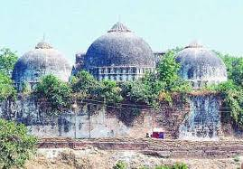
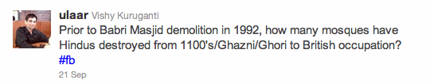
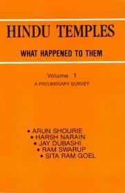

<figure aria-describedby="caption-attachment-1585" class="wp-caption alignleft" id="attachment_1585" style="width: 269px">

<figcaption class="wp-caption-text" id="caption-attachment-1585">Babri Masjid file photo from Wikipedia</figcaption></figure>

On Sep 21, I tweeted the following:

Since my follower count is a lowly 280, not much of a discussion happens on Twitter. But since I had also published it to Facebook, there were a few responses – a grand total of 2 friends “liked” the post. I was trying to be controversial people! I guess my friends know me too well – it was a rhetorical question and we all know the answer.

And then I read Arnab Ray’s (aka Twitter handle @greatbong) post on [The Babri Verdict](http://greatbong.net/2010/09/21/the-babri-verdict/) and realized that I had more to say on this subject. Arnab writes:

> *The wrongs of history need to be rectified, even though they may have occured hundreds of years ago.” To them I say—-So Babur knocked down a Hindu temple and built a mosque over it. It happened a long time ago. Get over it.*

<figure aria-describedby="caption-attachment-1587" class="wp-caption alignright" id="attachment_1587" style="width: 181px">

<figcaption class="wp-caption-text" id="caption-attachment-1587">Pic: courtesy vedicbooks.net</figcaption></figure>

Yes – it happened a long time ago (some 500 years ago ago). What is less widely known is that during the entire Mughal invasion period, some 2000 temples were systematically destroyed and 2000 mosques built in their place. This is the primary thesis of a two-volume book [Hindu Temples – What happened to them](http://en.wikipedia.org/wiki/Hindu_Temples:_What_Happened_to_Them) authored by Sita Ram Goel, Arun Shourie, Harsh Narain, Jay Dubashi and Ram Swarup. The primary source for this two-volume tome: books of Muslim historians of the period or the inscriptions of the mosques. As the Wikipedia article highlights, there’s no dearth of detractors to the content in this book. Critical comments range from “very bad book” (Manini Chatterjee) to “greatly inflated” (Cynthia Talbot) to L.K Advani “chiding Goel for using strong language”. Romila Thapar, a leading Indian historian, has criticized Goel, claiming that he does not understand how to use historical sources, without actually refuting any of the facts presented by Goel.

For the sake of argument, let’s assume that Cynthia Talbot is on to something — the numbers are “greatly inflated”, so maybe it’s not 2000 but 200! Nobody’s denying that temples were destroyed at all so surely the detractors will be happy with a 90% haircut? Two wrongs don’t make one right but I’m offering a once-in-a-century-outside-judicio deal to Hindus and Muslims: 200-2000 Hindu temples destroyed by Muslims over a 300 year period is a DEAD TIE (pun intended!) with one Muslim mosque destroyed by Hindus in 1992. I know the math doesn’t sound right but, believe me, it MUST make sense.

Why MUST it make sense? Because we’ve bickered about it long enough. According to Sagarika Ghose (in this recent article [Ayodhya in New India](http://ibnlive.in.com/blogs/sagarikaghose/223/62016/sagarika-ghoses-blog-ayodhya-in-new-india.html?from=tn)), the Babri Masjid Ram Janmabhoomi dispute is not a living issue with residents anymore. She concludes with the following:

> *Yet India is a different country today. Globalisation and 8 per cent growth have created an upwardly mobile newly rich society. While Ram may remain an article of faith for many Hindus, there is little evidence to show that conditions for street protests of the 1990s exist today. Ayodhya the article of faith, Ayodhya, the political symbol, is very much alive. But Ayodhya, the inspiration for a mass movement, seems to be an idea which has been overtaken by the opportunities and hopes of a new century and a whole new generation of voters born after 1992.*

However, it behooves us to be leery of politicians who, given half an opportunity, are capable of whipping the factions into a frenzy. So what can we hope/expect from the judicial verdict? An innocent thought from our resident second grader could offer a clue. He returned from school last week (on the day the Allahabad High Court was supposed to announce the verdict) and asked us “Why can’t they build a temple AND a mosque in that place?”

Arnab Ray concludes his article thus:

> *Now what should be done at the Babri site—I honestly believe (and I am sure I am not the only one) that, in order to please everyone, we should construct a gigantic shopping mall- multiplex complex. Why? Because a mall is the temple of modern India (not dams as Nehru said) as it is constructed in the name of the one God that unites us all—- Hindu, Muslim, Christian, Sikh, Chetan-Bhagatites. The Capitalist God, the most secular of them all. Vulgar and ostentatious He may be but at least when He peddles false hopes of salvation by making you sacrifice your money, He discriminates against no one.*

Sorry, Arnab! Don’t agree with your suggestion. I much prefer my second grader’s suggestion — last I checked there are a lot more religious folks than capitalists in India. Anyway, tomorrow is another day. I’m suddenly encouraged by this article that appeared on Rediff a few hours ago – [Mosque and temple can be built side by side in Ayodhya](http://news.rediff.com/report/2010/sep/27/mosque-and-temple-can-be-built-side-by-side.htm)!
