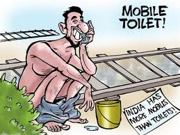

<figure aria-describedby="caption-attachment-1582" class="wp-caption alignleft" id="attachment_1582" style="width: 259px">

<figcaption class="wp-caption-text" id="caption-attachment-1582">Pic: courtesy bharatabharati.wordpress.com</figcaption></figure>

(Warning: if you are grossed out by graphic descriptions of crap and related topics, or are otherwise squeamish, might want to give this post a miss.)

Saw this story being shared on Twitter a few days ago – [India: Land of many cell phones, fewer toilets](http://www.businessweek.com/ap/financialnews/D9J6EKRG2.htm) and thought to myself – wasn’t this widely reported 3 months ago? Maybe Businessweek was late to the story… Anywaym I’m glad I clicked through to the story because some fresh factoids were revealed to me.

> *The government is spending $350 million a year to build toilets in rural areas. Bindeshwar Pathak, the founder of the Sulabh Sanitation and Social Reform Movement, estimates the country needs about 120 million more latrines — likely the largest sanitation project in world history.*
> 
> *Just beside the shacks, men and women defecate in separate areas behind rolling hills of green foliage that have sprung up over the garbage. Children run through those hills, flying kites.*
> 
> *With the wait for those toilets up to an hour even at 5 a.m., and the two-rupee (4-cent) fee too expensive for many, most people either use a field or wait to use the toilets at work, says Santosh Thorat, 32, a community organizer. Nearly 60 percent have developed piles from regularly waiting to defecate, he says.*

A day later, the inimitable Nitin Pai (of [The Acorn](http://acorn.nationalinterest.in/) fame) shared his 2007 post [TV over toilets](http://acorn.nationalinterest.in/2007/04/25/tv-over-toilets/) where he explains why slum-dwellers of Dharavi prefer TV to toilets.

> *Toilets are not very useful—especially in urban settings—unless there is a good system of sanitation. You can build a toilet, but you cant just buy sanitation. Similarly, running water is not something you can buy from a shop even if you had money (as many people in Dharavi do, that’s why they can afford to buy TV sets). So the residents of Dharavi are not seeking any more escape than their well-heeled counterparts in parts of the city that do have good toilets and running water. No, the residents of Dharavi chose to buy TV sets because the government has failed to provide them with sanitation and water supply.*

Which brings us to a 2004 post from Atanu Dey – [Choosing between WCs and PCs](http://www.deeshaa.org/2004/12/28/choosing-between-wcs-and-pcs/) that simply nails the argument and supplied the title of this post.

> *“Sanitation and clean drinking water are problems that are real and will have a greater impact on the lives of people in urban and rural India than giving them access to information and installing internet kiosks. If you provide them with just those two, you would improve their lives much more and they will suffer much less from diseases. A glass of clean drinking water will help them more than information on the internet about health. A decent place to crap in would help the women in urban and rural areas more than surfing the world wide web.*