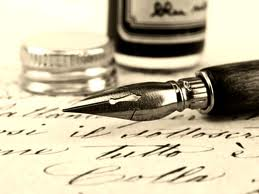

This is the first blog post I wrote (I mean *hand wrote*) with my new [Lamy](http://en.wikipedia.org/wiki/Lamy) fountain pen. Considering that the paper and pen are a dying breed (a question of when, not if), what made me go to the [William Penn](http://www.williampenn.net/index.php) (The World Pen store) in Koramangala and walk out with a charcoal black Lamy fountain pen? Not to digress too much, the modern fountain pen has evolved quite a bit in the past 20 years. Instead of that familiar squeeze-and-suction mechanism we were accustomed to during our school/college years, the modern fountain pen comes with a replaceable ink-filled cartridge. If you have a strong desire to transport yourself to the late 20th century, advanced fountain pen models come with a *converter* which, attaches to the cartridge and, allows one to fill up the old-fashioned way…from an ink bottle.

So why fountain pen? and why now? Let me rewind back to my 3rd grade days in St. Xaviers Bokaro. My class teacher (Mrs. John) was the first one who spotted my talent — in really bad handwriting. At the formative age of eight, by which most budding students would have learned the perfect pencil/pen holding technique (an angle of 45degrees), the lesson was lost on at least one specimen – me. It wasn’t a deliberate attempt on my part to flout guidelines set by teachers or parents (I was far from rebellious those days). In any case, I had reached Mrs. John’s 3rd Grade with a peculiar 89 degrees grip – a grip which to me, was as natural as the 45 degrees grip favored by the rest of the class. While the grip felt natural, the calligraphic output was far from intelligible or beautiful. What it thoroughly lacked was symmetry, balance and determinism. One glance at my notebook with my pencil poised purposefully and Mrs. John declared my writing was fit for a doctor. (Note for my non-Indian readers: the vast majority of Indian doctors have a notoriously illegible handwriting — their prescriptions can be deciphered only by seasoned pharmacists).

As I worked up my school grades, the one constant was my bad handwriting. The pencil gave way to the ink pen in 5th grade – alas! it didn’t change my fortunes. And it wasn’t that I didn’t try hard enough to improve my writing. Every summer, I would write several pages of cursive writing. I would slow down, try very hard to emulate that perfect 45 degrees angle, occasionally be encouraged by a perceptible improvement. Yet this would turn out to be short-lived – in the din and roar of the regular school year, my grip would relapse to the cursed 89 degrees with its predictable results.

Perhaps there was a genetic explanation for all this. After all, both my father and maternal grandfather were not renowned for their calligraphy. The latter’s writing was so unintelligible that his father, upon receiving postcards from him, would throw it away in dismay, only to pick it up hours later and attempt to decode the cipher.

In the 8th grade, our Hindi teacher observed that the entire class’s writing wasn’t up to par so he made us write a page every day — for about 3 months. He would grade the pages as *uttam* (Good in Hindi), *atiuttam* (very good in Hindi), or *sarvottam* (excellent in Hindi). My trials with the Devnagari script were similar to my tribulations with the Latin script. While most of the class’s writing grades hovered between *atiuttam* and *sarvottam*, mine stayed steady at *uttam*. This didn’t escape the attention of the teacher. After grading a month’s worth of my writing samples, he wrote the following comment in my diary: *Bahut din se dekh rahan hoon ki aapki likhawat mein sudhaar nahin aa raha hai! Thoda aur mehnet kijiye!* (English translation: For several days I’ve noticed that your writing is showing no signs of improvement. Try a little harder!)

I suppose one could let sleeping dogs and bad handwriting lie especially when the keyboard of the digital century is tapping away the obituary of the papyrus and the ink stylus. But that would be too easy, no? I would like to understand why my writing was (and continues to be) bad. They say handwriting experts can analyze writing samples and predict a person’s personality traits. Is it a case of the dog wagging its tail or the other way round? Perhaps it doesn’t matter. As we work out the flaws in our personality, the improvements should show itself in our handwriting, right? Only time will tell. Meanwhile I’m still enjoying the companionship and regular writing walks with my charcoal black Lamy fountain pen – eight months after its purchase.

