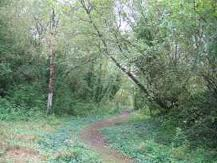

<figure aria-describedby="caption-attachment-1835" class="wp-caption alignleft" id="attachment_1835" style="width: 217px">

<figcaption class="wp-caption-text" id="caption-attachment-1835">Pic: courtesy greenwoodworker.co.uk</figcaption></figure>

There are only two primary strategies to running a marathon – running the entire distance at close to your target pace or adopt a run-walk rhythm for the entire distance. The latter (run-walk) strategy, popularized by US Olympian Jeff Galloway, advocates a run-walk rhythm (for example, run a mile followed by a minute of walking) where the length of the run and duration of the walk can be custom to the runner. The rest of this post has nothing to do with the run-walk strategy. Instead, it’s an attempt to analyze a key problem the former strategy (of running continuously) throws up — the *unplanned* walk.

What’s the big deal with walking a bit when the race distance is a whopping 42km? It’s not a big deal — as long as you’ve planned for it. A good friend puts it succinctly – *“it doesn’t matter whether you walk or run until you walk.”* When the unplanned walk arrives, a couple of conflicting emotions set in. One first feels an incredible relief in granting the body a much needed rest. This relief is almost immediately followed by a counterpoint feeling of despair and failure. Despair because you had not planned on having this *walking rest*. Each extra second/minute of walking wreaks havoc on your carefully controlled pace and, by consequence, adversely affects your goal – that *blessed* target completion time.

The two conflicting emotions end up making the rest-walk a combination of pleasure and pain – pleasure for the recovering body and pain for the mind that’s tasted a small defeat. Longer the duration of the rest-walk greater the pleasure-pain oscillation. At some point, despair turns into defeatist soliloquy like this *“Aw! what the hell, I’ve been walking for two minutes, what difference will an extra minute of walking make?”* Even after you eventually resume running after the first rest-walk, the bruised mind results in a defeatist body language — slower pace, becomes easier to stop for the next rest-walk, etc.