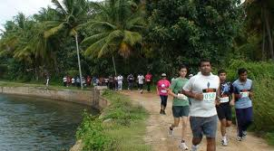

<figure aria-describedby="caption-attachment-1702" class="wp-caption alignleft" id="attachment_1702" style="width: 300px">

<figcaption class="wp-caption-text" id="caption-attachment-1702">Picturesque stretch of the KTM trail (Pic: courtesy buzzintown.com)</figcaption></figure>

“I hate this damn course!”

“I’m never gonna run this again”

“It was a mistake to make this my first ever marathon.”

“I cramped at 31k and things only got worse after that.”

“Boy! It was really hot today. I ran this last year too but I’m not sure I’ll return next year.”

Post-race remarks from three runners (including myself) after completing the 2009 edition of Kaveri Trail Marathon (KTM). After swearing ourselves silly, two of us returned to the course on Sep 19, 2010. Meher (regular podium finisher on the Bangalore running circuit) achieved a PB timing of 4 hours 24 min. I came in at 4 hours 53 min – far cry from my 2002 PB time of 4 hours 32 min but I ended up shaving 22 minutes from last year’s KTM effort (my 1st marathon in India). All things considered, good showing and many positive things to take away.

First a bit about the course. Set in the historic town of Srirangapatnam (closer to Mysore than Bangalore), the trail starts right near the gate of the Ranganathitu Bird Sanctuary. The trail has a fairly heterogeneous running surface and by heterogenous I mean: soft dirt, small &amp; medium sized pebbled surface, rocky, grassy, and a wee bit of gravely road. The trail is 10.55km long (up and down inclusive) so the half marathoners do one roundtrip while the full marathoners need to do the round trip twice. The route runs parallel to one of the canals of the Kaveri river (hence the name, duh!) for about 90% of the overall distance. It’s picturesque, rustic, and serene, lush green fields dotted with the occasional group of farmers tending to their crops, coconut trees casting their shade, and the flowing water body giving you company almost all the way.

Of course, a marathoner’s outlook towards the surroundings undergoes a sea change after the halfway mark. A bullock cart plodding at a leisurely pace and occupying 95% of the trail width is cute at the 5k mark but raises your hackles at the 30k when one is struggling to regain rhythm. With the advent of the morning sun (9am in Srirangapatnam = 1pm in Bangalore), the trail morphs to something else altogether. Calm and serene changes to hot, humid and desolate but wait… I’m getting ahead of myself.

Why did I return to KTM?

KTM 2009 was far from the crowning glory of my fledgling marathon running. It was a painfully grinding finish – the only thing satisfying about it was that I *finished* it. It would have been so much easier to just skip KTM but there were at least 3 reasons for not doing so:

- Needed to return to exorcise my demons from last year
- Seems a waste to run 1200+ km in a year and only run *one* official marathon
- With a peer running group that runs 4-5 marathons and one ultra-marathon a year, I’d be excommunicated if I did only one (There, I confessed guys!)

Before the race:

My preparation got off to a disastrous start in February after being diagnosed with a *moderate* case of slipped disc. The good news about *moderate* is that no surgery is required. 3 weeks of complete rest followed by a lifetime of back strengthening exercise regimen – sounded like a reasonable tradeoff to me. After a 3-month break, I resumed running in June – tentatively first with low weekly mileage then quickly ramped up to my regular mileage.

July was a heady month as I racked up a couple of 30k+ runs at a strong pace of 6:05. This heady rise was followed by a setback in August. I experienced classic symptoms of [ITBS](http://en.wikipedia.org/wiki/Iliotibial_band_syndrome) in my left knee after one of my long runs. I took the usual precautions for a few weeks (read “taking a break from running and regular icing and stretching” ) and tentatively resumed my training. I seemingly bounced back by doing a decently paced 30k run but the ITB pain never fully went away. As a result, my taper duration ended up lasting three weeks instead of two.

A tale of two race day weekends

The lead up to KTM 2010 was very different compared to the previous year. Last year was a mad dash in a convoy of Toyota Innovas — starting at 4am and reaching the race start a mere 5 min before the kickoff. I recall grabbing the bib from Shantanu, hurriedly pinning it on, stuffing packets of Gu gel in my left hand, and ambling off — the last among the group of 70-odd full marathoners. It also didn’t help that I had a tiff with the missus the prior evening. The problem with unresolved tiffs is that your mind plays and replays the conversation — like “how *could* she say that” and “how dumb was I to say *that*“. Anyway that was last year.

This year it was a family weekend at Mysore followed by KTM2010. We had reservations at the Royal Orchid in Brindavan Garden and a day of activities planned for Saturday. This was the main reason why the ITBS scare, a month before race day, didn’t dampen my enthusiasm too much — at worst, we’d have a great weekend in Mysore.

The Race

After my struggles holding a fistful of Gu gel packs at KTM2009, I got myself a Nike belt pouch which worked great for this year’s Mumbai Marathon. If you’ve read my Mumbai Marathon race report ([Running the Course – Mumbai Marathon 2010](http://ulaar.wordpress.com/2010/02/14/running-the-course-mumbai-marathon-2010/)), I’ve discussed at length my continuous hydration policy. I wasn’t about to change that policy for KTM2010, well maybe tweak it a bit. During the final 10k at Mumbai Marathon, I was getting really annoyed because I only had diluted Gatorade to sip. I craved pure unadulterated water — the craving was probably compounded because I wasn’t carrying it.

I finally decided to carry two bottles – one for diluted Gatorade, the other for water. This strategy of alternately sipping these fluids worked brilliantly… until the 23k mark when I needed to refill the bottles. Lugging two full bottles on fresh limbs vs. tired 23k limbs can be quite different. I had paced myself extra slow for the first 21k for fear of triggering ITBS too early in the race. The heavy bottle syndrome was the first distraction my mind had to deal with – fortunately I addressed it soon enough. At the 25k water stop, I jettisoned the water bottle leaving me with the tried-and-tested Gatorade bottle. The 22-26k stretch was negotiated with some trepidation because my problems last year began at the 24k mark when I had succumbed to the temptation to..walk!

My experience running KTM 2009 gave me insight into the [psychology of the unplanned walk](http://ulaar.wordpress.com/2010/12/30/psychology-of-the-unplanned-walk/). I had identified the *rest-walks* as the key reason for last year’s debacle and was determined to mitigate its deleterious impact on my race performance. The operative word was *mitigate* because I knew that the rest-walks were a question of when, not if. My strategy was to delay the inevitable ‘first’ rest-walk and play out the run-walk sequence for the remaining distance. As it turned out, I was able to push myself till the 29k mark before succumbing to my first rest-walk. And this time, my body had a legitimate (read “physical”) reason – the ITB on my left leg had acted up big time.

Dedicating the run

I dedicated this race to three special people.

1. RB: RB is my first ever best friend – from my formative years at St. Xaviers Bokaro. We went our separate ways in 1983-84 – me to Visakhapatnam-Ranchi-Jamshedpur-US, him to Delhi and then Calcutta for higher studies. We reconnected in late 2009. Turns out he was afflicted by a series of severe joint-related and hard-to-diagnose illnesses that have kept him bed-ridden and home-ridden in Calcutta for most of the last 20 years.
2. BTV: BTV is my batchmate and friend from BIT Mesra. Our paths overlapped again from 1998 to 2008 during my Silicon Valley days. Though BTV lived in Sacramento (100-odd miles from Silicon Valley), we’d still end up meeting at a mutual friend’s party every now and then. A week after celebrating his 40th birthday, BTV suffered a severe heart attack. He miraculously survived but stayed in a paralyzed/comatose state for weeks. The recovery process (improvement in motor functions, sensory functions) has been long and slow — two+ years and counting.
3. Binil Anthony: Binil was a great engineer/person in my team at Adobe. He was diagnosed with brain tumor in Aug 2009, underwent several treatments and procedures but ultimately passed away in Jun 2010. I met him exactly once – while he was convalescing after one of the treatments. The positivity and confidence he projected and the quiet strength I sensed from his mother were both inspiring and humbling.

Finishing the race

The final 10k in a marathon is the best time to have a series of internal soliloquy. As my ITBS pain intensified, that famous Lance Armstrong quote flashed by “Pain is temporary, quitting is permanent.”. “Yeah right. But this pain is bloody real, ok!” replied that other voice in my head. As I described in the [Psychology of the unplanned walk](http://ulaar.wordpress.com/2010/12/30/psychology-of-the-unplanned-walk/), the first rest-walk duly arrived after the 29k mark and I resigned myself to a series of long walks interspersed with some short runs.

At times like these, one is reminded about the reasons for running a marathon, and more importantly, why one should *finish*. I thought of my friend RB (who’s been enduring and managing pain on-and-off for *twenty* years) and then thought of my other friend BTV (who cannot walk or even sit up straight without support for the past three years). The mind makes a quick silly comparison of the predicaments and screams at me “What are YOU complaining about?” Enough said. This thought served as a whip to my body and I resumed running. After the second or third rest-walk, I made a strange counter-intuitive observation – my ITBS pain seemed more acute when I was walking than when I was running! Sure – my running pace at this stage was pretty close to 07:00 so it was more accurate to call it *ambling*. Anyway, this observation gave an unexpected fillip to my flagging spirits with the result that my run-walk rhythm changed with the running duration becoming longer and my walks shorter.

As the countdown hit “7k more to go”, I got two more reasons to galvanize myself:

1. A glance at my Garmin followed by quick mental math led me to conclude that I could finish under 5 hours if I maintained the current run-walk pace.
2. Sudden realization that I had a full-fledged family reception committee waiting for me at the finish line – my two boys and my wife. Yea!

The final kilometers were thankfully eaten up without further mishap. Then I turned the final corner, sighted the finish line, and saw the bright red and orange color t-shirts of my boys — briefly considered making a glorious sprint (to which my body said “Nice try!”) and I was home.