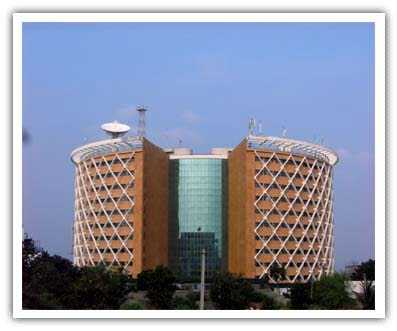

*\[Editor’s Note: After an extended silence in the [R2IProfiles](https://www.ulaar.com/categories/r2i/) category, I bring you an interview with a recently returned (to India) fellow blogger, Vasantha Gullapalli. Most of the answers below are partial or full extracts from her [blog](http://vgulla.blogspot.com/) (which you should frequent, especially if you are contemplating a move to Hyderabad). She and her husband are “Class of 2010” returnees which makes them two years our juniors 🙂 As it coincidentally turns out, Vasantha and her husband are long-time Sapient’ers and friends with Soumya Banerjee (of [Bengali Mumbaikar takes the long way home ](https://www.ulaar.com/2010/07/29/bengali-mumbaikar-takes-the-long-way-home/)fame).\]*

**Q: How long &amp; where did you live in US? When did you return to India?**  
 A: Lived in the US for 16 years mostly in the New Jersey/ New York area. Returned to India on Sep 25, 2010.

**Q: Why did you return?**  
A: *\[Reproduced entirely from her beautiful post –* [*Home is where the heart is*](http://vgulla.blogspot.com/2010/06/home-is-where-heart-is.html)*\]* In the most basic sense, ‘Home’ is nothing more than a shelter or roof over one’s head to protect from the basic elements of nature. But, is that all that is needed in a home? So, what is it that we need in life? One practical point of view suggests that all we need is air to breathe, food to eat and a shelter and then you add to this the basic human craving for love, companionship, etc., we are already talking about personal needs such as family, friends and then as we move towards being a social being, we are treading into professional aspirations, social status, etc. One of my friends said something that struck a chord with me which is something like this (shamelessly plagiarizing): Life revolves around these three pivots – ***Personal*** needs, ***Professional*** needs and ***Spiritual*** needs and finally Home is where all these three pivots can be balanced and satisfied. It definitely sounded very thought provoking and deep, but for me it has always been ‘Home is where the heart is’ and that heart sometimes doesn’t listen to my head 🙂 So, in the process of trying to understand my heart better, my head started listing down what the above statement really meant? What do I need from my home/life? Here are some that I could put down:

- I want to be able to be surrounded by people that I can relate to. I want to be able to understand what their lives are like, what struggles they have, how I can help them and want them to understand my life and lend a hand when I need it
- I want to be able to share my beliefs, superstitions or idiosyncrasies and not be looked upon like a ‘fool’ or ‘stranger’
- I want to be able to walk out of my home and be able to relate to even a complete stranger because we share the same background
- I don’t want to be planning every meeting and every moment that I feel like spending with the people I love
- I want to be able to drop things at a moment’s notice to be side-to-side with the people I love and care and selfishly would like the same from them in the time of need
- I want to be able to show off my little day-to-day victories or my kids accomplishments before that moment has passed
- I want to witness the special moments in ‘my peoples’ lives right then
- I want to be in a place where I will be missed when I don’t show up one day
- I want to be in a place where the difference I make will make a difference to me

**Q: Which Indian city did you move to and why?**  
A: Hyderabad (given the proximity to career opportunities and family).

**Q: If proximity to family wasn’t a top concern, which city would you have rather moved to?**  
A: Well, our priority was not just proximity to family, it was both good school and employment opportunities, a social circle that is needed for day to day life and just to have a life. Given these, I think we would have stuck with Hyderabad and second choice was Bangalore.

**Q: Dwellings – apartment, villa or independent home? How did you arrive at this decision? Did you move all/part of your household belongings?**

A: In Hyderabad, we will be moving into our apartment which is not done yet. Currently, enjoying our stay with our parents and my sister. From US, we shipped all the things that we thought we could use here plus things we and kids are attached to. We did not/could not sell the house and so rented it out, sold the cars, got rid of a lot of stuff that we either didn’t need anymore or not attached to as much. Since shipping was being taken care by my husband’s employer, we didn’t have to worry much. In spite of this, there was a lot of decluttering I had to do.

**Q: Which schools are your kid(s) going to? And what were your criteria in picking schools?**

A: Indus International School, Hyderabad. Short list and criteria discussed in the [School choices](http://our-returnticket.blogspot.com/2010/09/school-choices.html) post.

**Q: How do you rate your return to India on a scale of 1-10 (10=love the place, why didn’t we move earlier, 1=hate\_the\_place; currently planning my return back to USA)**  
A: 7 *\[Editor’s note: considering it’s less than 6 months since their move, I’d call this a pretty high rating\].* For context, check out our [1 month progress report](http://our-returnticket.blogspot.com/2010/10/1-month-progress-report-meeting.html).

**Q: What are the 3 things you absolutely love about India since you returned?**  
A: From our [first quarter progress report](http://our-returnticket.blogspot.com/2011/01/hit-or-miss.html), the top 3 are:

- My people around me – Lot of relief that I don’t have to save up vacations just to spend time with them, confidence that I am right here and they are around me if they or us need anything anytime.
- Kids adjustment – Kids have blended in so beautifully, they are enjoying school, making new friends, learning Telugu, enjoying our festivals, even enjoying the unexpected bandhs 🙂
- Time for each other – Although, I am having some time management issues, in general we don’t feel rushed and don’t have to wait for the weekend to have our breakfast at the table or sit down for a cup of tea in the evenings

**Q: What are the 3 things you absolutely detest about being in India?**  
A: Corruption, the state of politics in Andhra Pradesh, and the lack of professionalism in people you interact with day to day.

**Q: What are the 3 things you miss most about America?**  
A: Here’s our top 3:

- Privacy and coziness – I miss the privacy and coziness that comes with being just the 4 of us. I hope we will get this back once we move into our own home (we are still not there yet)
- Dependence: The Indian society is very tightly knit and how smooth our life is depends on the contacts we have. With this, comes some amount of dependence and unpredictability. I miss being able to drive down to the grocery shop. Since I am still not comfortable driving in India, I have to wait for some driver to grace us before I can step out.
- Streamlined day to day – In general, life in US is pretty streamlined and after the initial settling down and figuring out, our day to day was pretty streamlined and we were pretty confident with how to get things done. On the flip side, either because we are still not over the initial settling phase or perhaps this is just the way it is, there are very few things that are clearly streamlined here. Each time we seem to be using a different process or contact to get things done.

-------------
Closing note: Turns out the Gullpallis have recently executed an R2I2A - here's her [post](https://our-returnticket.blogspot.com/2020/08/life-happening-career-kids-and-indian.html) describing that.
