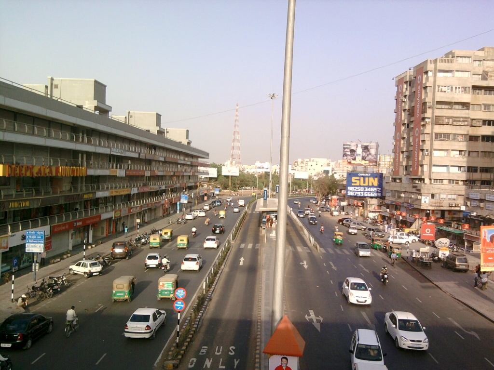

*\[Editor’s Note: For the 5th voice in this series, I bring you a guest post from Roona Ballachanda who describes herself on her [India Repat blog](http://indiarepat.blogspot.com/) as thus: “After seven years in the United States, I returned home to India in 2010, only to feel myself a stranger in my own country. Living an expat life in the US was an expectedly unique experience, however being an India Repat is something that I am yet unable to define or describe and so this blog…” She’s Class of 2010, still settling down – I found her story to be honest, authentic and more.\]*

<figure aria-describedby="caption-attachment-1748" class="wp-caption alignleft" id="attachment_1748" style="width: 300px">

<figcaption class="wp-caption-text" id="caption-attachment-1748">Shivranjani – Satellite in Ahmedabad (Pic: courtesy rojnuamdavad.wordpress)</figcaption></figure>

One night in August 2003, I boarded a flight heading out to the USA from Bangalore, India. Most of us here know the amount of preparation it takes to get into an American University and get a Student Visa as well, so here I was frozen with shock, thinking, “I am actually moving out of my country” and exhaustion after months of intensive work that culminated in this moment. Little did I realize to what extent this decision would influence my life in the ensuing years!

I spent two years in Illinois pursuing my master’s degree in social work and then moved to Cleveland, Ohio where I worked as a mental health social worker for five years. I visited India in 2006 to get married, my husband too worked in Cleveland and at that time, it appeared as if Cleveland would be our home for a considerable number of years, if not until the age of retirement!

My husband works for a manufacturing company and in 2009; they decided to open up Indian markets for their product. Once they decided upon this project, things happened so fast that he moved here in May of 2009 and I followed in May 2010.

After exploring different places to figure out the best place to conduct his business from, we decided on the city of Ahmedabad.

Although it was a relatively easy decision for my husband, it was a not easy for me to reconcile to this move. I felt that this would be a huge disruption in my life and career and would have preferred to wait until I had reached a certain turning point in my life before moving back. Due to this reason, even to this day, as I continue to struggle with settling down here, I cannot draw a definite line between issues related to countries and my own personal issues. As we do not have any children yet, we had one less thing to worry about while planning our repatriation.

I also think, initially, choosing Ahmedabad as the place to move back to made it very uncomfortable as well. I was born and raised in Coorg, Karnataka, lived in Mysore for a few years while attending College and then moved to the United States. Simply moving from Coorg/Mysore to Ahmedabad would have been culture shock enough without factoring in the United States as well! As for the month, I chose to move, the less said the better! I had just gotten through a particularly harsh winter in Cleveland, at the fag end of which, when there were signs of Spring in the air, in May, I moved to Ahmedabad where the hottest summer in a decade had begun and people, birds and animals were falling dead every other day unable to tolerate the heat. All I could see and feel was the unbelievably glaring sunlight, the scorching heat, the immense amount of dust, the soot and grime-covered buildings, the conservative culture and of course, the lack of boozing kens to drown our sorrows in as this is a dry state! To make things worse we were living in an almost empty apartment throughout the torrid summer as we had shipped our furniture and other household goods from Cleveland and it reached us only in November. There was no question of appreciating any of the nicer things except the air-conditioned shopping malls. Eventually this changed and I began to develop a liking to the place but when I first moved, I refused to believe that I would even be reconciled to this city one day, let alone like it!

When I try to think of what feels good about living in India, proximity to family tops the list(in our case proximity simply means living in the same country again!) along with the abundant sunshine and easy availability of garden fresh produce, meat and poultry, which makes it a relief not to have to rely mostly on supermarket crap. On the other hand, I still cannot tolerate the dust, the crazy traffic sense and the uncaring attitude most of our fellow country people have towards keeping our surroundings clean outside of our own homes and gardens.

There are certain things that I continue to miss about living in the US, I miss going out on road trips by myself, something I got used to during the year I lived alone in the States and exploring wine racks in the local stores, finally picking what I would like to try on any given day. I also miss the feeling of freedom where people respect personal decisions and individuality as a matter of course unlike India where we have no compunction about intruding into others’ space. However, what I miss most of all is the youthful optimism and cheer, the almost eerie feeling that you get of forgetting your mortality in the abundance and near perfection of life as it is lived in the United States.

If you ask me to rate my return to India on a scale of 1 to 10 with 10 being the happiest, I would say that today I stand at a four. This is partly because, so far, I am too engrossed with simply surviving this move to focus on building a life here but there is another more significant reason. India and the US are two hugely different entities and as I whole-heartedly loved the American way of life, it is taking me longer than I anticipated in working it out of my system and feeling at home in India again. I am not unhopeful of one day feeling content here but as of now, I still have days when I seriously contemplate moving back.

The one significant thing I realized from my moving back to India experience is that “how” we move matters a lot more than “why”. We can give ourselves umpteen number of reasons why coming back to India is a good idea but none of that will satisfy if the time, place and circumstances do not come together to make the move as seamless as possible and you have a decent closure for your life abroad before you come back home.