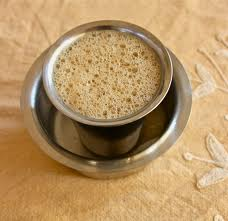

<figure aria-describedby="caption-attachment-1914" class="wp-caption alignleft" id="attachment_1914" style="width: 228px">

<figcaption class="wp-caption-text" id="caption-attachment-1914">South Indian filter coffe (Pic: courtesy saffrontail.blogspot.com)</figcaption></figure>

Every now and then, one reads an article, a book or prose and it’s not sufficient merely to shout from the ramparts “Buy/borrow the book and read it! It’s simply awesome!” What does one do in such cases?

Well… **Reproduce the entire text and then shout from the ramparts: “Read this!”**

The celebrated Indian novelist R.K. Narayan’s 1974 essay “Coffee Worries” moved me thus. I’m betting that his estate will not issue a cease-and-desist order on this blog because, after all, this essay is one among sixty essays which comprise the [Selected Essays 1958-1988 A Writer’s Nightmare](http://www.flipkart.com/writers-nightmare-selected-essays-1958-book-0140107916). Moreover, I’m also betting that most R.K.Narayan fans haven’t yet discovered that he wrote essays too and, after having read this rib tickler, will impulsively click on that Flipkart link and voila!

***Coffee Worries***

*For a South Indian, of all worries the least tolerable is coffee worry. Coffee worry may be defined as all unhappy speculation around the subject of coffee, as a habit, its supplies, its price, its quality, its morality, ethics, economics and so on. For a coffee addict (he does not like to be called an addict, the word has a disparaging sense, he feels that we might as well call each other milk addicts or food addicts or air addicts), the most painful experience is to hear a tea-drinker or a cocoa-drinker or a purist who drinks only water hold forth on the evils of drinking coffee. He views it as an attack on his liberty of thought and action. Even a misquoted Parliament report (as it recently happened) on the coffee policy of the government can produce in him the gravest disturbance, temporarily though.*

*It is not right to call it a habit. The word ‘habit’ like the word ‘addict’ has a disparaging sense. One might call smoking a habit, one might call almost everything else a habit, but not coffee. It is not a habit; it is a stabilizing force in human existence achieved through a long evolutionary process. The good coffee, brown and fragrant, is not a product achieved in a day. It is something attained after laborious trials and errors. At the beginning people must have attempted to draw decoction from the raw seed itself or tried to chew it; and then they learnt to fry it, and in the first instance, nearly converted it into charcoal. Now people have developed a sixth sense, and know exactly when the seed should be taken out of the frying pan and ground, and how finely or roughly it must be ground. Nothing pleases a normal man of South India more than the remark, “Oh, the coffee in his house is excellent.” You cannot get the likes of it anywhere else in the world.” Conversely no one likes to hear that his coffee is bad, although the truth may be that the powder he has used is adulterated, the strainer has let in all the powder, and there is every indication that they have (a horrible thing to do) added jaggery to the decoction. In this instance the thing to appreciate is not the coffee itself but the spirit behind it. South India has attained world renown for its coffee and every South Indian jealously guards this reputation.*

*Coffee forms nearly thirty per cent of any normal family budget. The South Indian does not mind this sacrifice. He may beg or run into debt for the sake of coffee, but he cannot feel that he has acquitted himself in his worldly existence properly unless he is able to provide his dependents with two doses of coffee a day and also ask any visitor who may drop in, “Will you have coffee?” without fear at heart. This is the basic minimum for a happy and satisfied existence. Here and there we may see households where the practice is more elaborately organized, and where coffee has to be available all hours of day or night. There are persons who call for a cup of coffee before starting a fresh sentence while writing or conversing. Perhaps all this may be too much. These are likely to come under the category of addicts, but their constant demand is understandable. No man asks for a fresh cup of coffee without criticizing the previous one. “It was not quite hot…. It seemed to have too much sugar. Let me see how this is…” It is only a continuous search for perfection, and let no one spoil it by giving it a bad name. Anyway, it cannot be called an addiction since anything that takes on that name brings forth evil results. Coffee has produced no bad result. It is supposed to spoil sleep, but there is a considerably growing school of thought that it is very good for insomnia. For one person who may say that coffee keeps him awake there are now at least three to declare that they can have a restful night only when they have taken a cup before retiring. All moralizing against coffee has misfired in this part of the country. “Coffee is a deadly poison, you are gradually destroying your system with it, etc.” declares some purist. He may lecture from a public platform or on a street corner but people will listen to him with only a pitying tolerance, with an air of saying. “Poor fellow, you don’t know what you are talking about, you don’t know what you are missing. You will still live and learn.” In course of time this prophecy is fulfilled. Many a man who came to scoff has remained to pray. Coffee has many conquests: saints, philosophers, thinkers and artists, who can never leave the bed unless they learn that coffee is ready, but not the least of its conquests is among those who came to wage a war on it.*

*—-0—-*