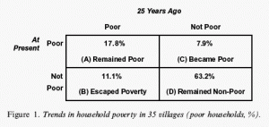
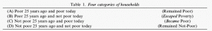
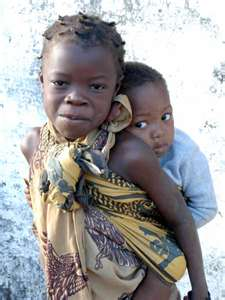

As I researched the back story on [Babajob](http://babajob.com), I learned that the main inspiration for Sean Blagsvedt (Babajob CEO) was a Duke University research study. The study \[[Escaping Poverty and Becoming Poor: Who Gains, Who Loses, and Why?\[PDF link](http://www.sanford.duke.edu/krishna/documents/Krishna_Rajasthan_poverty.pdf)\], authored by [Dr. Anirudh Krishna](http://fds.duke.edu/db/Sanford/krishna) in 2004, looked at data from 35 villages in Rajasthan over a period of 25 years and concluded that households’ escape from poverty is assisted by one set of factors, but an entirely different set of factors is associated with households’ decline.

Methodology: This study was conducted in 35 villages in five districts of Rajasthan . Poverty in Rajasthan has declined from 46% in 1973 to 27% in 1993, according to official statistics, which makes it one of the top five states in India in this regard. State GDP in Rajasthan has grown much faster than the national average during 1980-98. Education has also expanded rapidly in villages of this state, and 70% of villagers less than 25 years of age have five or more years of school education. Villages in the selected districts have an average population of 1,100 persons. More than 90% of village residents have agriculture as their principal occupation. Landholdings are however, quite small, less than half of one acre per capita on average; the land yields almost nothing in three years out of five because of scanty rainfall; and drought is a frequent visitor  
to this region. Village selection was purposive, including large as well as small villages, those located close to major roads and others more remotely situated. Villages where a single caste group is dominant were included along with others that have more diverse populations, including scheduled tribes and Muslims. A team of 16 field investigators, men and women in equal numbers and mostly themselves village residents of this area, trained together for three weeks at the start, and together we developed a preliminary methodology, which was pilot tested in nine villages and later refined and implemented in the 35 selected villages.

Establishing a shared understanding of what constitutes poverty was done using a *Stages-of-Progress* exercise. The first four stages of progress were common to different villages and are, in order:

- buying food to eat,
- sending children to school,
- possessing clothes to wear outside the house, and
- retiring debt in regular installments

**The Gainers**: 11% of households escaped poverty during the 25 year period – Category B. Diversification of income sources is the single most important reason associated with households’ escape from poverty in these villages. Of the 499 households of category B considered for this part of the analysis, diversification of income sources is a principal factor in 349 cases (70%).

Diversification requires taking up some other activity in addition to agriculture, and *successful diversification has in most cases required building a bridge to a city*. Some villagers have taken up a trade or a job in a city, while others remain in the village and produce goods for sale in cities. But comparatively few households escaping poverty have done so relying on resources and markets contained entirely within their rural area.

Personal capability and enterprise have counted much more in these cases of successful escape, and relatives’ help is also significant in many cases; however, direct assistance from government departments, NGOs, political parties and other outside agencies is comparatively much less important. Personal capability and enterprise figure prominently in 271 of 499 cases (54%). Help from relatives or friends is a principal reason in 208 cases (42%). But, assistance from government or other sources (including NGOs and political parties) figures as a contributing cause in only 7.5% of successful escape. *Despite the operation of various anti-poverty schemes almost continuously for the past 25 years, less than 10% of successful escapes from poverty in this region can be attributed even in part to assistance programs operated in this region over the past two decades*.

Some villagers have taken up additional activities but many more have sought new sources of livelihood in cities and they have gone as far a field as Mumbai, Bangalore, Chennai and Pune, several hundred kilometers away, to work as carpenters, cooks, ice cream vendors, laborers, masons, plumbers, sign-painters, tea stall assistants, truck drivers, and waiters. Mostly younger males move to the city for this purpose, and in nearly all of these cases they travel by themselves, leaving their families behind in the village. The positions they occupy in the city are hardly very secure and it is both more reliable and cheaper to have one’s family remain stable in the village.

Contacts providing information are critical for most cases of successful diversification. In 198 of 309 cases of successful diversification (64%), the availability of an external contact, a friend or more often a relative already established in the city, was critical for a households’ successful break from poverty. It is a sorry fact that even as the government in India has pledged itself increasingly to supporting market-led economic growth, it has not at the same time made market-based information easier to access by ordinary citizens. Instead, citizens rely mostly on kinship-based channels; those who are lucky enough to have relations in cities are the ones who are most able to diversify and break out of poverty.

**The Losers**: No single factor is associated with a household’s decline into poverty. Most often, a combination of factors is at work, pushing a household downward from nonpoverty into poverty. In more than 85% of all cases of decline into poverty, three principal factors are at work. A combination of health and health-related expenses, high-interest private debt, and social and customary expenses constitutes the major reasons for decline in the vast majority of cases.

Health problems and heavy expenses on healthcare (usually of poor quality and often with disastrous results) were included within the principal reasons for decline by a majority of households. Between one-half to two-thirds of category C households in every single village mentioned illnesses, accidents, and health-related expenditures among the four principal reasons contributing to their downfall. No matter if a village is very remotely situated or if it is located close to a big city (and a major hospital), health and expenses on healthcare figure prominently in more than half of all cases of households’ decline into poverty.

Debt is incurred when households in these villages need to make large and unexpected expenditures, especially on healthcare. Private moneylenders, and less often, relatives and friends, constitute the only available source of consumption credit. Private lenders’ rates of interest are almost invariably high, and they impose a severe burden, particularly upon poorer villagers.

Death feasts constitute the principal item of social expenditure in most villages of this region. Marriages also involve quite heavy  
expenditures, particularly for the bride’s family, and in about one-third of all these category C households, heavy expenditure on marriages constituted a principal reason for decline.

**Key Recommendations from Research**: Three elements – high healthcare costs, high interest consumption debt from private sources, and social expenses on deaths and marriages – together form a chain that leads many households into abiding poverty. Breaking the chain at any one of these three links can help rescue many thousands of households from falling into poverty each year. Villagers in the five districts studied here are all served by government-funded clinics and hospitals, but several reasons limit villagers’ use of these subsidized facilities. Reforming social practices and making reliable and affordable healthcare available will go a long way toward reducing the risk of households falling into poverty. In addition, and even separately by itself, making consumption loans available at a reasonable rate of interest will also help.

Arresting decline will be assisted by these measures, while promoting escape from poverty will require a different set of policy instruments. Diversification of income sources is critical in this respect, and information and contacts matter critically for a household diversifying successfully. It is through arranging for the provision of high-quality information that government agencies and NGOs can play the most effective roles in this region. Money currently spent to subsidize asset purchase by poor farmers is much better spent, in my view, by supplying information about disease control, about water tables, about opportunities in the city, about the means to hold state officials accountable, and about the methods that villagers can use to obtain gainful access to markets.

<figure aria-describedby="caption-attachment-971" class="wp-caption alignleft" id="attachment_971" style="width: 225px">

<figcaption class="wp-caption-text" id="caption-attachment-971">Pic: courtesy herewww.ispnews.net</figcaption></figure>

