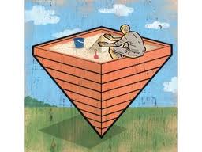

<figure aria-describedby="caption-attachment-1654" class="wp-caption alignleft" id="attachment_1654" style="width: 256px">

<figcaption class="wp-caption-text" id="caption-attachment-1654">Pic: courtesy borderbuster.blogspot.com</figcaption></figure>

India has a formidable chunk of its population at the Bottom of Pyramid (BOP), the poorest socio-economic group. Ever since BoP was defined by Professors C.K. Prahalad (University of Michigan) and Stuart Hart (Cornell University), and subsequently detailed in their respective books, a slew of healthy debates have raged:

- Is there really ‘fortune’ at the bottom of the pyramid? Aneel Karnani (also from University of Michigan) argues that there’s no fortune at the bottom and for most multinational companies the market is very small. Karnani propounds that the only way to alleviate poverty is to focus on the poor as producers, rather than as a market of consumers.
- Poor as business partners and innovators, rather than producers or consumers? An alternative approach proposed by Professor Stuart Hart and his colleague Erik Simanis have led to the development of the Base of Pyramid Protocol, an entrepreneurial process that guides companies in developing business partnerships with income-poor communities to co-create mutually beneficial businesses and markets.

For some businesses influenced by CK Prahalad’s BOP vision, it has resulted in new business models and market segments. For the Tata Group, the Ginger line of budget hotels (with rooms priced under Rs. 1000 per night) was a direct result of their engagement with Prahalad. According to this [TOI article](http://articles.timesofindia.indiatimes.com/2010-04-19/india-business/28135235_1_ck-prahalad-fmcg-major-hindustan-unilever-hotels), senior Tata group leadership point to the Nano car as exemplifying and confirming Prahalad’s concept of business at the ‘lower end of the market’. In a sense, the BOP definition has been conflated in this case study because a budget traveler who can afford to spend $20/day on hotel accommodation is definitely NOT in the BOP. Likewise ‘lower end of market’ != BOP.

**Size of the Indian BOP**: The global definition of Bottom of Pyramid pegs the income threshold at less than $2.50 a day which maps to a whopping 2.5 billion people (Source: Wikipedia). Rama Bijapurkar, in her book [Winning in the Indian Market](http://www.flipkart.com/winning-indian-market-rama-bijapurkar-book-047082199x), defines the BOP threshold for India at less than $1.0 a day which maps to 650 million Indians. Reflect on that number for a moment. *650 million*! That means greater than 50% of India is at BOP – how could that be? It sounded so incredulously high that I did some web searches. I came across Aneel Karnani’s 2007 article ([Huge ‘bottom of the pyramid’ market? Bah!](http://www.rediff.com/money/2007/jul/05guest1.htm) where he builds the case for why the BOP market size propounded by Prahalad and [World Resources Institute](http://www.wri.org/) (WRI) is inflated:

- *The Next 4 Billion report*, released jointly by International Finance Corporation (private sector arm of World Bank) and WRI in 2007, computes the size of the BOP to be $5 trillion. This, incidentally, is significantly lower then the previously cited (by BOP bulls) $15 trillion number.
- Definition of poverty: The common standard of $2/day converted at PPP (Purchasing Power Parity) in 1990 prices is used by Prahalad in his book and in Karnani’s article. This corresponds roughly to $1,000 PPP, adjusting for inflation to 2002 prices. The Next 4 Billion uses *$3,000 PPP*.
- The WRI report doesn’t justify the $3,000 cutoff (higher than any commonly used poverty lines) which essentially suggests that *98.6%* of the Indian population is in the ‘bottom of the pyramid’. 🙂
- From the perspective of a multinational organisation, the market size should be measured in US dollar terms converted at exchange rates, not at PPP. The multinational organization necessarily converts local currencies into its home currency at exchange rates. From the perspective of a local firm, it is appropriate to measure the market size in PPP$.
- Using the data from The Next 4 Billion report, and applying the $1,000 poverty line instead, the global BOP market size is $1.42 trillion at PPP, and $0.36 trillion at exchange rates.
- Based on data from The Next 4 Billion, there are *368 million* people in India below the poverty line of $1,000 at PPP, in 2002 prices. The BOP market in India is $297 billion at PPP, and only $54 billion at exchange rates.

I’m no economics whiz nor have I read in detail *The Next 4 Billion* report or the detailed back-and-forth exchanges between Prahalad and Karnani but the 368 million number sounds a whole lot more believable than 650 million.

(*Jun 15, 2011 Update*: If you are even remotely interested in the Bottom of Pyramid, you MUST read the Aneel Karnani interview on NextBillion’s blog – [Karnani ‘Fighting Poverty Together’ Eclectic Approaches](http://www.nextbillion.net/blog/2011/06/14/karnanis-))