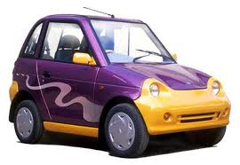

<figure aria-describedby="caption-attachment-624" class="wp-caption alignleft" id="attachment_624" style="width: 270px">

<figcaption class="wp-caption-text" id="caption-attachment-624">No! This is not the color scheme we picked.</figcaption></figure>

It’s almost a year since we purchased the Reva as our second car. The borderline-giddy post [Hum do humare do…bina exhaust ke](http://ulaar.wordpress.com/2010/06/27/hum-do-humare-do-bina-exhaust-ke/) on my personal blog records that event. Recently I crossed the 3000km mark and the quick math is that, on average, I drove 10k in the Reva everyday. This is not a lot of mileage even for a second car but I was fortunate that my office and kids’ school were both close to home. One of the key selling points of the Reva is the super-low operational cost – a mere 40 paise per km. To put things in perspective, the operational/fuel cost of the next cheapest gasoline-powered Indian small car (Tata Nano) is Rs. 2 per km. The Maruti Suzuki SX4 (our primary car) averages Rs. 6 per km.

So who’s this Katuri character and what’s his question? Chandra Sekhar Katuri, [one of Bangalore’s fast ultra-marathoner](http://chandras.posterous.com/runner-of-the-fortnight-interview)s and a good friend, was car-shopping 6 months ago. A thorough data-driven discerning shopper that he is, he quizzed me on various aspects of the Reva. Reva was quickly ruled off as a credible prospect since he was shopping for his “first car” and also planned to undertake inter-city trips. Of his many questions, there was one that I didn’t answer to his (or my) satisfaction. How “clean” is the Reva really? So what if an electric car has zero emissions…maybe it was just a case of moving the problem upstream (i.e. on the electricity generation side)?

Katuri had a valid question and I’ll now proceed to answer it. An electric car is only as clean as its electricity supply. Since majority of electricity generation in US, Europe and India is from coal-fired plants, celebrated cleantech venture capitalist Vinod Khosla disdainfully refers to electric cars as “plugging into a lump of coal”. Not happy with this characterization, I went looking for data on electricity generation sources in India. Here’s what I found (Source: [India-Reports.com](http://India-Reports.com)):

- Coal fuel plants – 53.3%
- Gas power plants – 10%
- Oil – 0.9%
- Hydro electric – 24.7%
- Nuclear – 2.9%
- Renewal energy sources – 7.7%

So my Reva isn’t *entirely* plugged in to a lump of coal – there’s 25% hydro electric power and 8% of renewable energy power as well. Whew!

Much later I was discussing my ‘punctured’ green credentials with a Ph.D student at IIT Bombay (whose research interests include, among other things, small wind energy turbines) and learned, to my unexpected delight, that there are two other reasons why the electric car, relatively speaking, is a far superior green choice compared to its gasoline guzzler cousin.

1. Coal is significantly more accessible than crude oil and power plants burn coal more efficiently than cars burn gasoline.
2. In an urban traffic scenario, the efficiency of an electric car is higher than that of a gasoline-powered car.

So there there…