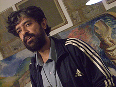

<figure aria-describedby="caption-attachment-1991" class="wp-caption alignleft" id="attachment_1991" style="width: 240px">

<figcaption class="wp-caption-text" id="caption-attachment-1991">Pic courtesy flickr.com</figcaption></figure>

*\[Editor’s Note: The purpose of this blog post is to acknowledge that water is a burning issue of the present. It requires the involvement and collaboration of governments, NGOs, companies, and citizens in crafting the right policies, innovating in water/sanitation infrastructure and, perhaps most importantly, effect behavior changes by citizens (homeowners and apartment dwellers). I had an opportunity to recently meet Viswanath Srikantaiah (aka “S. Viswanath”) – a central influential figure in the field of water and sanitation management and a Bangalore resident. This post chronicles my visit to his home, an introduction to some basic water statistics, an eye-opening tour of his house (talk about eating your own dog food) and some relevant Youtube videos. I hope this will be the first of many more informative posts in the Water category.\]*

The nice thing about the beginning of any journey is that one knows *so little*. I was catching up with my friend Sameer and he told me that his wife (Shubha) was a water consultant. I didn’t know such a profession even existed. Sameer rattled off a staccato of “did you know”  water statistics that piqued my attention. I quickly got an introduction to Shubha and, a few days later, was off in my bouncy Reva for a rendezvous with Shubha and her colleagues at Biome Solutions in Vidyaranyapura. If you are a Koramangala resident, Vidyaranyapura can be legitimately characterized as the boondocks – situated as it is due west of the GKVK (Gandhi Krishi Vignan Kendra) campus. The constraint imposed by a Reva electric car (maximum range of 70km) on a recovering smartphone+Google Maps addict made for a sobering drive.

I digress. I *did* eventually reach the rendezvous, which turned out to be the home of S. Viswanath – founder of [Rainwaterclub](http://www.rainwaterclub.org/), Director of [Biome Solutions](http://www.biome-solutions.com/), Advisor to [Arghyam](http://www.arghyam.org/), Secretary General of [IRCSA](http://www.ircsa.org/) (International Rainwater Catchment Systems Association), and an acclaimed national/international figure in water conservation and management.

**Background on Zenrainman**

Zenrainman is Viswanath’s Twitter handle. His Twitter bio reads “*Bob Dylan is God* *J* *Harvest rain, ecosan, live good.”* His YouTube bio is a bit more descriptive – *Poverty and the environmental destruction are both my areas of concern. This work hopes to help people overcome these problems in a participatory manner. I document people’s work on water, sanitation, energy, architecture, and sustainability*. His channel’s tagline *The Water and Sanitation Channel* is telling because a holistic view of water management inexorably includes sanitation and waste management.

Viswanath understands core issues around water in rural, urban, and peri-urban settings in Indian and international landscapes. He’s heavily networked with national and international universities, NGOs, government bodies, and civil society. His own home serves as an exemplary model of how far one can go in implementing water and waste management techniques in our own homes. ***Approximately 70% of his family’s water requirements are met through the rainwater harvesting systems installed in his house***. [Rainwaterclub](http://www.rainwaterclub.org/) (founded in 2000) and [Biome Solutions](http://www.biome-solutions.com/) (formed in 2008 through the merger of Rainwaterclub and Viswanath’s wife’s Architect practice) are arguably the only place in India that works on the entire range of solutions around water – all with no external funding. Clearly this wasn’t enough since Viswanath and Chitra also started the [Biome Trust](http://biometrust.blogspot.com/) – combining the talents of ecological architects, planners, and water experts with a commitment to making responsiveness to the environment and those inhabiting it not only a mainstream practice but also a matter of course.

Viswanath is very tech-savvy, a prolific Twitter user (19,000+ tweets and 1,400+ followers), a prolific YouTube producer (424 videos on rainwater harvesting and sanitation) – not just in English but several regional Indian languages as well. He’s a speaker or a key participant in nearly all the international water conferences, often times being invited to live-tweet at the conference.

**Rainwater Harvesting / Off-grid Living Videos from Zenrainman YouTube Channel**

Shubha gave me a wonderful tour of Viswanath and Chitra’s house – literally from the basement to the rooftop. Plain words will not do justice so I’ve selected 3 representative (MUST SEE) YouTube videos from his channel. Enjoy!

<iframe frameborder="0" height="390" src="http://www.youtube.com/embed/O-2dEifj5Ac" title="YouTube video player" width="480"></iframe>

<iframe frameborder="0" height="390" src="http://www.youtube.com/embed/daouoJiB4uw" title="YouTube video player" width="480"></iframe>

<iframe frameborder="0" height="390" src="http://www.youtube.com/embed/9FSuWorTInw" title="YouTube video player" width="480"></iframe>

**India/Bangalore water statistics 101**

- An estimated 22+ million borewells in India.
- Across India, 60-70% of drinking water comes from borewells.
- In 20 years, Bangalore has gone from drilling 100 feet to 1250 feet for groundwater. There are 400,000 borewells in Bangalore.
- 60% of the cost of supplying drinking water goes towards electricity (river water needs to be pumped long distances and ground water needs to be pumped up).
- 70% of Bangalore’s water comes from Cauvery river.
- Cost of producing water is Rs. 36 for every kiloliter (Bangalore). Yet, the customers are only charged Rs. 6. Why? Because no politician wants to mess with water policy just yet.