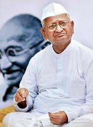

<figure aria-describedby="caption-attachment-1495" class="wp-caption alignleft" id="attachment_1495" style="width: 187px">

<figcaption class="wp-caption-text" id="caption-attachment-1495">Anna Hazare (Pic: courtesy justascrap.com)</figcaption></figure>

I’ve sometimes found it useful to resist the urge to blog immediately in the aftermath of a major event that I care about. The advantage with waiting is that one moves beyond gut reactions (ours and others), contemplate on some of the thoughtful opinions, and there’s a real opportunity to learn something new – not just about the issue but about ourselves too. The downside is that your blog post runs long – I started this yesterday and will be adding at least 2 new citations. 🙂

First a disclosure. I don’t watch TV news. I do own a TV and watch all manners of sporting events but I’ve sworn off TV news for about 3 years now. It’s all web news for me and plain old text at that. Barring an archived NDTV panel discussion that I watched in the aftermath of the Ayodhya court verdict, I also don’t watch any web video footage. 26/11, Barkhagate, Ayodhya verdict, and now the Anna Hazare ‘movement’ – I’ve followed these news events exclusively on the Web.

It’s been almost 2 days since the government and Anna Hazare reached an ‘agreement’, almost a week since Anna Hazare began his fast, and I’ve read scores of relevant articles on all sides of the table. Enough marination I say. Here are my learnings.

1. **Anna Hazare’s track record in fighting corruption in Maharashtra**: I reckon Anna Hazare had a very high [aided recall](http://www.asiamarketresearch.com/glossary/brand-recall.htm) among Indians even before he launched his fast-till-death agitation. I knew him to be a morally upright Gandhian who took up several people causes but didn’t know more. Thanks to Gaurav Sabnis’s blog post [On Anna and fasting](http://gauravsabnis.blogspot.com/2011/04/on-anna-hazare-and-fasting.html), I learnt that his agitations and fasts have hardly been futile. Specifically, 
  - His anti-corruption crusade in 1994 (along with whistleblowing official GK Khairnar) swayed public opinion against Sharad Pawar’s government led to subsequent electoral defeat at the hands of Sena/BJP.
  - The RTI (Right to Information) movement owes a lot to Anna. In 2003, after the Maharashtra government had passed the RTI but was not implementing it, Anna did a *maun vrat* (vote of silence). The public response to even his maun vrat demonstrated the extent to which this man had captured the public imagination – the Maharashtra government immediately passed an ordinance implementing the RTI law.
2. **Cynic is the new pseudo-secular**: A few days after 9/11, President George W. Bush famously declared to the world “*you are either with us or against us”* which set off, among other things, a frenzy of flag buying in America. It didn’t matter whether you were a citizen or not, whether you knew the national anthem or not, whether you had a green card or not, but… you had to have the American flag on your car. Flag stickers on your home windows wouldn’t hurt either. No memo to this effect was sent from any (fictitious) organization called Americans\_Suspect\_Immigrants\_Patriotism. Yet somehow the word on the immigrant street was that if you didn’t display the flag on your car, you’d stand out as a Noam Chomsky supporter. I’m seeing a very similar phenomenon in the past week. Either you supported *Anna Hazare’s fight against corruption* or.. you were a **cynic**. Nuances be damned. I searched in vain for a Facebook group (or an online petition) that supported Anna Hazare‘s fight against corruption but denounced Jan Lok Pal as the worst idea since Tughluq’s move to change his capital city from Delhi to Daulatabad. With my customary hyperbole quota exhausted, hopefully I shall be more measured in the rest of this post. Nearly every Twitter conversation or Facebook post I read/participated in had similar refrains – *how could a middle-class Indian NOT support the Anna Hazare movement*?
3. **Why I’m deeply skeptical about Jan Lok Pal bill**: *The Jan Lok Pal bill is not a solution to the problem of corruption. It risks making matters worse. The promoters and supporters of Jan Lok Pal and the public agitation to achieve it are profoundly misguided. Their popularity stems from having struck a vein of middle class outrage against the UPA government’s misdeeds. That doesn’t mean that the solutions they offer are right. If the Jan Lok Pal presides over the same system that has corrupted civil servants, politicians, anti-corruption watchdogs, judges, media, civil society groups and ordinary citizens, why should we expect that the ombudsman will be incorruptible? Because the person is handpicked by unelected, unaccountable ‘civil society’ members? Those who propose that Nobel laureates (of Indian origin, not even of Indian citizenship) and Ramon Magsaysay Award winners should be among those who pick the Great Ombudsman of India—who is both policeman and judge—insult the hundreds of millions of ordinary Indian voters who regularly exercise their right to franchise. For they are demanding that the Scandinavian grandees in the Nobel Committee and the Filipino members of the Magsaysay foundation should have an indirect role in selecting an all-powerful Indian official.* That was an extract from Nitin Pai’s [Against Jan Lok Pal and the politics of hunger strike](http://acorn.nationalinterest.in/2011/04/08/against-jan-lok-pal-and-the-politics-of-hunger-strikes/).
4. **Why Jan Lok Pal (in current form) is a terrible idea**: Think of point #3 (extract from Nitin Pai’s article) as the tip of the iceberg. For a systematic tear-down of the Jan Lok Pal bill in its current form, look no further than Amba Salelkar’s legal analysis on Yahoo! News: [Good intentions and the road to hell](http://in.news.yahoo.com/good-intentions-and-the-road-to-hell-%E2%80%93-the-jan-lokpal-bill.html).
5. **What? Lok Pal demon? Relax**: My friend, Subbu Vincent, co-founder/editor of [IndiaTogether.org](http://www.indiatogether.org) and co-founder of [CitizenMatters](http://www.citizenmatters.in), put out a special-edition analysis piece [Who Won? Politics](http://www.indiatogether.org/2011/apr/sbv-lokpal.htm). He makes several persuasive arguments one of which is that the bill has to go through a veritable series of steps before being passed by Parliament. He writes: *“Several people have read through the India Against Corruption group’s draft of the Lok Pal bill. They are worried that this will unleash upon India a new demon – a new unaccountable, all-powerful Lok Pal – that will stride along like a monster, abusing its power, and only drag the nation down into a deeper abyss. Still, a demon in the making? The parliamentary process for making law is clear. First the 50:50 joint committee will have to develop a consensus on one overarching question: What does ‘teeth’ to the Lok Pal and LokAyukta really mean in practice? i.e., How can deterrent of corruption be made real to the fullest extent our Constitution will permit? The consensus bill will have to then pass the union cabinet before the monsoon session begins. Next, it will be discussed in Parliament, where given the history made in the last week, there will very likely be a serious debate. After it will be about the ‘teeth’ politicians are giving a body to hunt the corrupt amongst themselves down. Fourth, it will likely be sent to a standing committee before being finally brought back to vote.*
6. **Teeth or no teeth?** Subbu’s argument is that the bill has a ways to go before it gets passed so don’t freak out people. At least not just yet. The underlying assumption of a 50:50 committee is that there will be a fair bit of negotiation between elected officials and ‘civil society’. Hopefully most of the structural flaws in the current draft (identified by Salelkar and others) would be rectified and the committee converges on the specifics of the ‘teeth’. And there’s the Aug 15 deadline (*4 months* from now). That’s the deadline Anna Hazare has issued for the *bill to be passed by parliament*. A bill, whose various flavors had a 40-year unsuccessful history in Indian parliament, and which now has a precedent-setting 50% civil society drafting committee representation, will be debated within the draft committee, then discussed in parliament, then gets sent to a standing committee before finally coming to a vote. All this in 4 months?And this is not even the Indian equivalent of the US Patriot Act (which was signed into law 45 days after 9/11)! So what happens if the bill doesn’t get passed by Aug 15? Anna Hazare has announced he will march to the Red Fort, erect a flag, launch the ‘second struggle’ for independence which, I suppose, doesn’t rule out another fast-unto-death. And the esteemed Arvind Kejriwal has threatening the ‘unleashing of civil disobedience’ movement. Yes – civil disobedience makes sense because, after all, the ruling UPA government’s top political party is led by the Italian-born Sonia Gandhi.
7. **Ethics and morality of precedent-setting fasts**: Almost every major organized religion venerates fasting. They may differ on exactly the practitioners would fast (number of consecutive days, days of the week/month, etc.) but for the most part it’s *supposed* to be an act of personal atonement, purifying/purging the soul, or expressing gratitude for what one has. When fasting gets into the public domain, it becomes coercive (at best) and blackmail (at worst). Atanu Dey, in his post [Anna Hazare goes to New Delhi](http://www.deeshaa.org/2011/04/08/anna-hazare-goes-to-new-delhi/), gets into the heart of the ethics and morality of it. *Hazare is celebrated as a Gandhian, and I believe that he is indeed one to the extent that he’s using an old Gandhian ploy. Gandhi too used fast-unto-death threats effectively and to much popular acclaim. Of all the hypocritical actions that Gandhi indulged in publicly, fasting to death is most definitely the most remarkable. It’s hypocritical because he talked loudly about non-violence and simultaneously took steps that could lead to death. If forcing others to give in to your demands by threatening to kill (suicide is not the same as homicide but it does involve the ultimate violence of the death of a sentient being) is not violence, non-violence is a meaningless concept mouthed by self-serving people. Dey writes further on the immaturity of India as a nation and the kind of precedent a ‘successful fast’ could engender. Hazare’s fasting to death and the public support that he has enlisted shows how immature India is as a nation. Endorsing his and his supporters’ actions in this case is dangerous for the simple reason that its essential consequence is rule by mobs hell bent on having their way by threatening violence. Already India suffers from episodes of mobs forcing the government to restrict personal freedoms such as expression and speech by violent means. Whether Hazare’s action will result in a better ombudsman bill or not is uncertain. But it will certainly reinforce the public perception that if you want your way, instead of taking the hard way of arguing your case, the quickest and most expedient way is to take to violence.*
8. **I finally understood my misgivings about Gandhi and Gandhism**: As Indians, we have many things to be grateful for Mahatma Gandhi. But fasting as a tool for political blackmail is NOT one of them. What’s widely known is that Gandhi undertook fasts at key junctures to put pressure on the British Crown. These fasts worked! I don’t have any issue with that because of the supremely extenuating circumstances. What’s less widely known is that Gandhi also used fasting as a tool for political blackmail. Several times. How to prop up blue-eyed-boy Jawaharlal Nehru (but not the popular choice) for the post of Prime Minister? Fast-to-death of course. How to handle/defeat his political opponent Ambedkar’s differing-from-Gandhi’s policy proposals for the Oppressed Classes? Well, fast-to-death of course.
9. **It’s the youth power, stupid**: B. Raman, former Addl. Secretary Govt. of India, writes in his April 7 post [An anti-corruption Ayatollah](http://ramanstrategicanalysis.blogspot.com/2011/04/anti-corruption-ayatollah.html) about the reasons why the UPA Government capitulated the way it did: *Anna Hazare and his supporters have been agitating on the need for an effective institutional mechanism against corruption for years and have re-doubled their efforts since January last.* *The Government has suddenly bestirred itself on this issue not just because of the fast of Anna Hazare, but because it has been startled by the outpouring of empathy and support for him from the youth of the country. Even the TV channels of this country largely ignored this movement since January till it saw hundreds of youth coming out into the streets in support of Anna Hazare.*

Additional reading:

- [The grammar of anarchy](http://pragati.nationalinterest.in/2010/08/the-grammar-of-anarchy/) (Speech by BR Ambedkar – archived with comments on INI/Acorn)
- [Corruption is ‘Hazaredous’](http://www.livemint.com/2011/04/10203939/Corruption-is-8216hazaredou.html?h=B) by Narayan Ramachandran (Livemint)
- [Even Pappu can fast – Only YOU can kill corruption](http://www.sify.com/news/even-pappu-can-fast-only-you-can-kill-corruption-news-analysis-lelkKgdgefh.html) by Raheel Khursheed
- [At the Risk of Heresy: Why I am not celebrating with Anna Hazare](http://kafila.org/2011/04/09/at-the-risk-of-heresy-why-i-am-not-celebrating-with-anna-hazare/) by Shuddhabrata Sengupta
- [Not a very civil coup](http://www.indianexpress.com/news/not-a-very-civil-coup/774339/0) by Mihir Sharma (Indian Express)
- [The seeds of authoritarianism](http://www.indianexpress.com/news/the-seeds-of-authoritarianism/774794/0) by Neera Chandhoke (Indian Express)
- [Why tar all politicians with the same brush?](http://www.indianexpress.com/news/why-tar-all-politicians-with-the-same-brush/774797/0) by Madhu Purnima Kishwar (Indian Express)