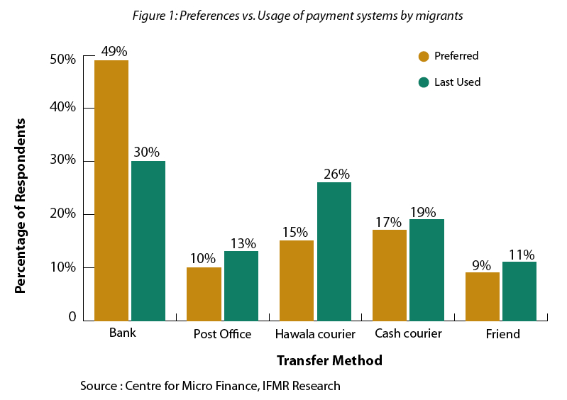
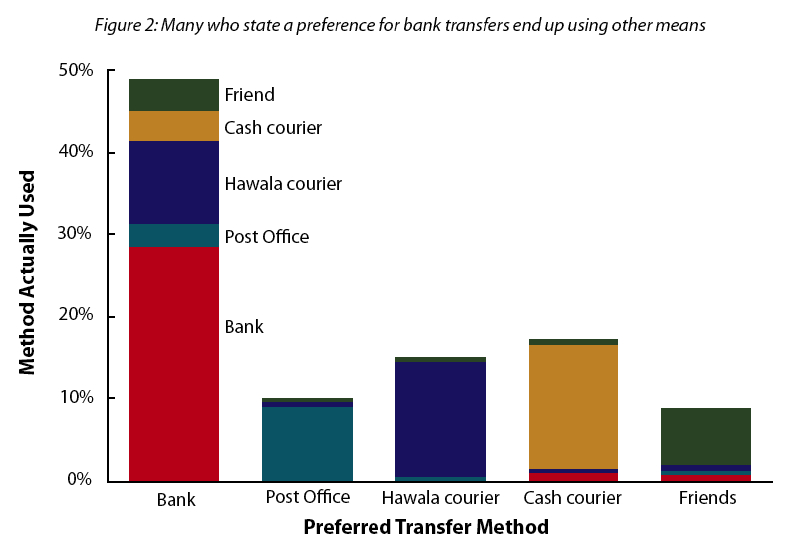
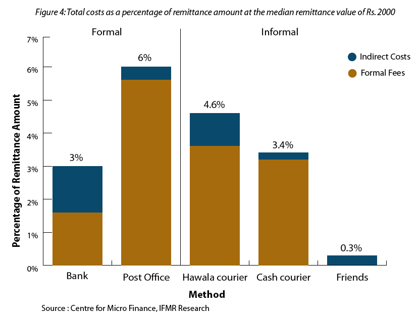
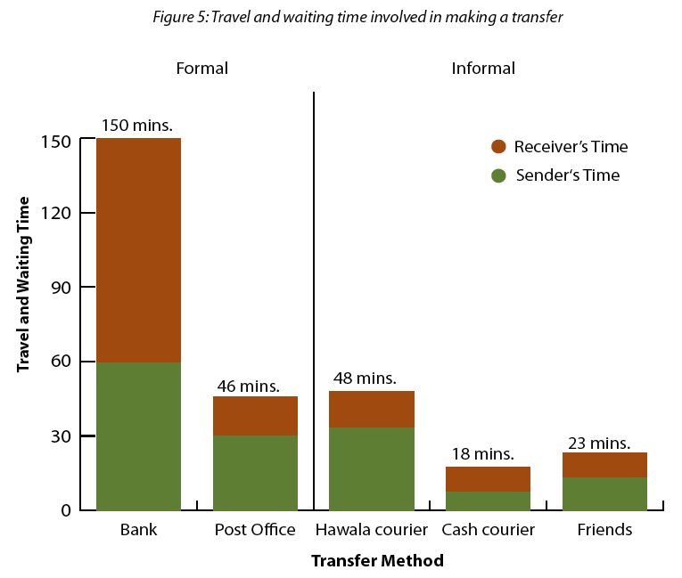
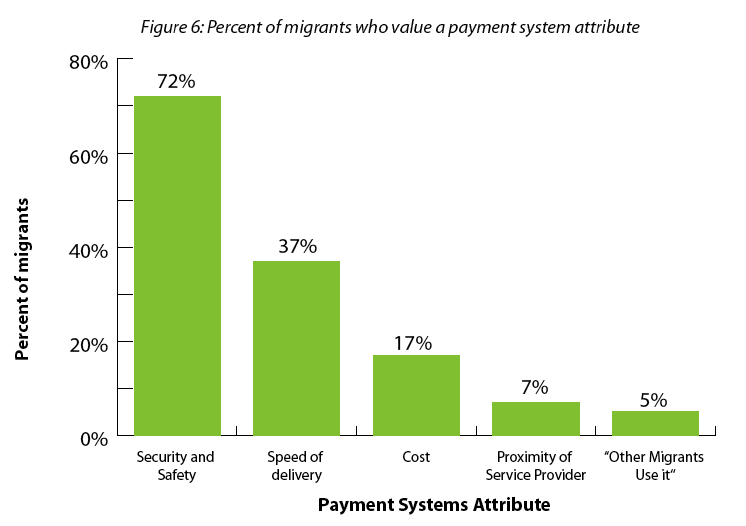

India’s 100 million strong domestic migrants contribute a whopping 10% of its GDP. As I covered in [The Twentyfirst Century Kabuliwalas of India](http://www.techsangam.com/2011/04/19/the-twentyfirst-century-kabuliwalas-of-india/), domestic migrants are one of the missing links in India’s development. A key recommendation from a study commissioned by UK-based [Overseas Development Institute](http://www.odi.org.uk/) is that migrants need dramatically improved access to market information, skills enhancement, certification of identity, remittances, housing and continued access to health, education and social assistance whilst *on the move*.

Remittances is arguably the biggest pain point for migrants. It’s ironic because these migrants are leaving their homes, traveling thousands of kilometers in order to *earn more money* — a significant portion of which they *send to their family* members in a reliable and cost-effective manner. A recent study [Putting Money in Motion: How much do migrants pay for domestic transfers? ](http://www.ifmr.ac.in/cmf/publications/wp/2010/42_Putting_Money_in_Motion.pdf)(PDF link) commissioned by Bill and Melinda Gates Foundation and executed by [Center for Micro Finance at IFMR Research](http://www.ifmr.ac.in/cmf/about.html) gets to the heart of the matter. The rest of the blog post is a presentation of key findings from that study (relevant graphs are at the bottom of this post).

- Nearly 50% ‘prefer’ to use banks for remittances but end up using it only in 30% of the cases. The biggest beneficiary in such cases are the hawala couriers.
- Though 26% of migrants use hawala couriers, nearly half of them would prefer to use some other mode.
- \[Figure 4\] Bank transfers are the cheapest option (at 3% of remittance amount), cash couriers slightly more (at 3.4%), hawala couriers 50% more expensive than bank transfers (at 4.6%) and post office the most expensive (at 6%).
- \[Figure 5\] Travel and waiting times (by the sender and receiver) also need to be factored into the overall cost of the remittance method. A bank transfer involves a total time of 2 1/2 hours – an average of 15 minutes of travel and 45 minutes at the bank for senders, plus an additional 40 minutes of travel and 50 minutes of waiting time for recipients.
- \[Figure 5\] Travel and waiting times for all other channels are quite low: post office (46 min), hawala couriers (48 min), and cash couriers (18 min).
- \[Figure 6\] When asked what migrants value in a payment system, security (at 72%) was the most common answer followed by speed of delivery (at 37%). The cost of transferring money is only the third criterion (at 17%).

If there’s one takeaway from this study, it’s this: migrants yearn for the security and reliability of formal channels (notably banks) but these channels are either not accessible (mostly at the receiving end of migrants’ families) or consume too much time so they’ve gravitated to informal channels like hawala couriers and cash couriers. Perhaps what’s needed is a new channel that brings the best of formal and informal channels? As it turns out, there are several startups like Eko Financial Services, Obopay, FINO and Oxigen that are attempting to bridge this gap. Stay tuned for coverage on these startups.

<figure aria-describedby="caption-attachment-40" class="wp-caption aligncenter" id="attachment_40" style="width: 300px">

<figcaption class="wp-caption-text" id="caption-attachment-40">Preferences vs. Usage of payment systems</figcaption></figure>

<figure aria-describedby="caption-attachment-41" class="wp-caption aligncenter" id="attachment_41" style="width: 300px">

<figcaption class="wp-caption-text" id="caption-attachment-41">Preferred vs. Actual Transfer Method</figcaption></figure>

<figure aria-describedby="caption-attachment-42" class="wp-caption aligncenter" id="attachment_42" style="width: 300px">

<figcaption class="wp-caption-text" id="caption-attachment-42">Cost as % of remittance amount (Median remittance of Rs. 2000)</figcaption></figure>

<figure aria-describedby="caption-attachment-43" class="wp-caption aligncenter" id="attachment_43" style="width: 300px">

<figcaption class="wp-caption-text" id="caption-attachment-43">Travel and waiting time in making transfer</figcaption></figure>

<figure aria-describedby="caption-attachment-44" class="wp-caption aligncenter" id="attachment_44" style="width: 300px">

<figcaption class="wp-caption-text" id="caption-attachment-44">Rating of payment system attribute</figcaption></figure>