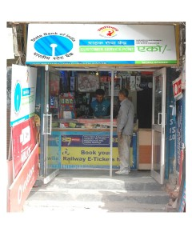

<figure aria-describedby="caption-attachment-1239" class="wp-caption alignleft" id="attachment_1239" style="width: 240px">

<figcaption class="wp-caption-text" id="caption-attachment-1239">When you hear "no-frills banking" think of a place like this (Pic: courtesy cgap.org)</figcaption></figure>

*\[Editor’s Note: A few weeks ago I had an engaging phone conversation with Abhishek Sinha, co-founder and CEO of [Eko Financial Services](http://eko.co.in/index.php), a trailblazing branchless banking social enterprise that’s making a dramatic difference to the lives of India’s migrants. This two-part series draws extensively from our phone conversation, follow-up email exchanges, and related research. Khata kholo har darwaza kholo is Eko’s marketing slog*[View Post](http://www.techsangam.com/2011/05/01/khata-kholo-har-darwaza-kholo-ekos-branchless-banking-part-1/)*an and translates to Open Account, Open Every Other Door.\]*

**Backstory**

For a guy in his early 30’s who’s already spent time with the richest man in the world (in Nov 2008) and the most powerful man in the world (in Nov 2010), Abhishek Sinha comes across as unassuming and down-to-earth. A graduate of Birla Institute of Technology, Mesra, Abhishek started his career with Mahindra Satyam in their telecom division. In 2002 startup fever overpowered him and he co-founded Six DEE Telecom Solutions, a telecom value added services company. By late 2006, Six DEE had rapidly grown to spanning nine countries and fifteen operators. It wasn’t a single Aha moment that gave birth to his second startup. Rather, it was a series of things which provided the inspiration — m-commerce explorations, a realization that there’s value in owning the “last mile”, and seeing the success of a similar program in Brazil. Once he connected the dots in his head, he exited Six DEE and co-founded [Eko](http://eko.co.in/index.php) along with his brother Abhinav in Sep 2007.

**Early days**

In 2006, the Reserve Bank of India first issued regulations around the [business correspondent model](http://www.rbi.org.in/Scripts/BS_CircularIndexDisplay.aspx?Id=2718) as a credible financial inclusion policy to extend banking services. Think of Business Correspondents as bank agents – agents incentivized to acquire new customers,  provide them with no-frills savings accounts, enable deposits, withdrawals and remittances for them. Since initial RBI guidelines only allowed not-for-profit organizations to be appointed as Business Correspondents, a separate entity (Eko Aspire Foundation) was created – to serve as the Business Correspondent partner of record while Eko India Financial Services would provide technology and back-end service enablement. Recent RBI legislative modifications have obviated the need for two separate entities and Eko plans to consolidate its operations under the single (Eko India Financial Services) roof).

Eko’s first partnership, with Centurion Bank of Punjab in mid-2008, also resulted in their first major setback. After the technology integration with Eko was complete and the program got underway, Centurion was acquired by HDFC who promptly decided to cancel the Eko/Centurion partnership.

Little were the Sinhas (Abhishek and Abhinav) aware that a perfect storm was just round the corner. Consultative Group to Assist the Poor (CGAP), a World Bank affiliated body whose donors include Bill and Melinda Gates Foundation, noticed Eko. Bill Gates was planning a visit to India in November 2008 and was looking to meet ‘interesting’ entrepreneurs in an informal setting. The stars aligned and the Sinha brothers were soon demonstrating the Eko solution to the Gates personal retinue (which included his father and sisters). Bill Gates was sufficiently impressed to comment “*This solution isn’t just for the bottom of pyramid*.” (more on this in Part 2 of the series)

The Bill Gates impromptu visit was followed by a series of positive developments for Eko. A Business Correspondent partnership with State Bank of India which kickstarted operations in Delhi in February 2009. CGAP awarded a $280,000 grant to Eko a month later. Eko was well and truly in business.

**How Eko transactions work for a migrant**

This 2-minute Youtube illustrates how a migrant walks into an Eko outlet in Delhi, opens a no-frills SBI account with a Rs. 50 deposit, and subsequently makes a remittance to his brother in a remote Bihar village — all using a mobile phone.  
<object classid="clsid:d27cdb6e-ae6d-11cf-96b8-444553540000" codebase="http://download.macromedia.com/pub/shockwave/cabs/flash/swflash.cab#version=6,0,40,0" height="390" style="height: 390px; width: 640px;" width="640"><param name="allowFullScreen" value="true"></param><param name="allowScriptAccess" value="always"></param><param name="src" value="http://www.youtube.com/v/mkkyPwkWvWU?version=3"></param><param name="allowfullscreen" value="true"></param><param name="allowscriptaccess" value="always"></param></object>

**Eko Outlets (aka CSPs**)

The last-mile distribution and payment infrastructure can be built in several ways. If you were a deep-pocketed large enterprise, chances are you wouldn’t blink at expenditure involved in equipping your outlets with Point of Sale terminals, might even consider establishing dedicated outlets. As a low capitalized startup, Eko had no choice but to innovate on a model with close to zero capex. India has anywhere between 15-50 million mom and pop stores selling salt to shampoo and edible chips to electronic chips/SIM cards. Eko’s innovation was to enlist these retailers to become “Eko outlets” aka Customer Service Points (CSPs).

The principal disruption that Eko achieved was to break the need for new and exclusive physical points of presence – since this involves large capital and operational expense. While achieving this disruption, it was equally important to retain and leverage existing over-the-counter transactional practices, many of which were pioneered by the Fast Moving Consumer Goods (FMCG) industry, and adapting them to the financial services industry. The shopkeepers already possess the trust of customers in their community, are deeply conscious of their reputation, and understand that repeat business depends on a clean record. Trust is the currency of every banker or financial services provider. The incremental effort at Eko was to educate the shopkeeper to sell financial services.

What’s the incentive for a shopkeeper to become an Eko outlet/CSP?

- Eko CSPs get a commission for all transactions enabled by them and accounts opened by them. On average, a CSP earns Rs. 2000 per month.
- For some, there’s pride (&amp; respect) as well – in being associated with a leading bank (SBI or ICICI) and enabling banking.
- Arguably there’s increased footfall into the store leading to an increase in the shopkeeper’s primary revenue line.
- A Super-CSP is a much larger retailer whose responsibility, besides playing the role of a CSP, is in selecting other CSP’s in his ‘zone’. A Super-CSP ends up making a lot more money from Eko commissions due to his expanded role.

Here’s a 4-minute Youtube video with testimonials from CSP’s on why signed up with Eko, how it’s benefiting their customers and them:  
<object classid="clsid:d27cdb6e-ae6d-11cf-96b8-444553540000" codebase="http://download.macromedia.com/pub/shockwave/cabs/flash/swflash.cab#version=6,0,40,0" height="390" style="height: 390px; width: 640px;" width="640"><param name="allowFullScreen" value="true"></param><param name="allowScriptAccess" value="always"></param><param name="src" value="http://www.youtube.com/v/Ucoe0C_OI_c?version=3"></param><param name="allowfullscreen" value="true"></param><param name="allowscriptaccess" value="always"></param></object>

**Impressive Stats**  
There’s much more to the Eko story – customer acquisition and marketing strategy, competition, revenue model, new customer segments, fundraising, geographical growth, etc. Stay tuned for Part 2 in the series. Until then, I leave you with a set of tantalizing and impressive Eko stats:

- Recently, Eko crossed an a cumulative 10 billion INR (~ $223 million) of transaction processing across 2.3 million customer transactions
- Daily volume of financial transaction processing is worth nearly$2 million
- Opened over 105,000 no-frills savings accounts and catered to another 500,000 unique customers who use Eko to remit money back home to regular branch based savings accounts

The Eko analysis continues here in [Part 2](http://www.techsangam.com/2011/05/12/khata-kholo-har-darwaza-kholo-ekos-branchless-banking-part-2/).