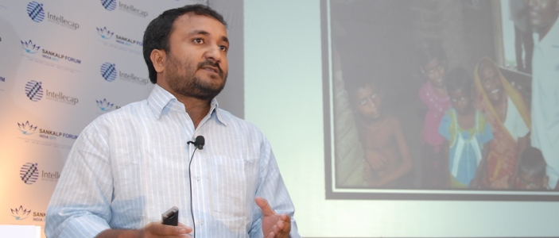

<figure aria-describedby="caption-attachment-61" class="wp-caption aligncenter" id="attachment_61" style="width: 703px">

<figcaption class="wp-caption-text" id="caption-attachment-61">Anand Kumar speaking about his journey (Source: Sankalp Forum 2011)</figcaption></figure>Well organized conferences usually feature popular speakers towards the start and end of the day. The penultimate session at Sankalp Forum Day#1 featured a talk by Anand Kumar (of Super 30 fame) — and what a talk it turned out to be. It helped that the audience had a high awareness of [Super 30](http://super30.org/) but nobody expected a straight-from-the-heart talk from Anand Kumar *delivered in Hindi*. I can’t recall the last time anyone at a conference got a standing ovation from virtually the entire audience.

Dressed casually in a *kurta* and khakis, Anand launched into his story with an ease that’s characteristic of someone comfortable in his skin, passionate about his work, and fixated on an ambition. Fascinated by mathematics from an early age, Anand’s talents were noticed by his teachers in Patna Science College where, among other things, he formed a Mathematics Club, dubbed *Ramanujan School of Mathematics*. In 1994, he got an opportunity to attend Cambridge University but extreme pecuniary and his father’s untimely death prevented him from joining. To make the family’s ends meet, his mother would make *papads* and he would ride around town on his bicycle to sell them. This turned out to be a turning point for Anand. Having witnessed extreme financial hardship since childhood, he decided to do something tangible for poor students – students who would invariably fade away with paucity of opportunities.

A new avatar of Ramanujan School of Mathematics was born where he trained a small group of students for various competitive entrance examinations for a very nominal fee. For extremely poor students, even the nominal fee was waived. After some years, he decided to take this program a lot more seriously and with a clear focus on the IIT-JEE – Ramanujan School of Mathematics had morphed into Super 30. Two of his graduating students decided to forgo other opportunities and instead joined Anand to provide teaching leadership for the two other legs of IIT-JEE preparation (Physics and Chemistry). Anand also called on his brother (a talented violinist based in Mumbai) to take on a CEO-like role for Super 30. Interested applicants went through a screening examination (based on 11th Standard curriculum) and the top 30 with the greatest potential entered the Super 30 program. Food, boarding, and tuition was free for these impoverished students with potential. This was financially sustainable via fees charged from rich families’ kids.

In the last eight years, 212 students out of 240 made to different IITs. In 2003 (Super 30’s first graduating year), 18 out of its 30 students “cracked” the JEE. The next year, the number jumped to 22. In 2006 and 2007, 28 students made it. The perfect ’30 out of 30 moment’ came in 2008. The perfect score was repeated in 2009 and 2010 – Super 30 was here to stay!

With success came the inevitable offers of donation from a diverse pool of individuals and groups – Prime Minister’s office, Chief Minister’s office, and the NRI community to name a few. The response in all cases was clear and consistent – “*Thanks. But no thanks! I’ll carry on just fine without the additional funds*!” And he continues to chug away.

**Success apparently also attracts the Mafia…and Miss Japan**

Simplistically speaking, Bihar’s recent history can be viewed in two phases: the *pre-Nitish-Kumar* phase and the *post-Nitish-Kumar* phase. Bihar in the *pre-Nitish-Kumar* phase was the epitome of lawlessness (and let’s not place the blame just on Laloo Prasad Yadav). When the powerful mafia got wind of Anand Kumar’s soaring success with Super 30, they wanted a piece of the action. Much to their chagrin, they soon realized there wasn’t any ‘action’ to be shared because neither was Anand making money nor was he interested in kow-towing to their plans. Despite grave threats and an incident where one of the Super 30 employees was stabbed by one of the mafia, Anand Kumar didn’t buckle. Fortunately for him and Super 30, Nitish Kumar happened and the crime situation improved quite dramatically. However, the mafia was still around and the new Bihar Chief Minister didn’t want to take any chances with one of the state’s treasures so the Super 30 founder soon found himself with an escort of 2-3 bodyguards, courtesy the Government of Bihar. The mafia finally activated their Plan B, which was to start a series of fake Super 30 tutoring institutes, with creative monikers such as “Raja Super 30”, “Nakli Super 30”, “Gaya Super 30”, and even “Original Super 30”. In other unrelated news, Miss Japan had heard about Super 30 so she made a trip to Patna and visited the institute as well.

**Super 30 is just the beginning…**

As Anand Kumar neared the end of his talk, he shared his big dream. He plans to build and start a *big* new school (he even showed a picture) and has set himself even bigger goals. He expects his graduating students to win Mathematics and Physics Olympiads and…brace yourself, he predicts that one of his students will one day win a Nobel Prize. Would you dare bet against this man? Anand Kumar, may your tribe increase in India!

*Update (May 26)*: The 2011 IIT JEE results are out and an impressive 24 made it this time. The big change for the Super 30 Entrance Test 2012 is that admissions won’t be confined to poor students from Bihar. It will be open to wards from lower middle class families as well (a raising of the economic eligibility criterion) and wards from other states are also eligible.