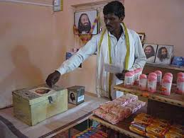

<figure aria-describedby="caption-attachment-603" class="wp-caption alignleft" id="attachment_603" style="width: 259px">

<figcaption class="wp-caption-text" id="caption-attachment-603">Store in Kathewadi: operates on honor system with no cashier</figcaption></figure>

Last month I had an interesting chat with a former SF Bay Area venture capitalist (Mahesh) who relocated to Hyderabad 3 years ago. He splits his time between advisory services for social enterprises and volunteering/teaching with [Art of Living](http://www.artofliving.org/). He shared a remarkable story about Kathewadi – a small village in Nanded district of Maharashtra. In many ways, Kathewadi was not very different from other small Indian villages – population of 600+ and 100+ households, no *pucca* roads or sewage system, and rampant drinking/smoking/gambling. The Art of Living Foundation adopted Kathewadi in Dec 2008 and transformed it into a model of village life within 1 1/2 years.

The transformation is nothing short of remarkable. Alcoholism plummeted from a whopping 70% to 0%. Each family in the village linked to Self Help Groups (SHGs) and started a *daan peti* (donation box) scheme which, along with the community’s heightened sense of trust and harmony, enabled them to setup and maintain a shop without a shopkeeper. The money saved from alcoholism (daily spend for addicts was in the Rs. 50-100 range), SHGs and the *daan peti* scheme gave them sufficient economic independence to build toilets for each of the 110 households.

Zero toilets to 110 toilets in 18 months with no external funding and the prestigious Nirmal Gram Award from Government of India. 70% alcoholism to 0% alcoholism in 18 months. A paved road through the village with no external funding. A shop with no shopkeeper running on an honor system. So how does an Art of Living intervention work, especially in a village setting like Kathewadi?

The starter Art of Living program is what they term as the *basic course* – a stress-relieving technique called *Sudarshan Kriya* which can be loosely described as a combination of yoga, breathing exercises, and meditation. What Art of Living has crafted for the rural context is something broader than the basic course. Originally branded as The 5H Program – Social Transformation &amp; Community Development, it includes 5 areas of focus (Health, Homes, Hygiene, Human Values, and Harmony in Diversity). A series of awareness camps (*Navchetna shivirs),* youth leadership training programs, *satsangs*, and of course the basic course are the underpinnings of their 5H program, described in a fair bit of detail on this [Art of Living Dwarka site](http://www.artoflivingdwarka.org/services/community/5h-program.html).

Details on how this program was administered in Kathewadi were not available except for the fact that at least one member in every household had done the Art of Living 5H curriculum – *Navcheta shivirs*, youth leadership programs, and basic course. Mahesh, who had visited Kathewadi earlier in the year, talked to many villagers asking them the same question “How did this change happen?” The answer in all cases was the same: *Bas hum badal gaye* (translates to “That’s it. We just changed.”)

What’s interesting about Kathewadi is that a virtuous cycle of village transformation started with the elimination of alcoholism. Mahesh told me that alcoholism is an endemic problem in both rich and poor villages. The Art of Living Hyderabad chapter (of which Mahesh is part of) has adopted two villages in Andhra Pradesh (Koyllagudem and Thotalavalluru) with the hope that they can replicate the magic of Kathewadi. Can they do it? Only time will tell.

<iframe allowfullscreen="true" class="youtube-player" height="394" src="https://www.youtube.com/embed/S9MlIXxG3Z0?version=3&rel=1&fs=1&autohide=2&showsearch=0&showinfo=1&iv_load_policy=1&wmode=transparent" style="border:0;" width="700"></iframe>