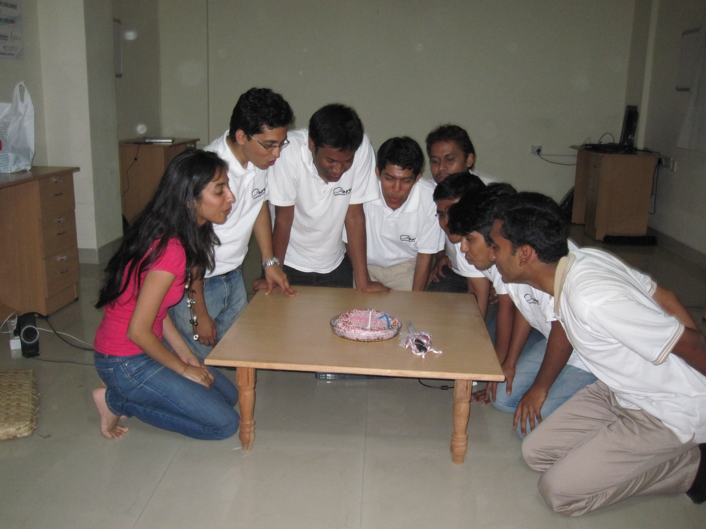

*\[Editor’s Note: Earlier this week, I spent a few hours chatting with Sameer Segal at his cozy rooftop office digs in HSR Layout. Sameer is the Founder &amp; CEO of one-year old [Artoo](http://www.artoo.in/), a startup with a vision of a “Paperless Microfinance” world with reduced delays and dramatically reduced expenses via its flagship Android application for the MFI field agents.\]*

<figure aria-describedby="caption-attachment-73" class="wp-caption alignright" id="attachment_73" style="width: 300px">

<figcaption class="wp-caption-text" id="caption-attachment-73">Artoo team - 1-year celebration (Co-founders Indus and Sameer on left)</figcaption></figure>

As I left Artoo’s rooftop office, I smiled in optimism not because of Artoo’s exciting future (which ***is*** exciting btw) but because there are many more Sameer stories still to be discovered and written. Here’s an electrical engineer who chooses to do his summer internship at, not Goldman Sachs, not Google, not Yahoo, but a micro-finance institution, rolls up his sleeves and spends time with BOP customers and field agents to understand pain points, and later quits a pedigreed MNC job at HSBC (after a mere 11 months) to start a company in the non-sexy world of micro finance. To top that, he has the full support of his parents who also provided funding for the first year of operations.

**Backstory**

Artoo’s name, inspired from the Star Wars anthology, is meant to signify that their solution would be an able companion to MFIs (similar to astromech droid [R2D2](http://en.wikipedia.org/wiki/R2-D2)). Sameer spent the summer of 2008 doing an internship at Bangalore-based Ujjivan (a leading urban/semi-urban focused MFI). He had picked Ujjivan because the internship scope was open-ended and it also gave him exposure on the business side. Eschewing the natural tendency to start coding *something*, Sameer participated in several focus groups with customers and field agents. Eventually, this led to two defining aha moments:

- *BOP customers perceive MFIs to be the window to outside world*: Per RBI regulations, MFIs can only deal with loans and insurance. But the BOP customers don’t know that!
- *MFI workflows terribly inefficient*: Paper-based workflows used by MFI field agents and branch offices meant a lot of data entry errors, delays in opening accounts, and collecting loans. One egregious pain point that caught Sameer’s attention was that it took a whopping 15 days for a customer to pre-close his account. Pre-closure is an important milestone for MFI customers because, once completed, it qualified them for a higher loan amount.

The first aha moment wasn’t immediately actionable but the second one was. Sameer quickly created a simple prototype (using off-the-shelf software) that allowed field agents to SMS the customer ID back to a central Ujjivan service which would send back complete details of the customer. The prototype was a rousing success and gave the kind of satisfaction any intern would crave as he headed back to finish his final year of engineering.

**Focus on Field Agents**:

<figure aria-describedby="caption-attachment-74" class="wp-caption alignright" id="attachment_74" style="width: 225px">

<figcaption class="wp-caption-text" id="caption-attachment-74">Field agent Rathna hard at work</figcaption></figure>

Field agents, who provide last-mile support for virtually all aspects of an MFI’s operations, represent 70-80% of an MFI’s workforce. The key takeaway from Sameer’s internship experience was that there was tremendous scope to improve the efficiency of MFI’s operations. Thus was born the idea of Artoo Slate, an Android-based software framework that takes the entire process of data collection and loan disbursement online. It captures rich data from the field, does away with the back and forth of paper, and thus avoids innumerable delays. It is an intuitive interface that has been designed keeping in mind the field staff’s limited educational training and exposure to technology.

**The Artoo Software – Focus on User Experience**: Every startup wants to build a great user experience but why is that enterprise software is never as intuitive as Facebook? Sameer believes that an intuitive user experience is every bit as important as the right business model and he’s put his money where his mouth is. In his seven-person team (of which three are summer interns from his alma mater), he has *two* user experience folks – a designer and a usability engineer. (Early stage startups almost never hire usability engineers.) I saw an impressive demo on a Google Nexus One device which included several UI tweaks to make the data collection process very efficient. This YouTube video walks you through most of the data collection UI:

<iframe frameborder="0" height="390" src="http://www.youtube.com/embed/HBjltXEkhpY" title="YouTube video player" width="480"></iframe>

**Ujjivan Pilot Results**: Artoo ran its first pilot with Ujjivan Financial Services (co-funded by Ujjivan and Lok Capital Foundation) in Dec 2010 which yielded some impressive results. The end-to-end data collection process was reduced from 3+ days to less than one hour. The collections processing time at Ujjivan’s branches previously used to take an hour – the Artoo pilot reduced it to less than 5 minutes. Overall, the Artoo workflow enabled a 35% increase in productivity, reduced the turnaround time for loans to two days and a projected 2.4% reduction in the Operating Expense Ratio (OER). The other big learning was that field agent adoption rates and performance were independent of seniority and technological savvy.

**Go to Market Strategy**: Artoo is focused on building a killer user experience for MFIs to efficiently acquire customers and manage collections. Recognizing that MFIs would differ in their processes and geographic focus areas (urban vs. rural), Artoo’s Slate framework has been designed to be customizable. With a successful Ujjivan pilot under his belt, Sameer is targeting the licensing of Artoo Slate to seven MFI’s this year. Besides Ujjivan, other urban/semi-urban focused Indian MFIs would likely include Janalakshmi, Equitas, Swadhaar, and Arohan. Since their platform (Android) and framework (Artoo Slate) are portable, Artoo is also pursuing some opportunities in Latin America and Africa.

Artoo’s subscription fee model is based on deployed volume of field agents per month. Subscription fee is expected to range between 600 INR and 1500 INR. Artoo hosts the solution with 99% SLA. One of Artoo’s early decisions was to partner with core banking solution and system integration partners. This is a smart move for two reasons: no need to worry about the myriad ERP solutions that MFIs have deployed and, more importantly, system integrators become a second sales channel to evangelize Artoo’s offerings. The incremental investment that MFIs would have to make is Android devices. According to Artoo’s calculations (for a 8000 INR Android device), the investment on devices would be fully recovered within 4 months.

**Beyond Financial Inclusion**:

While owning the MFI field agent user experience is clearly Artoo’s beachhead, their ambitions extend well beyond that. Sameer believes that the Slate framework can also serve as a platform through which MFIs can train their field staff on-the-go (e.g. basic English skills, computer skills, updates on new products and offerings) and monitor them on a real time basis to improve their overall service quality. Against the backdrop of a competitive MFI landscape with 30% attrition rates among field agents, these additional e-Learning modules could serve as retention tools for forward-thinking MFIs.

Additional/companion modules could be commissioned by individual MFIs or Artoo might create them and license them to participating MFIs on an opt-in basis. It’s this latter model that’s rife with interesting possibilities. Enter Indus Chadha – Artoo co-founder and liberal arts graduate from Columbia University. Indus, who also happens to be Sameer’s high school sweetheart and fiance, joins Artoo full-time in September and will focus on creating relevant offerings in the Education and Health verticals.

**Fundraising**: Artoo has bootstrapped its way so far thanks largely to funding from Sameer’s and Indus’s families. Closing a deal with one of their target MFIs would certainly get the revenue flowing but like any ambitious startup, Artoo wants to run a lot faster. They’ve kicked off a fundraising round (to raise approximately $750,000) either from angels or VCs. Our next Artoo post might either be to announce their Series A or their first partnership with an MFI. What do you want to bet on?